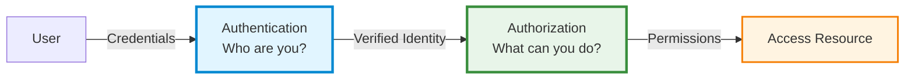
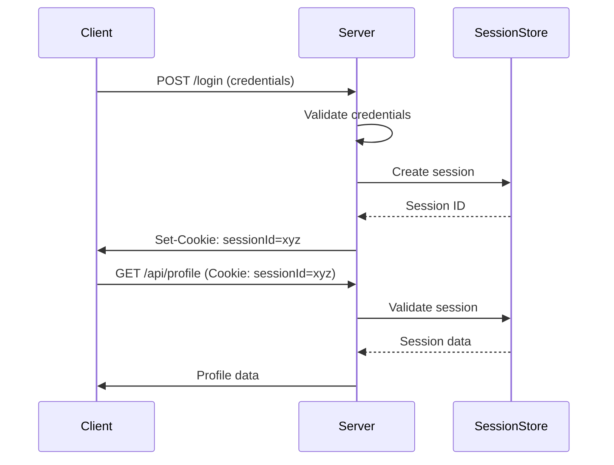
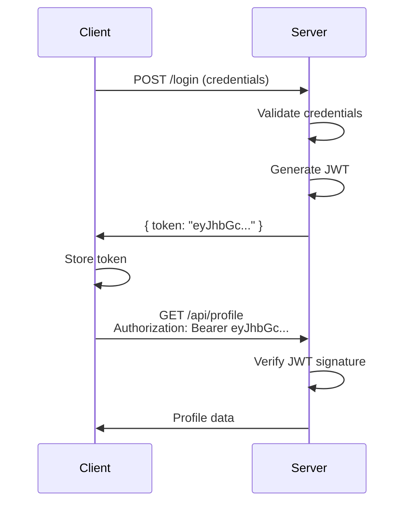
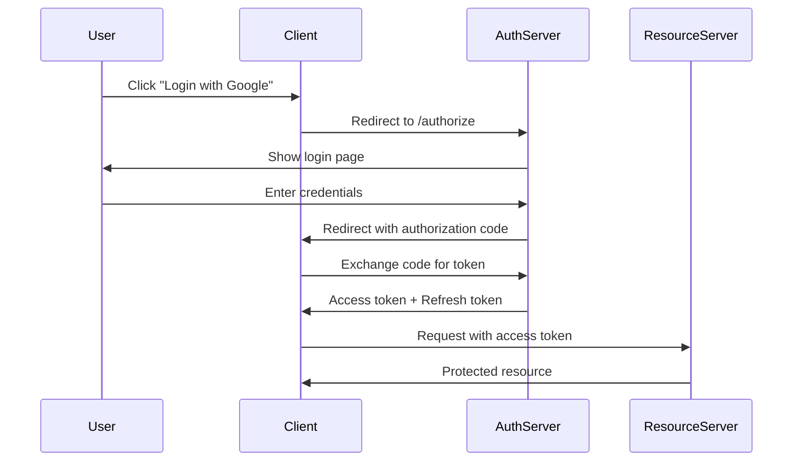
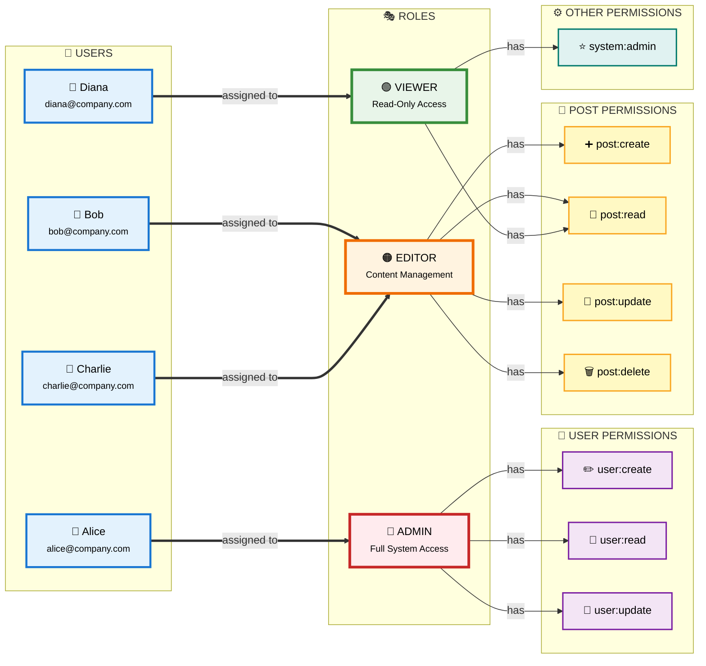
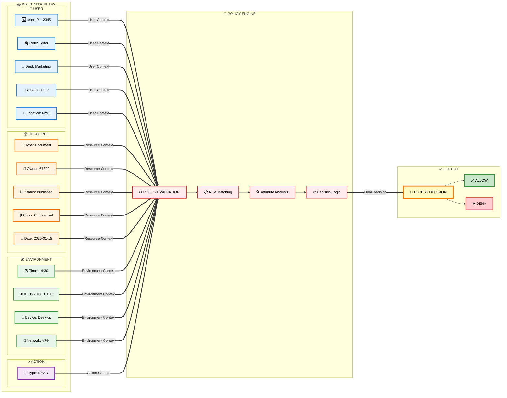
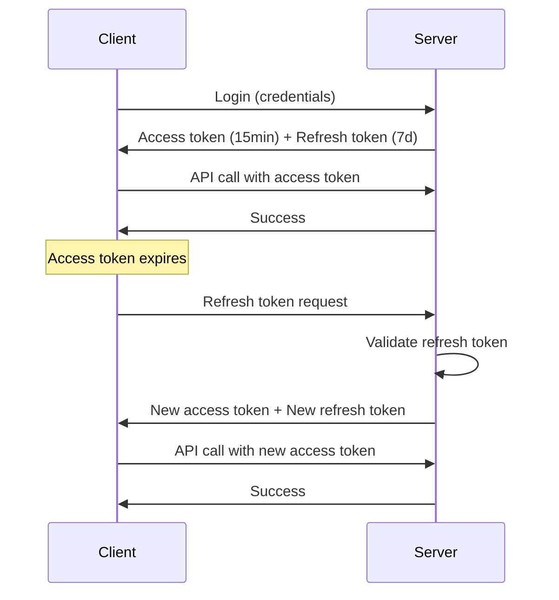

# Authentication & Authorization

Complete guide to implementing secure authentication and authorization in modern applications.

## Best Practices Checklist

| # | Best Practice | Reference / Details |
|:-:|--------------|---------------------|
| ⬜ | **Use HTTPS/TLS for all authentication endpoints** | Encrypt credentials in transit |
| ⬜ | **Never store passwords in plain text** | [Password Hashing](#password-hashing) - Use bcrypt, Argon2, or scrypt |
| ⬜ | **Implement rate limiting on auth endpoints** | Prevent brute force attacks |
| ⬜ | **Validate and sanitize all inputs** | Prevent injection attacks |
| ⬜ | **Implement Multi-Factor Authentication (MFA)** | [MFA](#multi-factor-authentication-mfa) - Add second factor |
| ⬜ | **Use role-based access control (RBAC)** | [RBAC](#role-based-access-control-rbac) - Organize permissions |
| ⬜ | **Log authentication attempts** | Monitor for suspicious activity |
| ⬜ | **Validate tokens on every request** | Don't trust client-side validation |
| ⬜ | **Implement proper password policies** | [Password Policies](#password-policies) - Length, complexity, expiration |
| ⬜ | **Use separate access and refresh tokens** | [Token Types](#access-vs-refresh-tokens) - Different lifespans |
| ⬜ | **Store tokens securely** | Never in localStorage for sensitive apps |
| ⬜ | **Implement CORS properly** | Restrict origins for API access |
| ⬜ | **Audit and review permissions regularly** | Remove unused access |

---

## Authentication vs Authorization



| Concept | Question | Example |
|---------|----------|---------|
| **Authentication** | Who are you? | Login with email/password, verify identity |
| **Authorization** | What can you do? | Admin can delete users, regular users cannot |

---

## Authentication Methods

### Comparison Table

| Method | Use Cases | Pros | Cons | Flow Diagram |
|--------|-----------|------|------|--------------|
| **Session-Based** | • Traditional web apps<br/>• Server-side rendered sites<br/>• Monolithic applications<br/>• E-commerce sites | ✅ Server controls sessions (can invalidate immediately)<br/>✅ Less data sent per request<br/>✅ Works well with server-side rendering<br/>✅ Built-in CSRF protection with proper setup | ❌ Not scalable (requires shared session store)<br/>❌ CSRF vulnerable without protection<br/>❌ Doesn't work well with mobile apps<br/>❌ Sticky sessions needed for load balancing | [View Flow](#1-session-based-authentication) |
| **JWT** | • Single Page Applications (SPAs)<br/>• Mobile applications<br/>• Microservices<br/>• API-first architecture<br/>• Stateless systems | ✅ Stateless (no server storage needed)<br/>✅ Works well with microservices<br/>✅ Excellent for mobile apps<br/>✅ Can include claims (roles, permissions)<br/>✅ Easy to scale horizontally | ❌ Cannot revoke tokens easily (until expiration)<br/>❌ Larger payload than session ID<br/>❌ XSS vulnerable if stored in localStorage<br/>❌ Token size increases with claims | [View Flow](#2-jwt-json-web-tokens) |
| **OAuth 2.0** | • Third-party login (Google, GitHub)<br/>• API access delegation<br/>• Single Sign-On (SSO)<br/>• Multi-tenant applications<br/>• Partner integrations | ✅ Industry standard protocol<br/>✅ No password handling needed<br/>✅ Fine-grained access scopes<br/>✅ Secure delegation of access<br/>✅ Supports multiple grant types | ❌ Complex to implement correctly<br/>❌ Requires external provider setup<br/>❌ Token management complexity<br/>❌ Multiple redirect flows | [View Flow](#3-oauth-20) |
| **API Keys** | • Public APIs<br/>• Machine-to-machine auth<br/>• Internal service communication<br/>• Simple integrations<br/>• Developer tools | ✅ Very simple to implement<br/>✅ Good for internal services<br/>✅ Easy to rotate and revoke<br/>✅ No user context needed<br/>✅ Suitable for scripts/automation | ❌ Less secure than OAuth<br/>❌ No fine-grained permissions<br/>❌ Hard to manage at scale<br/>❌ No standard format<br/>❌ Can be leaked in logs/URLs | [View Details](#4-api-keys) |

### 1. Session-Based Authentication

**How it works:**

1. User submits credentials
2. Server validates and creates session
3. Session ID stored in cookie
4. Client sends cookie with each request



---

### 2. JWT (JSON Web Tokens)

**How it works:**

1. User submits credentials
2. Server validates and creates JWT
3. Client stores JWT (localStorage, sessionStorage, memory)
4. Client sends JWT in Authorization header



---

### 3. OAuth 2.0

**Use cases:**

- Third-party login (Login with Google, GitHub, Facebook)
- API access delegation
- Single Sign-On (SSO)

**Flow Types:**

| Flow | Use Case | Security |
|------|----------|----------|
| **Authorization Code** | Web apps (server-side) | ⭐⭐⭐ Most secure |
| **Authorization Code + PKCE** | Mobile apps, SPAs | ⭐⭐⭐ Secure |
| **Implicit** | ⚠️ Deprecated | ⭐ Less secure |
| **Client Credentials** | Machine-to-machine | ⭐⭐ Secure |
| **Resource Owner Password** | Trusted first-party apps | ⭐⭐ Use sparingly |

**Authorization Code Flow:**



---

### 4. API Keys

**Use cases:**

- Public APIs
- Machine-to-machine authentication
- Simple service authentication

---

## Authorization Methods

### Role-Based Access Control (RBAC)

Users assigned to roles, roles have permissions.



---

### Attribute-Based Access Control (ABAC)

Permissions based on attributes (user, resource, environment).

**Relation Graph:**



**RBAC vs ABAC Comparison:**

| Aspect | RBAC | ABAC |
|--------|------|------|
| **Complexity** | Simple, easy to understand | Complex, requires policy engine |
| **Flexibility** | Limited to role definitions | Highly flexible with attributes |
| **Scalability** | May require many roles | Scales with policy complexity |
| **Granularity** | Coarse-grained | Fine-grained |
| **Use Case** | Standard enterprise applications | Dynamic, context-aware systems |
| **Example** | Admin can delete all posts | Owner can delete own posts on weekdays |

---

## Third-Party Services

### Identity Providers (IDPs)

| Service | Best For | Pricing | Features |
|---------|----------|---------|----------|
| **Auth0** | Enterprise, startups | Free tier, then $23/month | Social login, MFA, SSO, customizable |
| **Firebase Auth** | Mobile apps, quick setup | Free tier, pay-as-you-go | Google integration, anonymous auth |
| **AWS Cognito** | AWS ecosystem | Free tier (50k MAU), then $0.0055/MAU | User pools, identity pools, federation |
| **Okta** | Enterprise SSO | Contact sales | SAML, OIDC, MFA, enterprise features |
| **Supabase Auth** | Open-source alternative | Free tier, $25/month pro | Row-level security, magic links |
| **Clerk** | Modern web apps | Free tier, $25/month | Pre-built UI, webhooks, organizations |
| **Azure AD B2C** | Microsoft ecosystem | Pay-as-you-go | Social login, custom policies |

**Recommendation:** Auth0 for most use cases, Firebase Auth for mobile, AWS Cognito for AWS-heavy

---

### Social Login Providers

| Provider | OAuth Version | Use Case |
|----------|---------------|----------|
| **Google** | OAuth 2.0 | Widest adoption |
| **GitHub** | OAuth 2.0 | Developer tools |
| **Facebook** | OAuth 2.0 | Social apps |
| **Apple** | OAuth 2.0 | iOS apps (required) |
| **Microsoft** | OAuth 2.0 | Enterprise apps |
| **Twitter** | OAuth 1.0a / 2.0 | Social media integration |

---

## Password Security

### Password Hashing

| Algorithm | Security | Speed | Recommendation |
|-----------|----------|-------|----------------|
| **Argon2** | ⭐⭐⭐⭐⭐ | Medium | Best choice |
| **bcrypt** | ⭐⭐⭐⭐ | Slow | Industry standard |
| **scrypt** | ⭐⭐⭐⭐ | Slow | Good alternative |
| **PBKDF2** | ⭐⭐⭐ | Fast | Minimum acceptable |
| **SHA-256** | ⭐ | Very fast | ❌ Never use alone |
| **MD5** | ❌ | Very fast | ❌ Never use |

---

### Password Policies

```javascript
const validatePassword = (password) => {
  const errors = [];

  if (password.length < 12) {
    errors.push('Password must be at least 12 characters');
  }

  if (!/[a-z]/.test(password)) {
    errors.push('Password must contain lowercase letter');
  }

  if (!/[A-Z]/.test(password)) {
    errors.push('Password must contain uppercase letter');
  }

  if (!/[0-9]/.test(password)) {
    errors.push('Password must contain number');
  }

  if (!/[!@#$%^&*]/.test(password)) {
    errors.push('Password must contain special character');
  }

  // Check against common passwords
  if (commonPasswords.includes(password.toLowerCase())) {
    errors.push('Password is too common');
  }

  return errors;
};
```

---

## Multi-Factor Authentication (MFA)

### MFA Methods Comparison

| Method | Security Level | User Experience | Cost | Best For |
|--------|----------------|-----------------|------|----------|
| **TOTP (Authenticator Apps)** | ⭐⭐⭐⭐⭐ High | Easy (one-time setup) | Free | Most applications |
| **SMS OTP** | ⭐⭐⭐ Medium | Very easy | Pay per SMS | Consumer apps (not recommended for high security) |
| **Email OTP** | ⭐⭐ Low-Medium | Easy | Free | Low-security applications |
| **Hardware Keys (WebAuthn)** | ⭐⭐⭐⭐⭐ Highest | Medium (requires device) | $20-50 per key | High-security applications |
| **Push Notifications** | ⭐⭐⭐⭐ High | Very easy | Infrastructure cost | Mobile-first applications |
| **Biometric** | ⭐⭐⭐⭐⭐ High | Excellent | Device-dependent | Mobile apps with biometric support |

### MFA Providers & Solutions

#### Managed MFA Services

| Provider | Pricing | MFA Methods | Best For | Setup Time |
|----------|---------|-------------|----------|------------|
| **Auth0** | Free tier: 7,000 MAU<br/>Then from $23/mo | TOTP, SMS, Email, Push, WebAuthn, Biometric | Enterprise, Startups | ⏱️ 30 min |
| **Duo Security (Cisco)** | From $3/user/month<br/>30-day free trial | TOTP, SMS, Push, WebAuthn, Phone callback | Enterprise, Healthcare, Finance | ⏱️ 1-2 hours |
| **Okta** | From $2/user/month<br/>Free tier: 15,000 MAU | TOTP, SMS, Email, Push, WebAuthn, Biometric | Large Enterprise, SSO | ⏱️ 2-4 hours |
| **Microsoft Entra (Azure AD)** | Included with Azure AD<br/>$6/user/month (P1) | TOTP, SMS, Push (Authenticator), WebAuthn | Microsoft ecosystem | ⏱️ 1 hour |
| **AWS Cognito** | Free tier: 50,000 MAU<br/>$0.0055/MAU after | TOTP, SMS | AWS-heavy infrastructure | ⏱️ 1-2 hours |
| **Twilio Authy** | SMS pricing varies<br/>TOTP is free | TOTP, SMS, Push | Developers, Custom solutions | ⏱️ 30 min |
| **Google Identity Platform** | Pay-as-you-go<br/>$0.06 per verification | TOTP, SMS, Phone | Google ecosystem | ⏱️ 30 min |

#### Open-Source MFA Solutions

| Solution | Language/Stack | MFA Methods | Deployment | GitHub Stars | Best For |
|----------|----------------|-------------|------------|--------------|----------|
| **PrivacyIDEA** | Python/Flask | TOTP, SMS, Email, WebAuthn, Push | Self-hosted | ⭐ 1.5k | Enterprise self-hosted |
| **FreeOTP** | Java/Kotlin | TOTP, HOTP | Mobile app (client-side) | ⭐ 600+ | Client-side TOTP |
| **Authelia** | Go | TOTP, WebAuthn, Duo Push | Docker/Kubernetes | ⭐ 22k+ | Homelab, Self-hosted services |
| **Keycloak** | Java | TOTP, WebAuthn, SMS (via SPI) | Self-hosted/Docker | ⭐ 23k+ | Enterprise IAM, SSO |
| **LinOTP** | Python | TOTP, SMS, Email, WebAuthn | Self-hosted | ⭐ 300+ | Enterprise on-premise |
| **Authentik** | Python/Go | TOTP, WebAuthn, Email, SMS | Docker/Kubernetes | ⭐ 14k+ | Modern self-hosted SSO |

#### DIY Libraries for Custom Implementation

| Library | Language | MFA Types | Use Case | Installation |
|---------|----------|-----------|----------|--------------|
| **speakeasy** | JavaScript/Node.js | TOTP, HOTP | Custom Node.js backends | `npm install speakeasy` |
| **pyotp** | Python | TOTP, HOTP | Python applications | `pip install pyotp` |
| **google-auth-library** | JavaScript | TOTP (Google Authenticator) | Google-compatible TOTP | `npm install google-auth-library` |
| **WebAuthn4J** | Java | WebAuthn (FIDO2) | Java Spring applications | Maven/Gradle |
| **duo_universal** | Multi-language | Duo Push, TOTP | Duo integration | Language-specific |
| **SimpleWebAuthn** | JavaScript | WebAuthn (passkeys) | Modern passwordless auth | `npm install @simplewebauthn/server` |

### Quick Setup Recommendations

#### For Startups & Small Teams
**Recommended**: **Auth0** or **Twilio Authy**
- Generous free tier
- Quick setup (< 1 hour)
- Supports multiple MFA methods
- Good documentation

#### For Enterprise
**Recommended**: **Okta** or **Duo Security**
- Advanced policy controls
- SSO integration
- Compliance certifications (SOC2, HIPAA)
- Dedicated support

#### For Self-Hosted / Privacy-Focused
**Recommended**: **Authelia** or **Authentik**
- Open-source and self-hosted
- No vendor lock-in
- Full control over data
- Active community

#### For AWS-Heavy Infrastructure
**Recommended**: **AWS Cognito**
- Native AWS integration
- Pay-as-you-go pricing
- Works with Lambda, API Gateway
- Good for serverless

### SMS/Email Providers for OTP

| Provider | Type | Pricing | Global Coverage | Best For |
|----------|------|---------|-----------------|----------|
| **Twilio** | SMS/Email | $0.0079 per SMS | 180+ countries | Global applications |
| **Amazon SNS** | SMS | $0.00645 per SMS | 200+ countries | AWS infrastructure |
| **MessageBird** | SMS | From $0.015 per SMS | 200+ countries | European market |
| **SendGrid** | Email | Free: 100/day<br/>$15/mo: 40k/mo | Global | Email OTP |
| **Plivo** | SMS | From $0.0035 per SMS | 190+ countries | Cost-effective SMS |
| **Vonage (Nexmo)** | SMS | $0.0058 per SMS | 200+ countries | Enterprise SMS |

**Note**: SMS-based MFA is vulnerable to SIM swapping attacks. For high-security applications, use TOTP, WebAuthn, or hardware keys instead.

---

## Token Management

### Access vs Refresh Tokens

| Token Type | Lifespan | Storage | Purpose |
|------------|----------|---------|---------|
| **Access Token** | 15-60 minutes | Memory, sessionStorage | API access |
| **Refresh Token** | 7-90 days | HttpOnly cookie, secure storage | Get new access tokens |

### Refresh Token Flow



---

## Tags

`authentication`, `authorization`, `security`, `oauth`, `jwt`, `sessions`, `passwords`, `mfa`

---

*Last updated: 2025-11-02*
