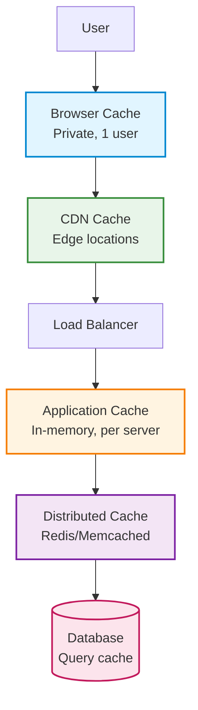

# Caching

Complete guide to implementing caching for performance optimization in backend systems.

## Best Practices Checklist

| # | Best Practice | Reference / Details |
|:-:|--------------|---------------------|
| ⬜ | **Cache frequently accessed data** | [When to Cache](#when-to-cache) - Read-heavy, computation-heavy |
| ⬜ | **Set appropriate TTL (Time To Live)** | [TTL Strategies](#ttl-time-to-live) - Balance freshness vs performance |
| ⬜ | **Implement cache invalidation** | [Invalidation](#cache-invalidation) - Keep data consistent |
| ⬜ | **Use cache-aside pattern for reads** | [Cache-Aside](#cache-aside-lazy-loading) - Load on demand |
| ⬜ | **Monitor cache hit/miss ratio** | Target >80% hit ratio |
| ⬜ | **Implement cache warming for critical data** | [Cache Warming](#cache-warming) - Preload on startup |
| ⬜ | **Use compression for large values** | Reduce memory usage |
| ⬜ | **Handle cache failures gracefully** | [Fallback](#fallback-strategies) - Continue without cache |
| ⬜ | **Use different cache layers** | [Multi-Layer](#multi-layer-caching) - Browser, CDN, Application, Database |
| ⬜ | **Avoid caching user-specific data** | Or use per-user cache keys |
| ⬜ | **Set cache size limits** | [Eviction Policies](#eviction-policies) - LRU, LFU, FIFO |
| ⬜ | **Use cache tags for grouped invalidation** | Invalidate related items together |
| ⬜ | **Implement stale-while-revalidate** | [SWR](#stale-while-revalidate) - Serve stale, update async |
| ⬜ | **Cache at the right layer** | Closer to user = faster response |
| ⬜ | **Use Redis for distributed caching** | [Redis](#redis) - Shared cache across servers |
| ⬜ | **Implement cache stampede prevention** | [Stampede](#cache-stampede-prevention) - Lock during regeneration |
| ⬜ | **Cache database query results** | [Query Caching](#database-query-caching) - Reduce DB load |
| ⬜ | **Use HTTP caching headers** | [HTTP Cache](#http-caching) - Browser and CDN caching |
| ⬜ | **Monitor cache memory usage** | Prevent OOM errors |
| ⬜ | **Document cache keys and TTLs** | Make it maintainable |

---

## Caching Layers



| Layer | Scope | Latency | Use Case |
|-------|-------|---------|----------|
| **Browser** | Single user | ~0ms | Static assets, API responses |
| **CDN** | Geographic region | ~10-50ms | Images, videos, static files |
| **Load Balancer** | All users | ~1-5ms | Rate limiting data |
| **Application (In-memory)** | Single server | ~0.1ms | Session data, hot data |
| **Distributed (Redis)** | All servers | ~1-2ms | Shared data, sessions |
| **Database** | All servers | ~10-100ms | Query results |

---

## When to Cache

### ✅ Good Candidates

- **Read-heavy data** (read:write ratio > 10:1)
- **Expensive computations** (> 100ms processing time)
- **External API responses** (third-party rate limits)
- **Database query results** (complex joins, aggregations)
- **Static or rarely changing data** (configuration, reference data)
- **User sessions** (authentication state)
- **Rendered HTML pages** (server-side rendering)

### ❌ Poor Candidates

- **Frequently changing data** (real-time stock prices)
- **User-specific sensitive data** (unless encrypted)
- **Small, fast queries** (< 5ms, not worth caching overhead)
- **Data requiring strong consistency** (financial transactions)
- **Large objects** (> 1MB, use CDN instead)

---

## Cache Storage Technologies

| Feature | In-Memory (Node.js) | Redis | Memcached |
|---------|---------------------|-------|-----------|
| **Scope** | Single server | Distributed | Distributed |
| **Latency** | ~0.1ms | ~1-2ms | ~1-2ms |
| **Persistence** | ❌ No | ✅ Yes (optional) | ❌ No |
| **Data Structures** | Key-value only | Strings, Hashes, Lists, Sets, Sorted Sets | Key-value only |
| **Max Value Size** | Limited by RAM | 512MB per key | 1MB per key |
| **Setup Complexity** | ⭐ Easy | ⭐⭐ Medium | ⭐⭐ Medium |
| **Clustering** | ❌ No | ✅ Yes | ✅ Yes |
| **Pub/Sub** | ❌ No | ✅ Yes | ❌ No |
| **Transactions** | ❌ No | ✅ Yes | ❌ No |
| **TTL Support** | ✅ Yes | ✅ Yes | ✅ Yes |
| **Use Case** | Single server, temporary cache | Production, distributed systems | Simple distributed caching |
| **Best For** | Development, small apps | Most production use cases | High-performance key-value only |

**Recommendation:**
- Use **In-Memory** for single-server or development
- Use **Redis** for production (most versatile)
- Use **Memcached** for simple, high-performance key-value caching

## HTTP Caching

### Cache-Control Headers

🕒 `Cache-Control` = <i>"How long can you keep this item before checking again?"</i>

**Common Directives:**

| Directive | Meaning | Use Case |
|-----------|---------|----------|
| `public` | Can be cached by anyone (CDN, browser) | Public data |
| `private` | Only browser can cache | User-specific data |
| `no-cache` | Must revalidate with server | Frequently changing |
| `no-store` | Don't cache at all | Sensitive data |
| `max-age=3600` | Cache for 3600 seconds | Static data |
| `s-maxage=3600` | CDN cache time (overrides max-age) | CDN optimization |
| `must-revalidate` | Check with server when stale | Important data |
| `immutable` | Never changes (use with versioned URLs) | JS/CSS bundles |

---

### ETag (Entity Tag)

🔍 `ETag` = <i>"If you check, how do you know whether it changed?"</i>

### Practical Guide

| Scenario | Use Cache-Control | Use ETag | Why |
|----------|-------------------|----------|-----|
| **Static assets (images, JS, CSS)** | ✅ Yes — long `max-age` or `immutable` | ❌ Not needed if versioned filenames | File content rarely changes |
| **API responses (e.g. /users/123)** | ✅ Yes — short `max-age`, `no-cache` | ✅ Yes — strong ETag for conditional GET | Data can change, but often doesn't |
| **Dynamic HTML pages** | ⚠️ Maybe (`no-cache`, `must-revalidate`) | ✅ Yes | Content can change unpredictably |
| **Private user data** | ✅ `private`, `no-store` | ❌ | Should not be cached at all |
| **Public JSON feeds** | ✅ `public`, `max-age=60` | ✅ Yes | Ideal for efficient polling |

### Quick Reference Guide

| Goal | Use |
|------|-----|
| **Control how long data stays fresh** | `Cache-Control` |
| **Detect if data changed** | `ETag` |
| **Save bandwidth on revalidation** | `ETag` + `Cache-Control: no-cache` |
| **Avoid caching sensitive data** | `Cache-Control: no-store` |
| **Cache versioned static files forever** | `Cache-Control: public, max-age=31536000, immutable` |

---

## Cache Invalidation

### Time-Based (TTL)

```javascript
// Set TTL when caching
await redis.setex('product:123', 3600, JSON.stringify(product)); // 1 hour

// Or set TTL separately
await redis.set('product:123', JSON.stringify(product));
await redis.expire('product:123', 3600);
```

### Event-Based

```javascript
// Invalidate on update
const updateProduct = async (productId, data) => {
  await db.products.update({ id: productId }, data);

  // Invalidate cache
  await redis.del(`product:${productId}`);
  await redis.del(`products:list`); // Also invalidate list cache
};
```

### Tag-Based

```javascript
// Cache with tags
const cacheWithTags = async (key, value, tags, ttl) => {
  await redis.setex(key, ttl, JSON.stringify(value));

  // Store reverse mapping
  for (const tag of tags) {
    await redis.sadd(`tag:${tag}`, key);
  }
};

// Invalidate by tag
const invalidateByTag = async (tag) => {
  const keys = await redis.smembers(`tag:${tag}`);

  if (keys.length > 0) {
    await redis.del(...keys);
    await redis.del(`tag:${tag}`);
  }
};

// Usage
await cacheWithTags(
  'product:123',
  product,
  ['category:electronics', 'brand:apple'],
  3600
);

// Invalidate all electronics
await invalidateByTag('category:electronics');
```

---

### Key Metrics to Track

```javascript
const cacheStats = {
  hits: 0,
  misses: 0,
  errors: 0
};

const getWithStats = async (key) => {
  try {
    const value = await redis.get(key);

    if (value) {
      cacheStats.hits++;
      return JSON.parse(value);
    } else {
      cacheStats.misses++;
      return null;
    }
  } catch (error) {
    cacheStats.errors++;
    throw error;
  }
};

// Calculate hit ratio
const getHitRatio = () => {
  const total = cacheStats.hits + cacheStats.misses;
  return total > 0 ? (cacheStats.hits / total * 100).toFixed(2) : 0;
};

// Expose metrics endpoint
app.get('/metrics/cache', (req, res) => {
  res.json({
    ...cacheStats,
    hitRatio: `${getHitRatio()}%`
  });
});
```

---

## Eviction Policies

| Policy | Description | Use Case |
|--------|-------------|----------|
| **LRU** (Least Recently Used) | Remove oldest accessed items | General purpose |
| **LFU** (Least Frequently Used) | Remove least used items | Hot data caching |
| **FIFO** (First In First Out) | Remove oldest items | Simple queue |
| **TTL** | Remove expired items | Time-sensitive data |
| **Random** | Remove random items | Simple, fast |

**Redis Configuration:**

```bash
# redis.conf
maxmemory 2gb
maxmemory-policy allkeys-lru  # LRU eviction
```

## Tags

`caching`, `performance`, `redis`, `memcached`, `optimization`, `scalability`

---

*Last updated: 2025-11-02*
