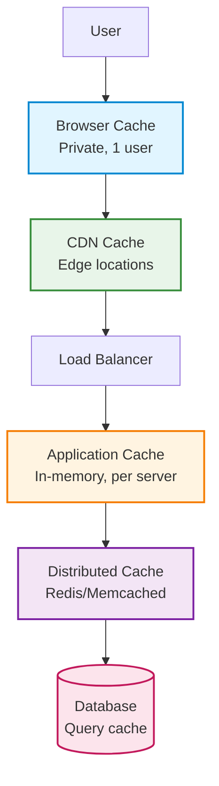

# Caching

Complete guide to implementing caching for performance optimization in backend systems.

## Best Practices Checklist

| # | Best Practice | Reference / Details |
|:-:|--------------|---------------------|
| ⬜ | **Cache frequently accessed data** | [When to Cache](#when-to-cache) - Read-heavy, computation-heavy |
| ⬜ | **Set appropriate TTL (Time To Live)** | [TTL Strategies](#ttl-time-to-live) - Balance freshness vs performance |
| ⬜ | **Implement cache invalidation** | [Invalidation](#cache-invalidation) - Keep data consistent |
| ⬜ | **Use cache-aside pattern for reads** | [Cache-Aside](#cache-aside-lazy-loading) - Load on demand |
| ⬜ | **Monitor cache hit/miss ratio** | Target >80% hit ratio |
| ⬜ | **Implement cache warming for critical data** | [Cache Warming](#cache-warming) - Preload on startup |
| ⬜ | **Use compression for large values** | Reduce memory usage |
| ⬜ | **Handle cache failures gracefully** | [Fallback](#fallback-strategies) - Continue without cache |
| ⬜ | **Use different cache layers** | [Multi-Layer](#multi-layer-caching) - Browser, CDN, Application, Database |
| ⬜ | **Avoid caching user-specific data** | Or use per-user cache keys |
| ⬜ | **Set cache size limits** | [Eviction Policies](#eviction-policies) - LRU, LFU, FIFO |
| ⬜ | **Use cache tags for grouped invalidation** | Invalidate related items together |
| ⬜ | **Implement stale-while-revalidate** | [SWR](#stale-while-revalidate) - Serve stale, update async |
| ⬜ | **Cache at the right layer** | Closer to user = faster response |
| ⬜ | **Use Redis for distributed caching** | [Redis](#redis) - Shared cache across servers |
| ⬜ | **Implement cache stampede prevention** | [Stampede](#cache-stampede-prevention) - Lock during regeneration |
| ⬜ | **Cache database query results** | [Query Caching](#database-query-caching) - Reduce DB load |
| ⬜ | **Use HTTP caching headers** | [HTTP Cache](#http-caching) - Browser and CDN caching |
| ⬜ | **Monitor cache memory usage** | Prevent OOM errors |
| ⬜ | **Document cache keys and TTLs** | Make it maintainable |

---

## Caching Layers



| Layer | Scope | Latency | Use Case |
|-------|-------|---------|----------|
| **Browser** | Single user | ~0ms | Static assets, API responses |
| **CDN** | Geographic region | ~10-50ms | Images, videos, static files |
| **Load Balancer** | All users | ~1-5ms | Rate limiting data |
| **Application (In-memory)** | Single server | ~0.1ms | Session data, hot data |
| **Distributed (Redis)** | All servers | ~1-2ms | Shared data, sessions |
| **Database** | All servers | ~10-100ms | Query results |

---

## When to Cache

### ✅ Good Candidates

- **Read-heavy data** (read:write ratio > 10:1)
- **Expensive computations** (> 100ms processing time)
- **External API responses** (third-party rate limits)
- **Database query results** (complex joins, aggregations)
- **Static or rarely changing data** (configuration, reference data)
- **User sessions** (authentication state)
- **Rendered HTML pages** (server-side rendering)

### ❌ Poor Candidates

- **Frequently changing data** (real-time stock prices)
- **User-specific sensitive data** (unless encrypted)
- **Small, fast queries** (< 5ms, not worth caching overhead)
- **Data requiring strong consistency** (financial transactions)
- **Large objects** (> 1MB, use CDN instead)

---

## Cache Storage Technologies

| Feature | In-Memory (Node.js) | Redis | Memcached |
|---------|---------------------|-------|-----------|
| **Scope** | Single server | Distributed | Distributed |
| **Latency** | ~0.1ms | ~1-2ms | ~1-2ms |
| **Persistence** | ❌ No | ✅ Yes (optional) | ❌ No |
| **Data Structures** | Key-value only | Strings, Hashes, Lists, Sets, Sorted Sets | Key-value only |
| **Max Value Size** | Limited by RAM | 512MB per key | 1MB per key |
| **Setup Complexity** | ⭐ Easy | ⭐⭐ Medium | ⭐⭐ Medium |
| **Clustering** | ❌ No | ✅ Yes | ✅ Yes |
| **Pub/Sub** | ❌ No | ✅ Yes | ❌ No |
| **Transactions** | ❌ No | ✅ Yes | ❌ No |
| **TTL Support** | ✅ Yes | ✅ Yes | ✅ Yes |
| **Use Case** | Single server, temporary cache | Production, distributed systems | Simple distributed caching |
| **Best For** | Development, small apps | Most production use cases | High-performance key-value only |

**Recommendation:**
- Use **In-Memory** for single-server or development
- Use **Redis** for production (most versatile)
- Use **Memcached** for simple, high-performance key-value caching

## HTTP Caching

### Cache-Control Headers

```javascript
// Express.js
app.get('/api/products', (req, res) => {
  res.set('Cache-Control', 'public, max-age=3600'); // 1 hour
  res.json(products);
});

// Static assets (never changes)
app.use('/static', express.static('public', {
  maxAge: '1y',
  immutable: true
}));

// Private data (browser only)
app.get('/api/user/profile', (req, res) => {
  res.set('Cache-Control', 'private, max-age=300'); // 5 minutes
  res.json(userProfile);
});

// No cache
app.get('/api/realtime/stock', (req, res) => {
  res.set('Cache-Control', 'no-store, no-cache, must-revalidate');
  res.json(stockPrice);
});
```

**Common Directives:**

| Directive | Meaning | Use Case |
|-----------|---------|----------|
| `public` | Can be cached by anyone (CDN, browser) | Public data |
| `private` | Only browser can cache | User-specific data |
| `no-cache` | Must revalidate with server | Frequently changing |
| `no-store` | Don't cache at all | Sensitive data |
| `max-age=3600` | Cache for 3600 seconds | Static data |
| `s-maxage=3600` | CDN cache time (overrides max-age) | CDN optimization |
| `must-revalidate` | Check with server when stale | Important data |
| `immutable` | Never changes (use with versioned URLs) | JS/CSS bundles |

---

### ETag (Entity Tag)

```javascript
const crypto = require('crypto');

app.get('/api/article/:id', async (req, res) => {
  const article = await db.articles.findById(req.params.id);

  // Generate ETag from content
  const etag = crypto.createHash('md5')
    .update(JSON.stringify(article))
    .digest('hex');

  // Check if client has current version
  if (req.headers['if-none-match'] === etag) {
    return res.status(304).end(); // Not Modified
  }

  res.set('ETag', etag);
  res.set('Cache-Control', 'private, max-age=0, must-revalidate');
  res.json(article);
});
```

---

## Cache Invalidation

### Time-Based (TTL)

```javascript
// Set TTL when caching
await redis.setex('product:123', 3600, JSON.stringify(product)); // 1 hour

// Or set TTL separately
await redis.set('product:123', JSON.stringify(product));
await redis.expire('product:123', 3600);
```

### Event-Based

```javascript
// Invalidate on update
const updateProduct = async (productId, data) => {
  await db.products.update({ id: productId }, data);

  // Invalidate cache
  await redis.del(`product:${productId}`);
  await redis.del(`products:list`); // Also invalidate list cache
};
```

### Tag-Based

```javascript
// Cache with tags
const cacheWithTags = async (key, value, tags, ttl) => {
  await redis.setex(key, ttl, JSON.stringify(value));

  // Store reverse mapping
  for (const tag of tags) {
    await redis.sadd(`tag:${tag}`, key);
  }
};

// Invalidate by tag
const invalidateByTag = async (tag) => {
  const keys = await redis.smembers(`tag:${tag}`);

  if (keys.length > 0) {
    await redis.del(...keys);
    await redis.del(`tag:${tag}`);
  }
};

// Usage
await cacheWithTags(
  'product:123',
  product,
  ['category:electronics', 'brand:apple'],
  3600
);

// Invalidate all electronics
await invalidateByTag('category:electronics');
```

---

## Advanced Patterns

### Stale-While-Revalidate

Serve stale data while fetching fresh data in background.

```javascript
const getSWR = async (key, fetchFn, ttl = 3600, staleTime = 300) => {
  const cached = await redis.get(key);

  if (cached) {
    const data = JSON.parse(cached);
    const cachedAt = data._cachedAt;

    // Check if stale (older than staleTime)
    if (Date.now() - cachedAt > staleTime * 1000) {
      // Refresh in background
      fetchFn().then(fresh => {
        redis.setex(key, ttl, JSON.stringify({
          ...fresh,
          _cachedAt: Date.now()
        }));
      });
    }

    return data;
  }

  // Cache miss - fetch fresh
  const fresh = await fetchFn();
  await redis.setex(key, ttl, JSON.stringify({
    ...fresh,
    _cachedAt: Date.now()
  }));

  return fresh;
};

// Usage
const products = await getSWR(
  'products:list',
  () => db.products.find(),
  3600,  // 1 hour TTL
  300    // Revalidate after 5 minutes
);
```

---

### Cache Stampede Prevention

Prevent multiple requests from regenerating cache simultaneously.

```javascript
const Redlock = require('redlock');
const redlock = new Redlock([redis]);

const getWithLock = async (key, fetchFn, ttl = 3600) => {
  const cached = await redis.get(key);
  if (cached) {
    return JSON.parse(cached);
  }

  const lockKey = `lock:${key}`;

  try {
    // Try to acquire lock
    const lock = await redlock.lock(lockKey, 10000); // 10 second lock

    // Check cache again (maybe another process filled it)
    const cached = await redis.get(key);
    if (cached) {
      await lock.unlock();
      return JSON.parse(cached);
    }

    // Fetch fresh data
    const fresh = await fetchFn();
    await redis.setex(key, ttl, JSON.stringify(fresh));

    await lock.unlock();
    return fresh;

  } catch (error) {
    // Couldn't acquire lock - wait and retry
    await new Promise(resolve => setTimeout(resolve, 100));
    return getWithLock(key, fetchFn, ttl);
  }
};
```

---

### Multi-Layer Caching

```javascript
class MultiLayerCache {
  constructor() {
    this.l1 = new NodeCache({ stdTTL: 60 }); // In-memory (1 min)
    this.l2 = redis; // Redis (shared)
  }

  async get(key) {
    // L1 cache (fastest)
    let value = this.l1.get(key);
    if (value) {
      return value;
    }

    // L2 cache (shared)
    const cached = await this.l2.get(key);
    if (cached) {
      value = JSON.parse(cached);
      this.l1.set(key, value); // Promote to L1
      return value;
    }

    return null;
  }

  async set(key, value, ttl) {
    this.l1.set(key, value, ttl);
    await this.l2.setex(key, ttl, JSON.stringify(value));
  }

  async del(key) {
    this.l1.del(key);
    await this.l2.del(key);
  }
}

const cache = new MultiLayerCache();
```

---

### Cache Warming

Preload cache with critical data on startup.

```javascript
const warmCache = async () => {
  console.log('Warming cache...');

  // Load popular products
  const products = await db.products.find({ popular: true });
  for (const product of products) {
    await redis.setex(
      `product:${product.id}`,
      3600,
      JSON.stringify(product)
    );
  }

  // Load configuration
  const config = await db.config.find();
  await redis.setex('config', 86400, JSON.stringify(config));

  console.log('Cache warmed');
};

// Run on server startup
app.listen(3000, async () => {
  await warmCache();
  console.log('Server ready');
});
```

---

### Database Query Caching

```javascript
// Wrapper for database queries
const cachedQuery = async (cacheKey, query, ttl = 3600) => {
  const cached = await redis.get(cacheKey);
  if (cached) {
    return JSON.parse(cached);
  }

  const result = await query();
  await redis.setex(cacheKey, ttl, JSON.stringify(result));

  return result;
};

// Usage
const getProducts = async (category) => {
  return cachedQuery(
    `products:category:${category}`,
    () => db.products.find({ category }),
    3600
  );
};
```

---

## Monitoring & Metrics

### Key Metrics to Track

```javascript
const cacheStats = {
  hits: 0,
  misses: 0,
  errors: 0
};

const getWithStats = async (key) => {
  try {
    const value = await redis.get(key);

    if (value) {
      cacheStats.hits++;
      return JSON.parse(value);
    } else {
      cacheStats.misses++;
      return null;
    }
  } catch (error) {
    cacheStats.errors++;
    throw error;
  }
};

// Calculate hit ratio
const getHitRatio = () => {
  const total = cacheStats.hits + cacheStats.misses;
  return total > 0 ? (cacheStats.hits / total * 100).toFixed(2) : 0;
};

// Expose metrics endpoint
app.get('/metrics/cache', (req, res) => {
  res.json({
    ...cacheStats,
    hitRatio: `${getHitRatio()}%`
  });
});
```

---

## Eviction Policies

| Policy | Description | Use Case |
|--------|-------------|----------|
| **LRU** (Least Recently Used) | Remove oldest accessed items | General purpose |
| **LFU** (Least Frequently Used) | Remove least used items | Hot data caching |
| **FIFO** (First In First Out) | Remove oldest items | Simple queue |
| **TTL** | Remove expired items | Time-sensitive data |
| **Random** | Remove random items | Simple, fast |

**Redis Configuration:**

```bash
# redis.conf
maxmemory 2gb
maxmemory-policy allkeys-lru  # LRU eviction
```

## Tags

`caching`, `performance`, `redis`, `memcached`, `optimization`, `scalability`

---

*Last updated: 2025-11-02*
