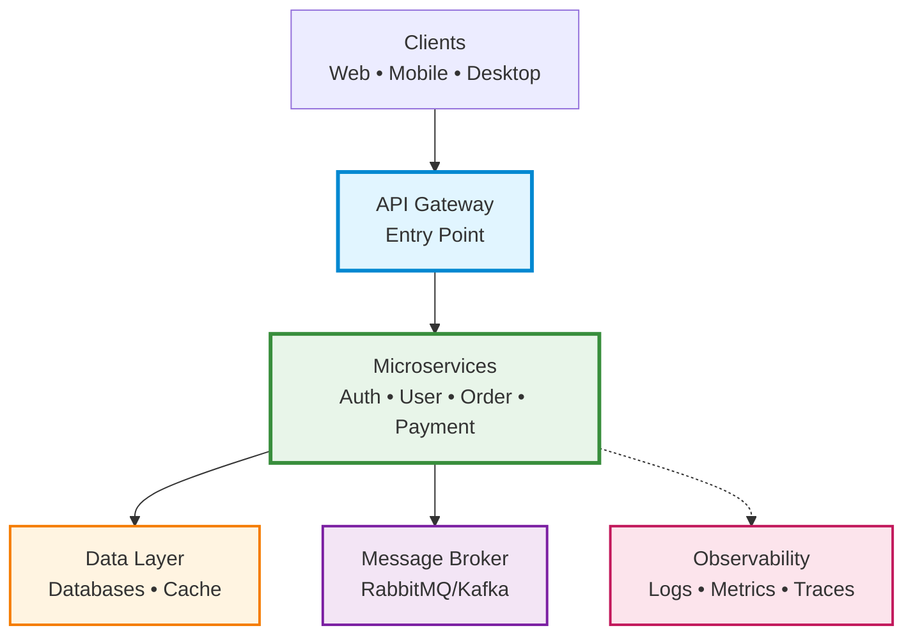
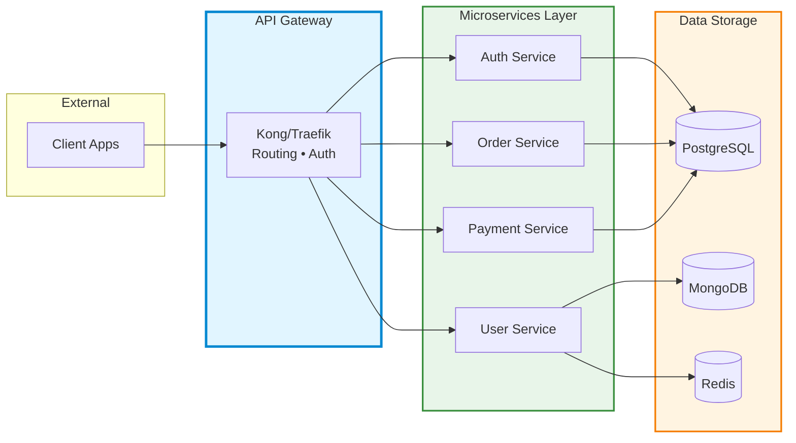
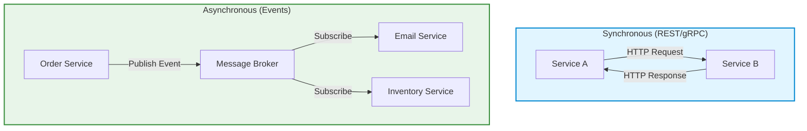

# Microservices

Guide to designing, building, and deploying microservices with best practices, frameworks, and tools.

## Best Practices Checklist

| # | Best Practice | Reference / Details |
|:-:|--------------|---------------------|
| ⬜ | **Use API Gateway for client access** | [API Gateway](#api-gateway) - Centralized entry point |
| ⬜ | **Implement service discovery** | [Service Discovery](#service-discovery) - Consul, Eureka, or K8s DNS |
| ⬜ | **Use asynchronous messaging** | [Communication Patterns](#communication-patterns) - Event-driven with message brokers |
| ⬜ | **Implement circuit breakers** | [Resilience Patterns](#circuit-breaker) - Prevent cascading failures |
| ⬜ | **Implement health checks** | [Health Checks](#health-checks) - `/health` and `/ready` endpoints |
| ⬜ | **Use database per service** | [Data Management](#database-per-service) - Avoid shared databases |
| ⬜ | **Implement authentication/authorization** | [Security](#authentication--authorization) - OAuth2, JWT, service mesh |
| ⬜ | **Implement rate limiting** | [Security](#rate-limiting) - Protect services from overload |
| ⬜ | **Handle failures gracefully** | [Resilience Patterns](#retry-pattern) - Retry, timeout, fallback |

---

## Architecture Overview

### High-Level Architecture



### Detailed Service Flow



### Communication Flow



---

## Communication Patterns

### Synchronous (REST/gRPC)

**When to use:**

- Direct request/response needed
- Real-time operations
- Simple CRUD operations

**REST Example:**

```javascript
// User Service calls Order Service
const orders = await fetch('http://order-service/api/v1/orders?userId=123');
```

**gRPC Example:**

```protobuf
// order.proto
service OrderService {
  rpc GetOrders (GetOrdersRequest) returns (GetOrdersResponse);
}
```

### Asynchronous (Message Broker)

**When to use:**

- Decoupled services
- Event-driven architecture
- High throughput

**Event-Driven Example:**

```javascript
// Order Service publishes event
await messageQueue.publish('order.created', {
  orderId: '123',
  userId: 'user-456',
  total: 99.99
});

// Notification Service subscribes
messageQueue.subscribe('order.created', async (event) => {
  await sendEmail(event.userId, 'Order Confirmation');
});
```

---

## Best Frameworks by Language

### Node.js

| Framework | Best For | Difficulty | Use Case |
|-----------|----------|------------|----------|
| **Express.js** | Simple APIs, flexibility | ⭐ Easy | General-purpose, REST APIs |
| **NestJS** | Enterprise apps, TypeScript | ⭐⭐ Medium | Complex business logic, scalable apps |
| **Fastify** | High performance | ⭐⭐ Medium | Performance-critical services |
| **Koa** | Minimalist APIs | ⭐ Easy | Lightweight services |

**Recommendation:** NestJS for enterprise, Express.js for simple services

### Python

| Framework | Best For | Difficulty | Use Case |
|-----------|----------|------------|----------|
| **FastAPI** | Modern APIs, auto docs | ⭐⭐ Medium | Data APIs, ML services, async operations |
| **Django REST** | Full-featured REST APIs | ⭐⭐⭐ Hard | Complex CRUD, admin panels |
| **Flask** | Lightweight APIs | ⭐ Easy | Simple services, prototypes |
| **Sanic** | Async high performance | ⭐⭐ Medium | High-throughput services |

**Recommendation:** FastAPI for modern microservices, Django REST for traditional apps

### Java

| Framework | Best For | Difficulty | Use Case |
|-----------|----------|------------|----------|
| **Spring Boot** | Enterprise microservices | ⭐⭐⭐ Hard | Large-scale production systems |
| **Micronaut** | Low memory, fast startup | ⭐⭐ Medium | Cloud-native, serverless |
| **Quarkus** | Kubernetes-native | ⭐⭐ Medium | Container-optimized services |
| **Helidon** | Lightweight cloud services | ⭐⭐ Medium | Modern cloud apps |

**Recommendation:** Spring Boot for enterprise, Quarkus for cloud-native

### Go

| Framework | Best For | Difficulty | Use Case |
|-----------|----------|------------|----------|
| **Gin** | Fast HTTP APIs | ⭐ Easy | High-performance REST APIs |
| **Echo** | Minimalist framework | ⭐ Easy | Simple services |
| **Fiber** | Express-like experience | ⭐ Easy | Fast APIs with familiar syntax |
| **Go-kit** | Distributed systems | ⭐⭐⭐ Hard | Complex microservices architecture |

**Recommendation:** Gin for most cases, Go-kit for complex systems

### C# / .NET

| Framework | Best For | Difficulty | Use Case |
|-----------|----------|------------|----------|
| **ASP.NET Core** | Enterprise microservices | ⭐⭐ Medium | Full-featured production services |
| **Minimal APIs** | Simple endpoints | ⭐ Easy | Lightweight services |
| **Dapr** | Distributed apps | ⭐⭐⭐ Hard | Cloud-native, polyglot systems |

**Recommendation:** ASP.NET Core for .NET ecosystem

### Rust

| Framework | Best For | Difficulty | Use Case |
|-----------|----------|------------|----------|
| **Actix-web** | High performance, async | ⭐⭐ Medium | Ultra-fast APIs, high-throughput services |
| **Rocket** | Developer-friendly | ⭐⭐ Medium | Type-safe web services |
| **Axum** | Modern, ergonomic | ⭐⭐ Medium | Async services with Tokio ecosystem |
| **Warp** | Composable filters | ⭐⭐⭐ Hard | Complex routing, filter-based APIs |

**Recommendation:** Actix-web for performance, Axum for modern async

---

## Essential Tools

### API Gateway

| Tool | Best For | Deployment |
|------|----------|------------|
| **Kong** | Enterprise, plugins | Self-hosted, Cloud |
| **NGINX** | High performance, simple | Self-hosted |
| **Traefik** | Kubernetes-native | K8s, Docker |
| **AWS API Gateway** | AWS ecosystem | AWS Cloud |
| **Azure API Management** | Azure ecosystem | Azure Cloud |

**Recommendation:** Traefik for Kubernetes, Kong for self-hosted

### Service Discovery

| Tool | Best For | Integration |
|------|----------|-------------|
| **Consul** | Multi-cloud, K8s | HashiCorp stack |
| **Eureka** | Spring ecosystem | Java/Spring Boot |
| **Kubernetes DNS** | K8s only | Built-in K8s |
| **etcd** | Kubernetes, distributed config | Cloud-native |

**Recommendation:** Kubernetes DNS if using K8s, Consul otherwise

### Message Brokers

| Tool | Best For | Use Case |
|------|----------|----------|
| **RabbitMQ** | Traditional messaging | Work queues, task distribution |
| **Apache Kafka** | High-throughput streaming | Event sourcing, logs, analytics |
| **NATS** | Lightweight, fast | Real-time messaging |
| **AWS SQS/SNS** | AWS ecosystem | Managed queuing |
| **Redis Streams** | Simple pub/sub | Caching + messaging |

**Recommendation:** Kafka for event streaming, RabbitMQ for task queues

### Observability

**Logging:**

| Tool | Type | Best For |
|------|------|----------|
| **ELK Stack** | Elasticsearch + Logstash + Kibana | Full-text search, analytics |
| **Loki** | Grafana Labs | Kubernetes logs |
| **Fluentd** | Log aggregator | Multi-source collection |

**Metrics:**

| Tool | Best For |
|------|----------|
| **Prometheus** | Time-series metrics |
| **Grafana** | Visualization dashboards |
| **Datadog** | All-in-one SaaS |

**Tracing:**

| Tool | Best For |
|------|----------|
| **Jaeger** | Distributed tracing |
| **Zipkin** | Lightweight tracing |
| **OpenTelemetry** | Vendor-neutral standard |

**Recommendation:** Prometheus + Grafana + Jaeger (open-source stack)

---

## Database Per Service

Each service manages its own database:

```
Auth Service → PostgreSQL (Relational data)
User Service → MongoDB (Document store)
Order Service → PostgreSQL (Transactions)
Product Service → Elasticsearch (Search)
Analytics Service → ClickHouse (Time-series)
Cache Layer → Redis (In-memory)
```

**Why?**

- ✅ Service independence
- ✅ Technology flexibility
- ✅ Easier scaling
- ⚠️ Distributed transactions complexity

---

## Resilience Patterns

### Circuit Breaker

Prevent cascading failures:

```javascript
const circuitBreaker = require('opossum');

const options = {
  timeout: 3000,      // Timeout after 3s
  errorThresholdPercentage: 50,  // Open after 50% errors
  resetTimeout: 30000  // Try again after 30s
};

const breaker = circuitBreaker(callExternalService, options);

breaker.fallback(() => ({ error: 'Service unavailable' }));

// Use breaker
const result = await breaker.fire(params);
```

### Retry Pattern

Retry failed requests:

```javascript
const retry = require('async-retry');

await retry(async () => {
  const response = await fetch('http://external-service/api');
  if (!response.ok) throw new Error('Request failed');
  return response.json();
}, {
  retries: 3,
  minTimeout: 1000,
  maxTimeout: 5000
});
```

### Timeout Pattern

Always set timeouts:

```javascript
const timeout = (promise, ms) => {
  return Promise.race([
    promise,
    new Promise((_, reject) =>
      setTimeout(() => reject(new Error('Timeout')), ms)
    )
  ]);
};

// Use timeout
await timeout(fetch('http://slow-service'), 5000);
```

---

## API Gateway

Centralized entry point for all services:

**Responsibilities:**

| Function | Description |
|----------|-------------|
| **Routing** | Forward requests to appropriate services |
| **Authentication** | Verify JWT tokens |
| **Rate limiting** | Prevent abuse |
| **Load balancing** | Distribute traffic |
| **Caching** | Cache frequent responses |
| **Logging** | Centralized request logs |
| **SSL termination** | Handle HTTPS |

**Example (NGINX):**

```nginx
upstream user-service {
  server user-service:3000;
}

upstream order-service {
  server order-service:3001;
}

server {
  listen 80;

  location /api/v1/users {
    proxy_pass http://user-service;
  }

  location /api/v1/orders {
    proxy_pass http://order-service;
  }
}
```

---

## Health Checks

Implement health endpoints:

```javascript
// Express.js example
app.get('/health', (req, res) => {
  res.json({ status: 'UP', timestamp: new Date() });
});

app.get('/health/ready', async (req, res) => {
  const checks = await Promise.all([
    checkDatabase(),
    checkMessageQueue(),
    checkCache()
  ]);

  const isReady = checks.every(check => check.ok);
  res.status(isReady ? 200 : 503).json({
    status: isReady ? 'READY' : 'NOT_READY',
    checks
  });
});
```

---

## Security

### Authentication & Authorization

**OAuth2 + JWT:**

```javascript
// Verify JWT in API Gateway
const jwt = require('jsonwebtoken');

app.use((req, res, next) => {
  const token = req.headers.authorization?.split(' ')[1];

  try {
    const decoded = jwt.verify(token, process.env.JWT_SECRET);
    req.user = decoded;
    next();
  } catch (error) {
    res.status(401).json({ error: 'Unauthorized' });
  }
});
```

### Service Mesh

**Istio/Linkerd benefits:**

- mTLS between services
- Traffic management
- Observability
- Security policies

### Rate Limiting

```javascript
const rateLimit = require('express-rate-limit');

const limiter = rateLimit({
  windowMs: 15 * 60 * 1000,  // 15 minutes
  max: 100  // 100 requests per window
});

app.use('/api/', limiter);
```

---

## When to Use Microservices

### ✅ Good Fit

- Large, complex applications
- Multiple development teams
- Need independent scaling
- Different technology requirements per component
- Frequent deployments

### ❌ Not Recommended

- Small applications
- Single team (< 5 developers)
- Simple CRUD applications
- Tight coupling between components
- Limited operational expertise

## Tags

`microservices`, `architecture`, `distributed-systems`, `backend`, `design-patterns`, `devops`

---

*Last updated: 2025-11-02*
