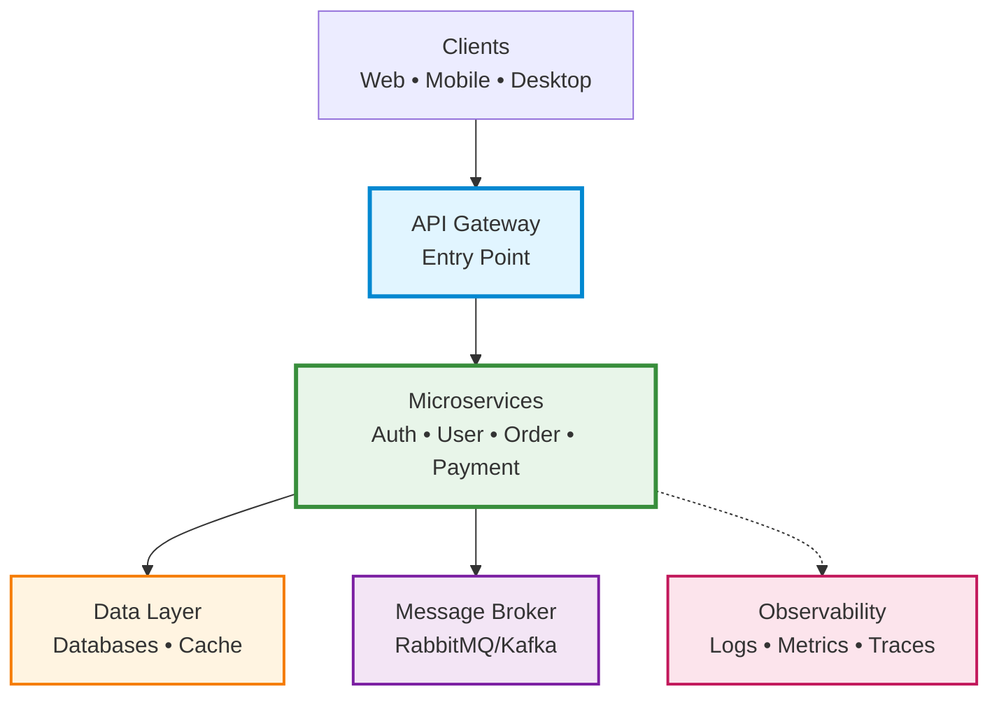
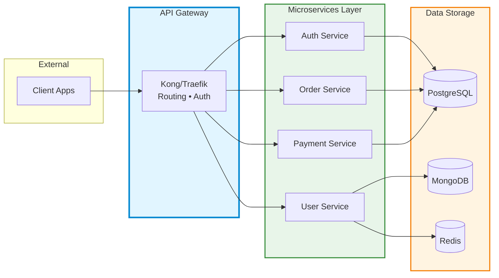
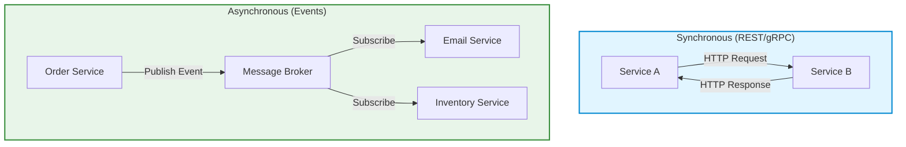

# Microservices

Guide to designing, building, and deploying microservices with best practices, frameworks, and tools.

## Best Practices Checklist

| # | Best Practice | Reference / Details |
|:-:|--------------|---------------------|
| ⬜ | **Use API Gateway for client access** | [API Gateway](#api-gateway) - Centralized entry point |
| ⬜ | **Implement service discovery** | [Service Discovery](#service-discovery) - Consul, Eureka, or K8s DNS |
| ⬜ | **Use asynchronous messaging** | [Communication Patterns](#communication-patterns) - Event-driven with message brokers |
| ⬜ | **Implement circuit breakers** | Prevent cascading failures |
| ⬜ | **Implement health checks** | `/health` and `/ready` endpoints |
| ⬜ | **Use database per service** | Avoid shared databases |
| ⬜ | **Implement rate limiting** | Protect services from overload |
| ⬜ | **Handle failures gracefully** | Retry, timeout, fallback pattern |

---

## Architecture Overview

### High-Level Architecture

### Detailed Service Flow

### Communication Flow

---

## Communication Patterns

| Pattern | Type | Protocol | Use Cases | Pros | Cons | Best For |
|---------|------|----------|-----------|------|------|----------|
| **REST** | Synchronous | HTTP/JSON | • Direct request/response • Simple CRUD operations • Real-time operations | ✅ Simple, widely adopted ✅ Easy to debug ✅ Human-readable ✅ Cacheable | ❌ Tight coupling ❌ Latency sensitive ❌ Over/under-fetching data | Simple services, public APIs, traditional web apps |
| **gRPC** | Synchronous | HTTP/2 + Protobuf | • High-performance RPC • Streaming data • Service-to-service calls | ✅ Very fast (binary) ✅ Built-in code generation ✅ Bi-directional streaming ✅ Type-safe | ❌ Harder to debug ❌ Binary format ❌ Limited browser support | Internal microservices, low-latency services, polyglot systems |
| **GraphQL** | Synchronous | HTTP/JSON | • Complex data queries • Mobile/web clients • Aggregated data from multiple services | ✅ Flexible queries ✅ No over-fetching ✅ Single endpoint ✅ Strongly typed | ❌ Complex server setup ❌ Caching challenges ❌ N+1 query problem | BFF (Backend for Frontend), mobile apps, complex UIs |
| **Message Queue** | Asynchronous | AMQP/Custom | • Task distribution • Work queues • Decoupled services | ✅ Reliable delivery ✅ Load leveling ✅ Retry mechanisms ✅ Decoupled | ❌ Eventual consistency ❌ Complex debugging ❌ Message ordering issues | Background jobs, email sending, image processing |
| **Event Streaming** | Asynchronous | Kafka Protocol | • Event sourcing • Real-time analytics • Event-driven architecture | ✅ High throughput ✅ Event replay ✅ Multiple consumers ✅ Scalable | ❌ Complex setup ❌ Eventual consistency ❌ Storage overhead | Activity tracking, log aggregation, real-time analytics |
| **WebSocket** | Synchronous | WebSocket | • Real-time bidirectional • Live updates • Chat, gaming | ✅ Real-time, low latency ✅ Persistent connection ✅ Bidirectional | ❌ Connection management ❌ Scaling challenges ❌ Firewall issues | Chat apps, live dashboards, gaming, real-time collaboration |

### Pattern Selection Guide

| Requirement | Recommended Pattern |
|-------------|---------------------|
| **Need immediate response** | REST or gRPC |
| **High performance between services** | gRPC |
| **Background processing** | Message Queue |
| **Event sourcing / audit trail** | Event Streaming (Kafka) |
| **Real-time updates to clients** | WebSocket or Server-Sent Events |
| **Complex data aggregation** | GraphQL |
| **Simple public API** | REST |
| **Decoupled microservices** | Message Queue or Event Streaming |

---

## Best Frameworks by Language

### Node.js

| Framework | Best For | Difficulty | Use Case |
|-----------|----------|------------|----------|
| **Express.js** | Simple APIs, flexibility | ⭐ Easy | General-purpose, REST APIs |
| **NestJS** | Enterprise apps, TypeScript | ⭐⭐ Medium | Complex business logic, scalable apps |
| **Fastify** | High performance | ⭐⭐ Medium | Performance-critical services |
| **Koa** | Minimalist APIs | ⭐ Easy | Lightweight services |

**Recommendation:** NestJS for enterprise, Express.js for simple services

### Python

| Framework | Best For | Difficulty | Use Case |
|-----------|----------|------------|----------|
| **FastAPI** | Modern APIs, auto docs | ⭐⭐ Medium | Data APIs, ML services, async operations |
| **Django REST** | Full-featured REST APIs | ⭐⭐⭐ Hard | Complex CRUD, admin panels |
| **Flask** | Lightweight APIs | ⭐ Easy | Simple services, prototypes |
| **Sanic** | Async high performance | ⭐⭐ Medium | High-throughput services |

**Recommendation:** FastAPI for modern microservices, Django REST for traditional apps

### Java

| Framework | Best For | Difficulty | Use Case |
|-----------|----------|------------|----------|
| **Spring Boot** | Enterprise microservices | ⭐⭐⭐ Hard | Large-scale production systems |
| **Micronaut** | Low memory, fast startup | ⭐⭐ Medium | Cloud-native, serverless |
| **Quarkus** | Kubernetes-native | ⭐⭐ Medium | Container-optimized services |
| **Helidon** | Lightweight cloud services | ⭐⭐ Medium | Modern cloud apps |

**Recommendation:** Spring Boot for enterprise, Quarkus for cloud-native

### Go

| Framework | Best For | Difficulty | Use Case |
|-----------|----------|------------|----------|
| **Gin** | Fast HTTP APIs | ⭐ Easy | High-performance REST APIs |
| **Echo** | Minimalist framework | ⭐ Easy | Simple services |
| **Fiber** | Express-like experience | ⭐ Easy | Fast APIs with familiar syntax |
| **Go-kit** | Distributed systems | ⭐⭐⭐ Hard | Complex microservices architecture |

**Recommendation:** Gin for most cases, Go-kit for complex systems

### C# / .NET

| Framework | Best For | Difficulty | Use Case |
|-----------|----------|------------|----------|
| **ASP.NET Core** | Enterprise microservices | ⭐⭐ Medium | Full-featured production services |
| **Minimal APIs** | Simple endpoints | ⭐ Easy | Lightweight services |
| **Dapr** | Distributed apps | ⭐⭐⭐ Hard | Cloud-native, polyglot systems |

**Recommendation:** ASP.NET Core for .NET ecosystem

### Rust

| Framework | Best For | Difficulty | Use Case |
|-----------|----------|------------|----------|
| **Actix-web** | High performance, async | ⭐⭐ Medium | Ultra-fast APIs, high-throughput services |
| **Rocket** | Developer-friendly | ⭐⭐ Medium | Type-safe web services |
| **Axum** | Modern, ergonomic | ⭐⭐ Medium | Async services with Tokio ecosystem |
| **Warp** | Composable filters | ⭐⭐⭐ Hard | Complex routing, filter-based APIs |

**Recommendation:** Actix-web for performance, Axum for modern async

---

## Essential Tools

### API Gateway

| Tool | Best For | Deployment |
|------|----------|------------|
| **Kong** | Enterprise, plugins | Self-hosted, Cloud |
| **NGINX** | High performance, simple | Self-hosted |
| **Traefik** | Kubernetes-native | K8s, Docker |
| **AWS API Gateway** | AWS ecosystem | AWS Cloud |
| **Azure API Management** | Azure ecosystem | Azure Cloud |

**Recommendation:** Traefik for Kubernetes, Kong for self-hosted

### Service Discovery

| Tool | Best For | Integration |
|------|----------|-------------|
| **Consul** | Multi-cloud, K8s | HashiCorp stack |
| **Eureka** | Spring ecosystem | Java/Spring Boot |
| **Kubernetes DNS** | K8s only | Built-in K8s |
| **etcd** | Kubernetes, distributed config | Cloud-native |

**Recommendation:** Kubernetes DNS if using K8s, Consul otherwise

### Message Brokers

| Tool | Best For | Use Case |
|------|----------|----------|
| **RabbitMQ** | Traditional messaging | Work queues, task distribution |
| **Apache Kafka** | High-throughput streaming | Event sourcing, logs, analytics |
| **NATS** | Lightweight, fast | Real-time messaging |
| **AWS SQS/SNS** | AWS ecosystem | Managed queuing |
| **Redis Streams** | Simple pub/sub | Caching + messaging |

**Recommendation:** Kafka for event streaming, RabbitMQ for task queues

### Observability

**Logging:**

| Tool | Type | Best For |
|------|------|----------|
| **ELK Stack** | Elasticsearch + Logstash + Kibana | Full-text search, analytics |
| **Loki** | Grafana Labs | Kubernetes logs |
| **Fluentd** | Log aggregator | Multi-source collection |

**Metrics:**

| Tool | Best For |
|------|----------|
| **Prometheus** | Time-series metrics |
| **Grafana** | Visualization dashboards |
| **Datadog** | All-in-one SaaS |

**Tracing:**

| Tool | Best For |
|------|----------|
| **Jaeger** | Distributed tracing |
| **Zipkin** | Lightweight tracing |
| **OpenTelemetry** | Vendor-neutral standard |

**Recommendation:** Prometheus + Grafana + Jaeger (open-source stack)

---

## API Gateway

Centralized entry point for all services:

**Responsibilities:**

| Function | Description |
|----------|-------------|
| **Routing** | Forward requests to appropriate services |
| **Authentication** | Verify JWT tokens |
| **Rate limiting** | Prevent abuse |
| **Load balancing** | Distribute traffic |
| **Caching** | Cache frequent responses |
| **Logging** | Centralized request logs |
| **SSL termination** | Handle HTTPS |

## Tags

`microservices`, `architecture`, `distributed-systems`, `backend`, `design-patterns`, `devops`

---

*Last updated: 2025-11-02*
