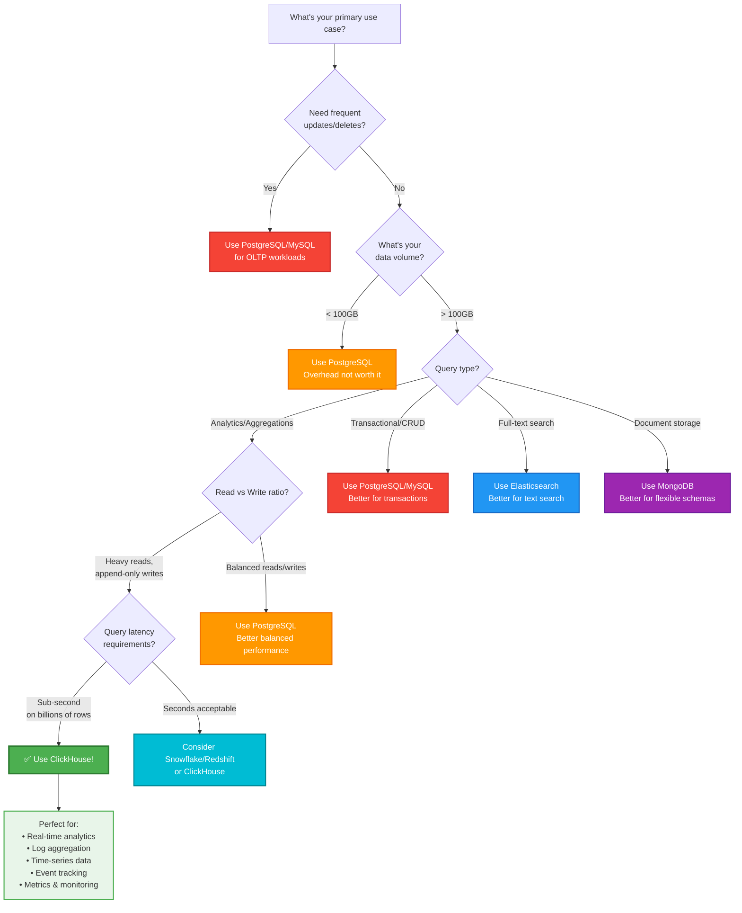

# ClickHouse

A high-performance, column-oriented SQL database management system (DBMS) designed for online analytical processing (OLAP) and real-time analytics on massive datasets.

## Use Cases

### When to Use ClickHouse

Choose ClickHouse over other databases when you need its unique strengths:

| Use Case | Why ClickHouse Over Other Databases |
|----------|-------------------------------------|
| **Real-Time Analytics & BI** | **vs PostgreSQL/MySQL**: 100-1000x faster for aggregations on billions of rows thanks to columnar storage. Query entire year of data in milliseconds instead of minutes.<br/><br/>**vs Elasticsearch**: Better compression (10-20x), lower storage costs, and true SQL support for complex analytics. More efficient for structured time-series data.<br/><br/>**vs BigQuery/Snowflake**: Lower costs for high-frequency queries, no cold start delays, and full control over infrastructure. Better for real-time dashboards. |
| **Log Analytics & Monitoring** | **vs Elasticsearch**: 5-10x better compression means lower storage costs. Faster aggregations on large time ranges. Native support for complex SQL analytics without learning DSL.<br/><br/>**vs Splunk**: Dramatically lower costs (open source), better performance on structured logs, and SQL interface that developers already know.<br/><br/>**vs Traditional RDBMS**: Can handle 100x more log volume with better query performance. Purpose-built for append-only log data. |
| **Time-Series Data** | **vs InfluxDB/TimescaleDB**: Superior performance at scale (billions of data points), better compression, and more flexible query capabilities with full SQL support.<br/><br/>**vs Prometheus**: Can store years of metrics data efficiently (vs weeks/months), supports complex joins and aggregations, and handles high cardinality better.<br/><br/>**vs Cassandra**: Faster analytical queries, better compression, simpler operations, and SQL interface instead of CQL. |
| **E-commerce & Product Analytics** | **vs MongoDB**: 50-100x faster for aggregations and analytics queries. Better for read-heavy analytical workloads. Columnar format perfect for user event data.<br/><br/>**vs Data Warehouses (Redshift/BigQuery)**: Lower latency for real-time queries (milliseconds vs seconds), lower costs for frequent queries, and no vendor lock-in.<br/><br/>**vs PostgreSQL**: Can analyze billions of user events in real-time. PostgreSQL would struggle with even millions of rows for complex funnel queries. |
| **Financial Data & Ad-Tech** | **vs Traditional Databases**: Can process millions of transactions per second with sub-second query latency. Built for high-throughput ingestion.<br/><br/>**vs Kafka + Stream Processing**: Serves as both storage and query engine, eliminating need for separate systems. Direct SQL queries on streaming data.<br/><br/>**vs In-Memory Databases (Redis)**: Similar query speeds but with persistent storage, much higher data volumes, and lower memory costs. |
| **Data Warehousing** | **vs Snowflake/BigQuery**: 10-100x lower costs for same workload, no vendor lock-in, and better performance for real-time queries. Full control over infrastructure.<br/><br/>**vs Hadoop/Spark**: Simpler architecture (no complex clusters), faster queries (seconds vs minutes), and SQL interface instead of MapReduce/Spark jobs.<br/><br/>**vs Redshift**: Better compression, faster queries, lower costs, and easier to operate. No need for VACUUM or complex maintenance. |

### Decision Flowchart: Should You Use ClickHouse?



**Quick Decision Table:**

| Your Scenario | Recommendation | Why |
|---------------|----------------|-----|
| Frequent updates/deletes on records | ❌ PostgreSQL/MySQL | ClickHouse is terrible at mutations |
| Dataset &lt; 100GB | ⚠️ PostgreSQL | ClickHouse overhead not worth it |
| Transactional workloads (CRUD operations) | ❌ PostgreSQL/MySQL | Need ACID guarantees |
| Flexible document schemas (JSON heavy) | ❌ MongoDB | Better for unstructured data |
| Full-text search across documents | ❌ Elasticsearch | Purpose-built for search |
| Primary application database | ❌ PostgreSQL/MySQL | ClickHouse is analytics-only |
| Analytics on 100GB+ data, append-only | ✅ ClickHouse | Perfect fit! |
| Real-time dashboards on billions of rows | ✅ ClickHouse | Sub-second queries |
| Log aggregation at scale | ✅ ClickHouse | Excellent compression & speed |
| Time-series metrics (years of data) | ✅ ClickHouse | Better than Prometheus/InfluxDB |
| Event tracking & user analytics | ✅ ClickHouse | Made for this! |

## Key Features

### Key Characteristics

- **Columnar Storage**: Data is stored by columns rather than rows, dramatically improving compression ratios and query performance for analytical workloads
- **Vectorized Query Execution**: Processes data in batches rather than row-by-row, significantly reducing processing time and enabling parallelization
- **Real-Time Data Ingestion**: Handles millions of events per second with low latency
- **Horizontal Scalability**: Scales across multiple nodes for distributed analytical workloads
- **SQL Support**: Uses standard SQL with extensions for analytical queries
- **Compression**: Achieves 10x-100x compression ratios due to columnar format

### 1. Lightning-Fast Queries

```sql
-- Scan 10 billion rows in seconds
SELECT
    toStartOfDay(timestamp) as day,
    countIf(status = 200) as success,
    countIf(status >= 400) as errors,
    avg(response_time) as avg_time,
    quantile(0.99)(response_time) as p99_time
FROM http_logs
WHERE timestamp >= today() - 30
GROUP BY day
ORDER BY day DESC

-- Typical execution time: 100-500ms on 10B rows
```

### 2. Efficient Compression

```sql
-- Example compression ratios
CREATE TABLE events (
    timestamp DateTime,
    user_id UInt64,
    event_name String,
    properties String
) ENGINE = MergeTree()
ORDER BY (timestamp, user_id)
SETTINGS index_granularity = 8192;

-- Compression: 1TB uncompressed → 50-100GB compressed (10-20x)
```

### 3. Materialized Views

```sql
-- Pre-aggregate data for instant queries
CREATE MATERIALIZED VIEW daily_stats
ENGINE = SummingMergeTree()
ORDER BY (date, country)
AS SELECT
    toDate(timestamp) as date,
    country,
    count() as events,
    sum(revenue) as total_revenue
FROM raw_events
GROUP BY date, country;

-- Query the materialized view (instant results)
SELECT * FROM daily_stats WHERE date >= today() - 7;
```

### 4. Distributed Queries

```sql
-- Query distributed across multiple nodes
CREATE TABLE events_distributed AS events
ENGINE = Distributed(cluster_name, default, events, rand());

-- Automatically parallelized across all nodes
SELECT count() FROM events_distributed;
```

### 5. Advanced SQL Features

```sql
-- Array functions
SELECT
    arrayMap(x -> x * 2, [1, 2, 3]) as doubled;

-- JSON extraction
SELECT
    JSONExtractString(properties, 'user_agent') as browser
FROM events;

-- Approximate algorithms for speed
SELECT
    uniqExact(user_id) as exact_users,      -- Exact count (slower)
    uniq(user_id) as approx_users           -- ~2% error (10x faster)
FROM events;
```

## Pricing

### ClickHouse Cloud Pricing (2025)

As of January 2025, ClickHouse Cloud introduced updated pricing with significant changes:

| Component | Cost | Notes |
|-----------|------|-------|
| **Compute** | vCPU + RAM based | Pay-as-you-go model |
| **Storage** | $25.30 per TiB | Compare to AWS S3: $23/TiB |
| **Data Transfer (Egress)** | New fees (2025) | Makes migrations expensive |
| **Price Change** | ~30% increase | Grandfathered until July 23, 2025 |

### Self-Hosted Pricing

| Deployment Option | Cost Range | Details |
|-------------------|------------|---------|
| **Open Source** | Free | Apache 2.0 license, community support |
| **AWS Infrastructure** | $500-$5,000/month | c5.2xlarge: $0.34/hr (~$245/mo)<br/>EBS SSD: ~$0.10/GB/month |
| **GCP Infrastructure** | Similar to AWS | Comparable instance and storage costs |
| **On-Premises** | Hardware costs | Server hardware + operational expenses |

### Managed Service Alternatives

| Provider | Key Features | Pricing Model |
|----------|--------------|---------------|
| **Altinity.Cloud** | • Fully managed ClickHouse<br/>• 100% open source (no restrictions)<br/>• BYOC/BYOK support<br/>• Better transparency | More cost-effective than ClickHouse Cloud |
| **DoubleCloud** | • Managed service on AWS/GCP<br/>• Multi-cloud support | Competitive pricing |
| **ClickHouse Cloud** | • Official managed service<br/>• Automatic scaling | Premium pricing, egress fees apply |

## Setup & Installation

### Docker (Quickest Start)

```bash
# Run ClickHouse server
docker run -d \
  --name clickhouse-server \
  -p 8123:8123 \
  -p 9000:9000 \
  --ulimit nofile=262144:262144 \
  clickhouse/clickhouse-server

# Connect with CLI client
docker run -it --rm \
  --link clickhouse-server:clickhouse \
  clickhouse/clickhouse-client \
  --host clickhouse
```

### Docker Compose (Development)

Create `docker-compose.yml`:

```yaml
version: '3.8'

services:
  clickhouse:
    image: clickhouse/clickhouse-server:latest
    container_name: clickhouse
    ports:
      - "8123:8123"  # HTTP interface
      - "9000:9000"  # Native interface
      - "9009:9009"  # Inter-server communication
    volumes:
      - ./clickhouse-data:/var/lib/clickhouse
      - ./clickhouse-config:/etc/clickhouse-server
    ulimits:
      nofile:
        soft: 262144
        hard: 262144
    environment:
      CLICKHOUSE_DB: analytics
      CLICKHOUSE_USER: admin
      CLICKHOUSE_PASSWORD: secure_password
      CLICKHOUSE_DEFAULT_ACCESS_MANAGEMENT: 1

  clickhouse-client:
    image: clickhouse/clickhouse-client:latest
    container_name: clickhouse-client
    depends_on:
      - clickhouse
    command: ['--host', 'clickhouse']
    profiles:
      - client

volumes:
  clickhouse-data:
  clickhouse-config:
```

Start the cluster:

```bash
# Start server
docker-compose up -d

# Connect with client
docker-compose run --rm clickhouse-client

# Or use HTTP interface
curl 'http://localhost:8123/?query=SELECT+version()'
```

### Kubernetes with Altinity Operator

#### Install the Operator

```bash
# Install Altinity ClickHouse Operator
kubectl apply -f https://raw.githubusercontent.com/Altinity/clickhouse-operator/master/deploy/operator/clickhouse-operator-install-bundle.yaml

# Verify installation
kubectl get pods -n kube-system | grep clickhouse-operator
```

#### Deploy ClickHouse Cluster

Create `clickhouse-cluster.yaml`:

```yaml
apiVersion: "clickhouse.altinity.com/v1"
kind: "ClickHouseInstallation"
metadata:
  name: "clickhouse-cluster"
  namespace: analytics
spec:
  configuration:
    clusters:
      - name: "main-cluster"
        layout:
          shardsCount: 4
          replicasCount: 3
        schemaPolicy:
          replica: "All"
          shard: "All"
    zookeeper:
      nodes:
        - host: zookeeper-0.zookeeper-headless
          port: 2181
        - host: zookeeper-1.zookeeper-headless
          port: 2181
        - host: zookeeper-2.zookeeper-headless
          port: 2181
    users:
      admin/password_sha256_hex: "ba7816bf8f01cfea414140de5dae2223b00361a396177a9cb410ff61f20015ad"
      admin/networks/ip:
        - "10.0.0.0/8"
      analytics/password: "analytics_password"
      analytics/profile: "default"
  defaults:
    templates:
      podTemplate: pod-template
      dataVolumeClaimTemplate: data-volume
      logVolumeClaimTemplate: log-volume
  templates:
    podTemplates:
      - name: pod-template
        spec:
          containers:
            - name: clickhouse
              image: clickhouse/clickhouse-server:24.11
              resources:
                requests:
                  memory: "16Gi"
                  cpu: "4"
                limits:
                  memory: "32Gi"
                  cpu: "8"
    volumeClaimTemplates:
      - name: data-volume
        spec:
          accessModes:
            - ReadWriteOnce
          resources:
            requests:
              storage: 500Gi
          storageClassName: fast-ssd
      - name: log-volume
        spec:
          accessModes:
            - ReadWriteOnce
          resources:
            requests:
              storage: 50Gi
```

Deploy:

```bash
# Apply the configuration
kubectl apply -f clickhouse-cluster.yaml

# Check status
kubectl get chi

# Get service endpoints
kubectl get svc | grep clickhouse

# Connect to ClickHouse
kubectl exec -it chi-simple-cluster-production-0-0-0 -- clickhouse-client
```

### macOS Installation

```bash
# Using Homebrew
brew install clickhouse

# Start server
clickhouse-server

# In another terminal, connect
clickhouse-client
```

## Development Guide

### Creating Your First Database

```sql
-- Create database
CREATE DATABASE analytics;

-- Use database
USE analytics;

-- Create table with MergeTree engine
CREATE TABLE events (
    timestamp DateTime,
    event_id UInt64,
    user_id UInt64,
    event_name String,
    country LowCardinality(String),
    city String,
    properties String,
    revenue Decimal(10, 2)
) ENGINE = MergeTree()
PARTITION BY toYYYYMM(timestamp)
ORDER BY (timestamp, user_id, event_id)
TTL timestamp + INTERVAL 90 DAY
SETTINGS index_granularity = 8192;
```

### Common Queries

```sql
-- Time-series aggregation
SELECT
    toStartOfHour(timestamp) as hour,
    uniq(user_id) as unique_users,
    count() as total_events,
    sum(revenue) as total_revenue
FROM events
WHERE timestamp >= now() - INTERVAL 24 HOUR
GROUP BY hour
ORDER BY hour DESC;

-- Top N analysis
SELECT
    country,
    city,
    count() as events,
    uniq(user_id) as users
FROM events
WHERE timestamp >= today()
GROUP BY country, city
ORDER BY events DESC
LIMIT 10;

-- Funnel analysis
SELECT
    user_id,
    groupArray(event_name) as funnel
FROM events
WHERE timestamp >= today()
    AND event_name IN ('page_view', 'add_to_cart', 'checkout', 'purchase')
GROUP BY user_id
HAVING length(funnel) >= 2
ORDER BY length(funnel) DESC;

-- Retention cohorts
SELECT
    toStartOfWeek(timestamp) as cohort_week,
    countDistinct(user_id) as cohort_size,
    countDistinctIf(user_id, timestamp >= cohort_week + INTERVAL 7 DAY) as week_1,
    countDistinctIf(user_id, timestamp >= cohort_week + INTERVAL 14 DAY) as week_2
FROM events
GROUP BY cohort_week
ORDER BY cohort_week DESC;
```

### Data Migration from PostgreSQL

```sql
-- In ClickHouse, create table matching PostgreSQL schema
CREATE TABLE users_clickhouse (
    id UInt64,
    email String,
    created_at DateTime,
    last_login DateTime
) ENGINE = MergeTree()
ORDER BY (id, created_at);

-- Use MaterializedPostgreSQL engine for real-time sync
CREATE DATABASE postgres_db
ENGINE = MaterializedPostgreSQL('postgres:5432', 'database_name', 'user', 'password');

-- Or use PostgreSQL table function for one-time import
INSERT INTO users_clickhouse
SELECT id, email, created_at, last_login
FROM postgresql('postgres:5432', 'database_name', 'users', 'user', 'password');
```

### Performance Tuning

```sql
-- Check query performance
SELECT
    query,
    event_time,
    query_duration_ms,
    read_rows,
    read_bytes
FROM system.query_log
WHERE type = 'QueryFinish'
ORDER BY event_time DESC
LIMIT 10;

-- Check table size and compression
SELECT
    table,
    formatReadableSize(sum(bytes)) as size,
    sum(rows) as rows,
    avg(compression_codec) as compression_ratio
FROM system.parts
WHERE active
GROUP BY table;

-- Optimize table (merge parts)
OPTIMIZE TABLE events FINAL;

-- Check for slow queries
SELECT
    query,
    query_duration_ms
FROM system.query_log
WHERE query_duration_ms > 1000
ORDER BY query_duration_ms DESC
LIMIT 20;
```

## Best Practices

### 1. Choose the Right Table Engine

```sql
-- MergeTree: Most common, for general use
CREATE TABLE events ENGINE = MergeTree()
ORDER BY (timestamp, user_id);

-- ReplacingMergeTree: Deduplicate rows
CREATE TABLE users ENGINE = ReplacingMergeTree()
ORDER BY user_id;

-- SummingMergeTree: Pre-aggregate metrics
CREATE TABLE metrics ENGINE = SummingMergeTree()
ORDER BY (date, metric_name);

-- Distributed: Query across multiple nodes
CREATE TABLE events_distributed ENGINE = Distributed(
    cluster_name, database, table, rand()
);
```

### 2. Optimize ORDER BY

```sql
-- Good: Query filters match ORDER BY
CREATE TABLE events ENGINE = MergeTree()
ORDER BY (timestamp, user_id, event_name);

-- Queries using this ordering will be fast
SELECT * FROM events
WHERE timestamp >= today()
  AND user_id = 12345;  -- Uses index efficiently

-- Bad: Query filters don't match ORDER BY
SELECT * FROM events
WHERE country = 'US';  -- Full table scan (slow)
```

### 3. Use Partitioning Wisely

```sql
-- Partition by month for time-series data
CREATE TABLE events ENGINE = MergeTree()
PARTITION BY toYYYYMM(timestamp)
ORDER BY (timestamp, user_id);

-- Benefits:
-- 1. Drop old partitions instantly
ALTER TABLE events DROP PARTITION '202501';

-- 2. Query only relevant partitions
SELECT count() FROM events
WHERE timestamp >= '2025-11-01';  -- Only scans November partition
```

### 4. Use Materialized Views

```sql
-- Pre-aggregate heavy queries
CREATE MATERIALIZED VIEW hourly_metrics
ENGINE = SummingMergeTree()
ORDER BY (hour, country)
AS SELECT
    toStartOfHour(timestamp) as hour,
    country,
    count() as events,
    uniq(user_id) as unique_users,
    sum(revenue) as total_revenue
FROM events
GROUP BY hour, country;

-- Query is now instant
SELECT * FROM hourly_metrics
WHERE hour >= today();
```

### 5. Monitor and Optimize

```bash
# Monitor disk usage
clickhouse-client --query "
SELECT
    database,
    table,
    formatReadableSize(sum(bytes)) as size
FROM system.parts
WHERE active
GROUP BY database, table
ORDER BY sum(bytes) DESC"

# Monitor query performance
clickhouse-client --query "
SELECT
    query,
    query_duration_ms,
    read_rows,
    formatReadableSize(read_bytes) as read_size
FROM system.query_log
WHERE type = 'QueryFinish'
  AND event_time >= now() - INTERVAL 1 HOUR
ORDER BY query_duration_ms DESC
LIMIT 10"
```

### 6. Cost Optimization

#### Use Appropriate Compression Codecs

```sql
-- Choose codecs based on data type
CREATE TABLE events (
    timestamp DateTime CODEC(DoubleDelta),        -- Time-series data
    user_id UInt64 CODEC(Delta, LZ4),            -- Sequential IDs
    event_name LowCardinality(String),           -- Save memory for repeated values
    properties String CODEC(ZSTD),               -- Best general compression
    counter UInt32 CODEC(T64, LZ4)               -- Small integers
) ENGINE = MergeTree()
ORDER BY (timestamp, user_id);
```

#### Set TTL to Auto-Delete Old Data

```sql
-- Delete data older than 90 days
ALTER TABLE events
    MODIFY TTL timestamp + INTERVAL 90 DAY;

-- Different retention for different columns
ALTER TABLE events
    MODIFY COLUMN properties String TTL timestamp + INTERVAL 30 DAY,
    MODIFY TTL timestamp + INTERVAL 90 DAY;

-- Move old data to cheaper storage
ALTER TABLE events
    MODIFY TTL
        timestamp + INTERVAL 7 DAY TO VOLUME 'hot',
        timestamp + INTERVAL 30 DAY TO VOLUME 'cold',
        timestamp + INTERVAL 90 DAY DELETE;
```

#### Use Sampling for Exploratory Queries

```sql
-- Query 10% of data for quick exploration
SELECT
    country,
    count() * 10 as estimated_events  -- Multiply by sampling rate
FROM events SAMPLE 0.1
WHERE date = today()
GROUP BY country;

-- Use different sampling rates
SELECT count() FROM events SAMPLE 0.01;  -- 1% sample
SELECT count() FROM events SAMPLE 1000000;  -- Sample 1M rows
```

#### Monitor Storage Costs

```sql
-- Check compression ratios
SELECT
    table,
    formatReadableSize(sum(data_compressed_bytes)) as compressed,
    formatReadableSize(sum(data_uncompressed_bytes)) as uncompressed,
    round(sum(data_uncompressed_bytes) / sum(data_compressed_bytes), 2) as ratio
FROM system.columns
WHERE database = 'analytics'
GROUP BY table
ORDER BY sum(data_compressed_bytes) DESC;

-- Identify large tables
SELECT
    table,
    formatReadableSize(sum(bytes)) as size,
    sum(rows) as rows,
    formatReadableSize(avg(bytes_on_disk)) as avg_part_size
FROM system.parts
WHERE active AND database = 'analytics'
GROUP BY table
ORDER BY sum(bytes) DESC;
```

## Tags

`clickhouse`, `analytics`, `olap`, `columnar-database`, `real-time`, `big-data`, `database`, `sql`, `data-warehouse`, `time-series`

---

*Last updated: 2025-11-07*
