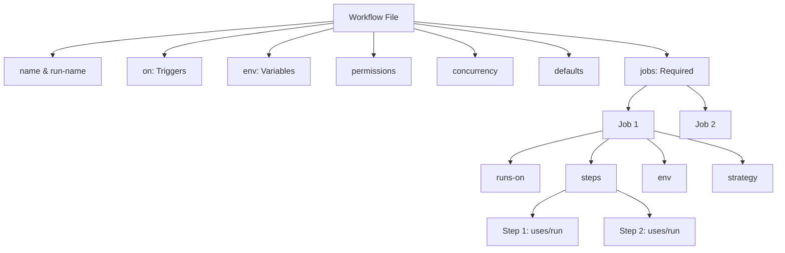

# Configuration Reference

Complete GitHub Actions workflow syntax reference with visual guides.

## Workflow Structure



### Basic Structure

```yaml
name: Workflow Name
on: [push, pull_request]
env:
  GLOBAL_VAR: value
permissions:
  contents: read
jobs:
  job-name:
    runs-on: ubuntu-latest
    steps:
      - uses: actions/checkout@v4
      - run: echo "Hello"
```

## Workflow Triggers

### Trigger Types Overview

| Trigger | Use Case | Example |
|---------|----------|---------|
| `push` | Code pushed to repo | Branch/tag filtering |
| `pull_request` | PR opened/updated | PR lifecycle events |
| `schedule` | Cron-based | Daily builds, cleanup |
| `workflow_dispatch` | Manual trigger | Deploy on-demand |
| `workflow_call` | Reusable workflows | Call from other workflows |
| `repository_dispatch` | External API trigger | Webhook integrations |

### Common Event Patterns

#### push - Branch & Path Filtering

```yaml
on:
  push:
    branches: [main, develop, 'feature/**', '!feature/test']
    paths: ['src/**', '!src/**/*.test.js']
    tags: ['v*']
```

#### pull_request - Types

| Type | When | Common Use |
|------|------|------------|
| `opened` | PR created | Initial checks |
| `synchronize` | New commits | Re-run tests |
| `reopened` | PR reopened | Resume checks |
| `closed` | PR closed | Cleanup |
| `ready_for_review` | Draft → ready | Full CI |
| `review_requested` | Review asked | Notify team |

#### schedule - Cron Jobs

| Pattern | Meaning | Example Use |
|---------|---------|-------------|
| `0 0 * * *` | Daily at midnight | Cleanup, backups |
| `0 */6 * * *` | Every 6 hours | Periodic checks |
| `0 9 * * 1` | Monday 9 AM | Weekly reports |
| `*/15 * * * *` | Every 15 min | Health checks |

```yaml
on:
  schedule:
    - cron: '0 0 * * *'
```

#### workflow_dispatch - Manual Trigger

| Input Type | Use Case | Example |
|------------|----------|---------|
| `string` | Free text | Version number |
| `boolean` | Toggle | Dry run flag |
| `choice` | Dropdown | Environment selection |
| `environment` | Environment select | Deploy target |

```yaml
on:
  workflow_dispatch:
    inputs:
      environment:
        type: choice
        options: [dev, staging, production]
      dry-run:
        type: boolean
        default: false
```

#### workflow_call - Reusable Workflows

```yaml
on:
  workflow_call:
    inputs:
      config-path:
        required: true
        type: string
    secrets:
      token:
        required: true
```

#### All Event Types

| Category | Events |
|----------|--------|
| **Code** | `push`, `pull_request`, `pull_request_target` |
| **Issues** | `issues`, `issue_comment` |
| **Releases** | `release`, `published` |
| **Deployments** | `deployment`, `deployment_status` |
| **Workflow** | `workflow_run`, `workflow_dispatch`, `workflow_call` |
| **Repository** | `create`, `delete`, `fork`, `watch` |
| **External** | `repository_dispatch` |

---

## Environment Variables (`env`)

### Workflow Level
```yaml
env:
  NODE_VERSION: '18'
  DEPLOY_ENV: production

jobs:
  build:
    steps:
      - run: echo $NODE_VERSION
```

### Job Level
```yaml
jobs:
  build:
    env:
      BUILD_TYPE: release
    steps:
      - run: echo $BUILD_TYPE
```

### Step Level
```yaml
- name: Deploy
  env:
    API_KEY: ${{ secrets.API_KEY }}
  run: ./deploy.sh
```

### Default Environment Variables

```yaml
${{ github.actor }}                    # User who triggered
${{ github.event_name }}              # Event that triggered
${{ github.ref }}                      # Branch or tag ref
${{ github.ref_name }}                 # Short ref name
${{ github.repository }}               # owner/repo
${{ github.repository_owner }}         # owner
${{ github.sha }}                      # Commit SHA
${{ github.run_id }}                   # Unique run ID
${{ github.run_number }}               # Run number
${{ github.workflow }}                 # Workflow name
${{ github.job }}                      # Job name
${{ runner.os }}                       # OS (Linux, Windows, macOS)
${{ runner.arch }}                     # Architecture
${{ runner.temp }}                     # Temp directory
```

---

## Permissions

```yaml
# Workflow level
permissions:
  contents: read
  pull-requests: write
  issues: write
  packages: write
  id-token: write
  actions: read
  checks: write
  deployments: write
  statuses: write

# Job level
jobs:
  build:
    permissions:
      contents: read
      packages: write
```

**Permission levels:**
- `read`, `write`, `none`

**Common permissions:**
- `contents` - Repository contents
- `pull-requests` - Pull requests
- `issues` - Issues
- `packages` - GitHub Packages
- `id-token` - OIDC token
- `actions` - GitHub Actions
- `checks` - Checks
- `deployments` - Deployments

---

## Concurrency

```yaml
# Cancel in-progress runs
concurrency:
  group: ${{ github.workflow }}-${{ github.ref }}
  cancel-in-progress: true

# Don't cancel, queue instead
concurrency:
  group: deployment-${{ github.ref }}
  cancel-in-progress: false
```

---

## Defaults

```yaml
defaults:
  run:
    shell: bash
    working-directory: ./src

jobs:
  build:
    defaults:
      run:
        shell: pwsh
        working-directory: ./app
```

**Available shells:**
- `bash`, `sh`
- `pwsh`, `powershell` (Windows)
- `cmd` (Windows)
- `python`

---

## Jobs

### Basic Job Configuration

```yaml
jobs:
  job-id:
    name: Display name
    runs-on: ubuntu-latest
    timeout-minutes: 30
    continue-on-error: false
    if: github.ref == 'refs/heads/main'
    env:
      VAR: value
    outputs:
      result: ${{ steps.step-id.outputs.result }}
    steps:
      - run: echo "Hello"
```

### Runners (`runs-on`)

```yaml
# GitHub-hosted
runs-on: ubuntu-latest        # Ubuntu (latest)
runs-on: ubuntu-22.04         # Ubuntu 22.04
runs-on: ubuntu-20.04         # Ubuntu 20.04
runs-on: windows-latest       # Windows Server
runs-on: macos-latest         # macOS (x86)
runs-on: macos-13             # macOS 13 (x86)
runs-on: macos-14             # macOS 14 (ARM64/M1)

# Larger runners (Team/Enterprise)
runs-on: ubuntu-latest-4-cores
runs-on: ubuntu-latest-8-cores
runs-on: ubuntu-latest-16-cores

# Self-hosted
runs-on: self-hosted
runs-on: [self-hosted, linux, x64]
runs-on: [self-hosted, macOS, ARM64]

# Matrix
runs-on: ${{ matrix.os }}
```

### Job Dependencies

```yaml
jobs:
  setup:
    runs-on: ubuntu-latest
    steps:
      - run: echo "Setup"

  build:
    needs: setup              # Wait for setup
    runs-on: ubuntu-latest
    steps:
      - run: echo "Build"

  test:
    needs: [setup, build]     # Wait for multiple
    runs-on: ubuntu-latest
    steps:
      - run: echo "Test"

  deploy:
    needs: test
    if: success()             # Only if test succeeded
    runs-on: ubuntu-latest
    steps:
      - run: echo "Deploy"
```

### Job Outputs

```yaml
jobs:
  setup:
    runs-on: ubuntu-latest
    outputs:
      version: ${{ steps.get-version.outputs.version }}
      matrix: ${{ steps.set-matrix.outputs.matrix }}
    steps:
      - id: get-version
        run: echo "version=1.2.3" >> $GITHUB_OUTPUT

      - id: set-matrix
        run: echo "matrix=[\"18\", \"20\"]" >> $GITHUB_OUTPUT

  build:
    needs: setup
    runs-on: ubuntu-latest
    steps:
      - run: echo "Version: ${{ needs.setup.outputs.version }}"
```

### Strategy (Matrix)

```yaml
strategy:
  matrix:
    os: [ubuntu-latest, windows-latest, macos-latest]
    node: [16, 18, 20]
    include:
      - os: ubuntu-latest
        node: 20
        experimental: true
    exclude:
      - os: macos-latest
        node: 16
  fail-fast: true             # Stop all on first failure
  max-parallel: 3             # Max concurrent jobs

steps:
  - name: Use matrix values
    run: echo "OS=${{ matrix.os }}, Node=${{ matrix.node }}"
```

### Container Jobs

```yaml
jobs:
  test:
    runs-on: ubuntu-latest
    container:
      image: node:18
      credentials:
        username: ${{ github.actor }}
        password: ${{ secrets.GITHUB_TOKEN }}
      env:
        NODE_ENV: test
      volumes:
        - /data:/data
      options: --cpus 2
```

### Service Containers

```yaml
jobs:
  test:
    runs-on: ubuntu-latest
    services:
      postgres:
        image: postgres:14
        env:
          POSTGRES_PASSWORD: postgres
        options: >-
          --health-cmd pg_isready
          --health-interval 10s
          --health-timeout 5s
          --health-retries 5
        ports:
          - 5432:5432

      redis:
        image: redis:7
        options: >-
          --health-cmd "redis-cli ping"
          --health-interval 10s
        ports:
          - 6379:6379

    steps:
      - run: |
          echo "Postgres available at localhost:5432"
          echo "Redis available at localhost:6379"
```

---

## Steps

### Run Commands

```yaml
- name: Step name
  id: step-id
  run: |
    echo "Multi-line"
    echo "command"
  shell: bash
  working-directory: ./src
  env:
    VAR: value
  continue-on-error: false
  timeout-minutes: 5
  if: success()
```

### Use Actions

```yaml
- uses: actions/checkout@v4
  with:
    fetch-depth: 0
  env:
    VAR: value
  id: checkout
  name: Checkout code
  if: always()
  continue-on-error: false
  timeout-minutes: 10
```

### Conditional Steps

```yaml
# Status functions
if: success()                 # Previous steps succeeded
if: failure()                 # Any previous step failed
if: cancelled()              # Workflow was cancelled
if: always()                 # Always run

# Comparisons
if: github.ref == 'refs/heads/main'
if: github.event_name == 'push'
if: startsWith(github.ref, 'refs/tags/')
if: contains(github.event.head_commit.message, '[skip ci]')
if: runner.os == 'Linux'

# Step outcomes
if: steps.step-id.outcome == 'success'
if: steps.step-id.conclusion == 'failure'

# Job status
if: needs.setup.result == 'success'

# Logical operators
if: success() && github.ref == 'refs/heads/main'
if: failure() || cancelled()
if: "!cancelled()"
```

---

## Expressions and Functions

### String Functions

```yaml
contains(github.ref, 'main')
startsWith(github.ref, 'refs/tags/')
endsWith(github.ref, '/main')
format('Hello {0} {1}', 'GitHub', 'Actions')
join(array, ', ')
toJSON(object)
fromJSON('{"key": "value"}')
```

### Status Functions

```yaml
success()      # All previous steps succeeded
failure()      # Any previous step failed
cancelled()    # Workflow cancelled
always()       # Always execute
```

### Object Filters

```yaml
${{ github.event.*.name }}
${{ github.event.commits.*.message }}
```

### Operators

```yaml
# Comparison
==, !=, <, <=, >, >=

# Logical
&&, ||, !

# Example
if: github.event_name == 'push' && github.ref == 'refs/heads/main'
```

---

## Contexts

### github Context

```yaml
${{ github.actor }}
${{ github.event_name }}
${{ github.ref }}
${{ github.sha }}
${{ github.repository }}
${{ github.workflow }}
${{ github.job }}
${{ github.run_id }}
${{ github.run_number }}
${{ github.event.pull_request.number }}
${{ github.event.issue.number }}
```

### env Context

```yaml
${{ env.MY_VAR }}
```

### job Context

```yaml
${{ job.status }}
${{ job.container.id }}
${{ job.services.postgres.id }}
```

### steps Context

```yaml
${{ steps.step-id.outputs.result }}
${{ steps.step-id.outcome }}         # success, failure, cancelled, skipped
${{ steps.step-id.conclusion }}      # Final status after continue-on-error
```

### runner Context

```yaml
${{ runner.os }}                     # Linux, Windows, macOS
${{ runner.arch }}                   # X86, X64, ARM, ARM64
${{ runner.name }}
${{ runner.temp }}
${{ runner.tool_cache }}
```

### needs Context

```yaml
${{ needs.job-id.result }}           # success, failure, cancelled, skipped
${{ needs.job-id.outputs.key }}
```

### secrets Context

```yaml
${{ secrets.SECRET_NAME }}
```

### inputs Context

```yaml
${{ inputs.parameter-name }}         # For workflow_dispatch and workflow_call
```

---

## Reusable Workflows

### Calling Workflow

```yaml
jobs:
  call-workflow:
    uses: owner/repo/.github/workflows/reusable.yml@main
    with:
      input1: value
    secrets:
      token: ${{ secrets.TOKEN }}
```

### Reusable Workflow Definition

```yaml
on:
  workflow_call:
    inputs:
      input1:
        required: true
        type: string
      input2:
        required: false
        type: number
        default: 10
    secrets:
      token:
        required: true
    outputs:
      output1:
        description: "Output description"
        value: ${{ jobs.job-id.outputs.result }}

jobs:
  job-id:
    runs-on: ubuntu-latest
    steps:
      - run: echo "${{ inputs.input1 }}"
```

---

## Environments

```yaml
jobs:
  deploy:
    runs-on: ubuntu-latest
    environment:
      name: production
      url: https://example.com
    steps:
      - run: ./deploy.sh
```

**Environment features:**
- Protection rules
- Required reviewers
- Wait timer
- Deployment branches
- Environment secrets

---

## Composite Actions

```yaml
# .github/actions/my-action/action.yml
name: 'My Action'
description: 'Action description'
inputs:
  param1:
    description: 'Parameter 1'
    required: true
    default: 'default-value'
outputs:
  result:
    description: 'Result'
    value: ${{ steps.step-id.outputs.result }}

runs:
  using: 'composite'
  steps:
    - run: echo "${{ inputs.param1 }}"
      shell: bash
    - id: step-id
      run: echo "result=success" >> $GITHUB_OUTPUT
      shell: bash
```

---

## Workflow Commands

```bash
# Set output
echo "name=value" >> $GITHUB_OUTPUT

# Set environment variable
echo "VAR=value" >> $GITHUB_ENV

# Add to PATH
echo "/path/to/dir" >> $GITHUB_PATH

# Set step summary
echo "## Summary" >> $GITHUB_STEP_SUMMARY
echo "Build succeeded" >> $GITHUB_STEP_SUMMARY

# Grouping log lines
echo "::group::Group title"
echo "Log lines"
echo "::endgroup::"

# Log commands
echo "::debug::Debug message"
echo "::notice::Notice message"
echo "::warning::Warning message"
echo "::error::Error message"

# Stop commands
echo "::stop-commands::token"
# Commands are ignored
echo "::token::"
```

---

## Artifacts and Caching

### Upload Artifacts

```yaml
- uses: actions/upload-artifact@v4
  with:
    name: my-artifact
    path: |
      dist/
      build/
    retention-days: 5
    if-no-files-found: error
    compression-level: 6
```

### Download Artifacts

```yaml
- uses: actions/download-artifact@v4
  with:
    name: my-artifact
    path: ./download
```

### Cache

```yaml
- uses: actions/cache@v3
  with:
    path: |
      ~/.npm
      ~/.cache
    key: ${{ runner.os }}-${{ hashFiles('**/package-lock.json') }}
    restore-keys: |
      ${{ runner.os }}-
```

---

## Tags

`github-actions`, `configuration`, `reference`, `syntax`, `workflow`, `ci-cd`

---

*Last updated: 2025-10-30*
