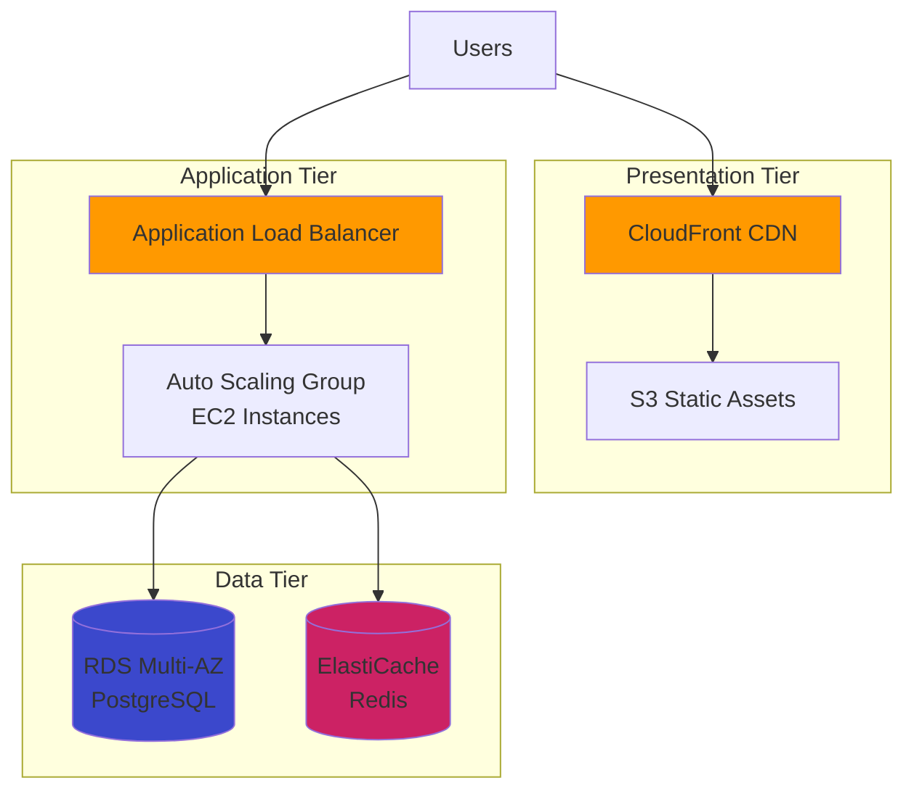
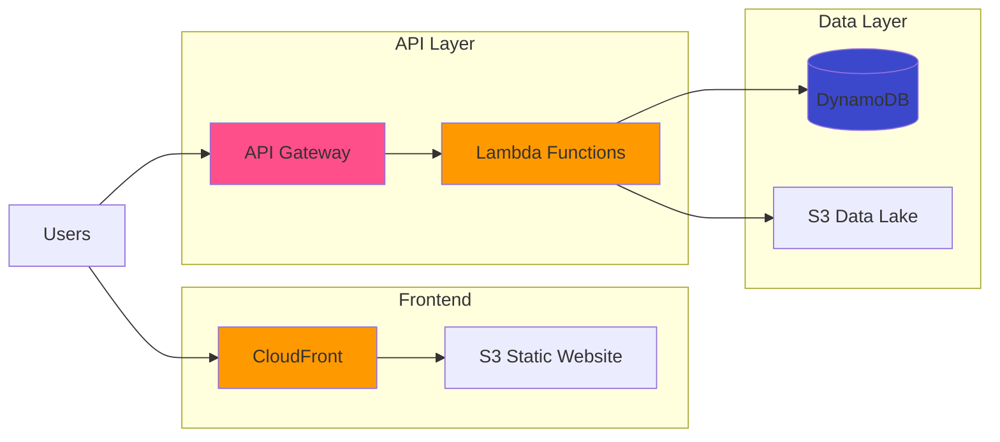
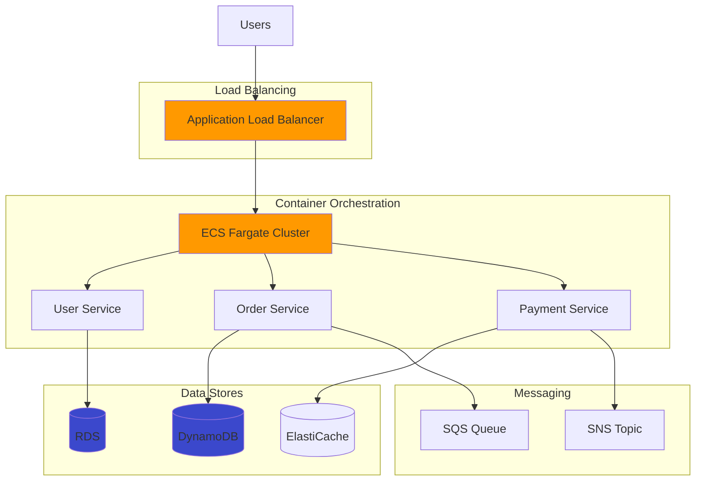
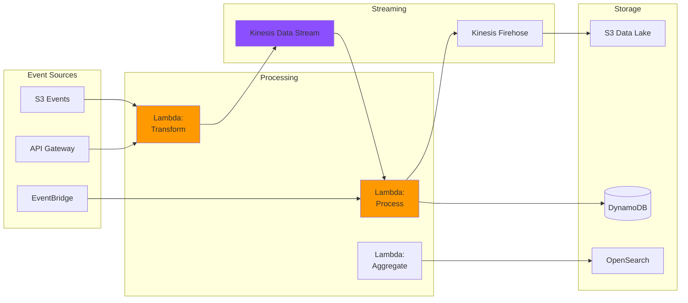
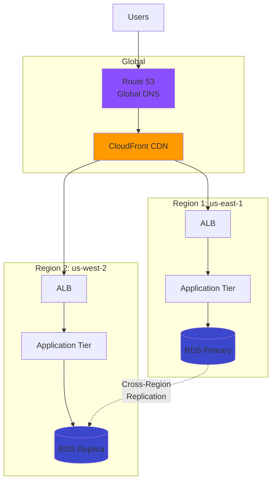

# AWS (Amazon Web Services)

Best practices, architecture patterns, and essential services for building on Amazon Web Services.

## Overview

AWS is the world's most comprehensive cloud platform, offering over 200 services for compute, storage, databases, networking, and more.

## Best Practices

### Security

**1. Identity and Access Management**

- Enable **MFA (Multi-Factor Authentication)** for all users, especially root account
- Use **IAM roles** instead of access keys for EC2 instances and services
- Follow **least privilege principle** - grant only necessary permissions
- Implement **IAM password policies** with complexity requirements
- Rotate **access keys** regularly (90 days maximum)
- Use **AWS Organizations** for multi-account management
- Enable **AWS CloudTrail** for comprehensive audit logging

**2. Data Protection**

- Encrypt data **at rest** using:
  - S3: Server-side encryption (SSE-S3, SSE-KMS)
  - EBS: Volume encryption
  - RDS: Database encryption
- Encrypt data **in transit** using TLS/SSL
- Use **AWS KMS** (Key Management Service) for encryption key management
- Enable **S3 versioning** for important data
- Implement **S3 bucket policies** to prevent public access
- Use **AWS Secrets Manager** for managing credentials and API keys

**3. Network Security**

- Use **Security Groups** as stateful firewalls
- Implement **Network ACLs** for subnet-level security
- Enable **VPC Flow Logs** for network traffic monitoring
- Use **AWS WAF** (Web Application Firewall) for application protection
- Implement **AWS Shield** for DDoS protection
- Use **PrivateLink** for private connectivity to AWS services

**4. Monitoring and Compliance**

- Enable **AWS Config** for resource compliance monitoring
- Use **Amazon GuardDuty** for threat detection
- Implement **AWS Security Hub** for centralized security findings
- Set up **CloudWatch alarms** for security events
- Regular security assessments using **AWS Trusted Advisor**
- Conduct **vulnerability scans** and penetration testing

### Cost Optimization

**1. Compute Cost Optimization**

- Use **Reserved Instances** (RI) for predictable, steady-state workloads (up to 72% savings)
- Leverage **Savings Plans** for flexible commitment-based discounts
- Use **Spot Instances** for fault-tolerant, flexible workloads (up to 90% savings)
- Right-size instances using **AWS Compute Optimizer**
- Implement **Auto Scaling** to match capacity with demand
- Use **Lambda** for event-driven workloads to avoid idle compute costs
- Consider **Graviton instances** for better price-performance

**2. Storage Cost Optimization**

- Implement **S3 Intelligent-Tiering** for automatic cost optimization
- Use **S3 Lifecycle policies** to transition data to cheaper storage classes
- Delete **incomplete multipart uploads** and old snapshots
- Use **EBS gp3** instead of gp2 for better price-performance
- Enable **S3 Transfer Acceleration** only when needed
- Compress and deduplicate data before storage

**3. Monitoring and Governance**

- Set up **AWS Budgets** with alerts for cost thresholds
- Use **Cost Explorer** for detailed cost analysis and forecasting
- Tag resources consistently for **cost allocation tracking**
- Enable **Cost Anomaly Detection** for unusual spending patterns
- Review **Trusted Advisor** cost optimization recommendations
- Delete unused **Elastic IPs**, **EBS volumes**, and **load balancers**
- Use **AWS Cost and Usage Reports** for detailed billing analysis

**4. Data Transfer Optimization**

- Minimize cross-region and cross-AZ data transfer
- Use **CloudFront CDN** to reduce origin data transfer costs
- Implement **VPC endpoints** to avoid NAT Gateway charges
- Use **S3 Transfer Acceleration** judiciously

### High Availability

**1. Multi-AZ Architecture**

- Deploy critical workloads across **multiple Availability Zones**
- Use **RDS Multi-AZ** for automatic database failover
- Configure **ElastiCache with Multi-AZ** for cache resilience
- Distribute load balancers across multiple AZs
- Use **Auto Scaling Groups** spanning multiple AZs

**2. Fault Tolerance and Resilience**

- Implement **health checks** for EC2 instances and load balancers
- Use **Application Load Balancer** with health check grace periods
- Configure **RDS automated backups** and point-in-time recovery
- Enable **DynamoDB point-in-time recovery** (PITR)
- Implement **S3 Cross-Region Replication** for critical data
- Use **Amazon Route 53** health checks and DNS failover

**3. Disaster Recovery**

- Define **RTO** (Recovery Time Objective) and **RPO** (Recovery Point Objective)
- Implement appropriate DR strategy:
  - **Backup and Restore**: Lowest cost, slower recovery
  - **Pilot Light**: Core infrastructure always running
  - **Warm Standby**: Scaled-down production environment
  - **Multi-Region Active-Active**: Highest availability, highest cost
- Regular **disaster recovery testing**
- Use **AWS Backup** for centralized backup management
- Store backups in different regions

**4. Monitoring and Alerting**

- Set up **CloudWatch dashboards** for key metrics
- Configure **CloudWatch alarms** for critical thresholds
- Use **AWS X-Ray** for distributed tracing
- Implement **SNS notifications** for critical alerts
- Monitor **AWS Health Dashboard** for service events

## Architecture Patterns

### 1. Three-Tier Web Application

### 2. Serverless Application

### 3. Microservices on ECS/EKS

### 4. Event-Driven Architecture

### 5. Multi-Region Active-Active

## Top AWS Services

### Compute

| Service | Description | Use Case | Pricing Model |
|---------|-------------|----------|---------------|
| **EC2** | Virtual servers in the cloud | General-purpose computing, custom applications | Per hour/second |
| **Lambda** | Serverless compute | Event-driven, microservices, API backends | Per request + duration |
| **ECS** | Container orchestration | Docker containers, microservices | EC2 or Fargate pricing |
| **EKS** | Managed Kubernetes | Kubernetes workloads | $0.10/hour + worker nodes |
| **Fargate** | Serverless containers | Containers without managing servers | Per vCPU + memory |
| **Elastic Beanstalk** | Platform as a Service | Quick deployments, web apps | No additional charge |
| **Batch** | Batch processing | Large-scale data processing | EC2 pricing |

### Storage

| Service | Description | Use Case | Pricing Model |
|---------|-------------|----------|---------------|
| **S3** | Object storage | Static assets, data lakes, backups | Per GB stored + requests |
| **EBS** | Block storage for EC2 | Database storage, file systems | Per GB provisioned |
| **EFS** | Elastic file system | Shared file storage | Per GB used |
| **Glacier** | Archive storage | Long-term backups, compliance | Very low per GB |
| **Storage Gateway** | Hybrid cloud storage | On-premises to cloud | Gateway + storage costs |
| **FSx** | Fully managed file systems | Windows/Lustre file systems | Per GB + throughput |

### Database

| Service | Description | Use Case | Pricing Model |
|---------|-------------|----------|---------------|
| **RDS** | Managed relational databases | PostgreSQL, MySQL, Oracle, SQL Server | Instance hours + storage |
| **DynamoDB** | NoSQL database | High-scale applications, gaming, IoT | Per read/write unit |
| **Aurora** | High-performance RDS | Mission-critical apps | Instance hours + I/O |
| **ElastiCache** | In-memory caching | Redis/Memcached caching | Node hours |
| **DocumentDB** | MongoDB-compatible | Document database workloads | Instance hours |
| **Neptune** | Graph database | Social networks, recommendations | Instance hours |
| **Redshift** | Data warehouse | Analytics, BI | Node hours |

### Networking & Content Delivery

| Service | Description | Use Case | Pricing Model |
|---------|-------------|----------|---------------|
| **VPC** | Virtual private cloud | Network isolation | No charge (resources charged) |
| **Route 53** | DNS service | Domain management, traffic routing | Per hosted zone + queries |
| **CloudFront** | CDN | Global content delivery | Per GB transferred |
| **ELB** | Load balancing | Traffic distribution (ALB, NLB, CLB) | Per hour + data processed |
| **API Gateway** | API management | RESTful/WebSocket APIs | Per million requests |
| **Direct Connect** | Dedicated network connection | Hybrid cloud, high throughput | Port hours + data transfer |
| **PrivateLink** | Private connectivity | Secure service access | Per endpoint hour + data |

### Security & Identity

| Service | Description | Use Case | Pricing Model |
|---------|-------------|----------|---------------|
| **IAM** | Identity management | User/role management | Free |
| **KMS** | Key management | Encryption keys | Per key + requests |
| **Secrets Manager** | Secrets storage | API keys, passwords | Per secret per month |
| **WAF** | Web application firewall | DDoS, SQL injection protection | Per rule + requests |
| **Shield** | DDoS protection | DDoS mitigation | Standard free, Advanced paid |
| **GuardDuty** | Threat detection | Security monitoring | Per GB analyzed |
| **Security Hub** | Security posture | Centralized security findings | Per check per account |

### Monitoring & Management

| Service | Description | Use Case | Pricing Model |
|---------|-------------|----------|---------------|
| **CloudWatch** | Monitoring and observability | Metrics, logs, alarms | Per metric + log ingestion |
| **CloudTrail** | Audit logging | API activity tracking | Per event delivered |
| **X-Ray** | Distributed tracing | Application performance | Per trace recorded |
| **Systems Manager** | Operations management | Patch management, automation | Free (some features charged) |
| **Config** | Resource compliance | Configuration tracking | Per item + rule |
| **Trusted Advisor** | Best practice recommendations | Cost, security optimization | Free tier + Business support |

### Analytics & Big Data

| Service | Description | Use Case | Pricing Model |
|---------|-------------|----------|---------------|
| **Kinesis** | Real-time data streaming | Log processing, analytics | Per shard hour + data |
| **EMR** | Big data processing | Hadoop, Spark clusters | EC2 instances + EMR cost |
| **Athena** | Serverless query service | S3 data queries | Per TB scanned |
| **Glue** | ETL service | Data preparation | Per DPU hour |
| **QuickSight** | Business intelligence | Dashboards, visualizations | Per user per month |
| **OpenSearch** | Search and analytics | Log analytics, full-text search | Instance hours |

### Developer Tools

| Service | Description | Use Case | Pricing Model |
|---------|-------------|----------|---------------|
| **CodeCommit** | Git repositories | Source control | Per active user |
| **CodeBuild** | Build service | CI/CD builds | Per build minute |
| **CodeDeploy** | Deployment automation | Application deployment | Free for EC2/Lambda |
| **CodePipeline** | CI/CD orchestration | Release automation | Per active pipeline |
| **Cloud9** | Cloud IDE | Development environment | Free (EC2 costs apply) |
| **CloudFormation** | Infrastructure as Code | Resource provisioning | Free (resources charged) |

### Machine Learning & AI

| Service | Description | Use Case | Pricing Model |
|---------|-------------|----------|---------------|
| **SageMaker** | ML platform | Training and deploying models | Instance hours |
| **Rekognition** | Image/video analysis | Facial recognition, content moderation | Per image analyzed |
| **Comprehend** | Natural language processing | Sentiment analysis, entity extraction | Per unit of text |
| **Translate** | Text translation | Multi-language translation | Per character |
| **Polly** | Text-to-speech | Voice generation | Per character |
| **Lex** | Conversational AI | Chatbots | Per request |

## Tags

`aws`, `cloud`, `devops`, `infrastructure`, `amazon`, `architecture`, `best-practices`

---

*Last updated: 2025-10-31*
