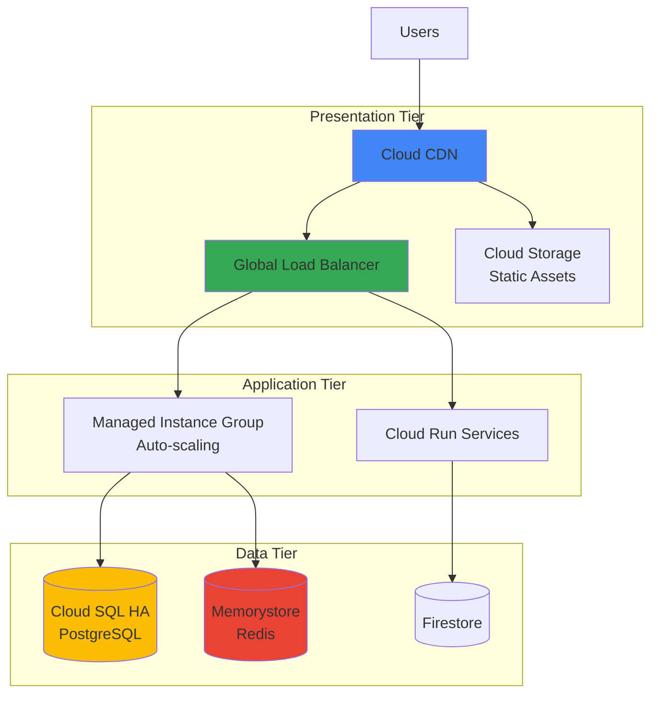
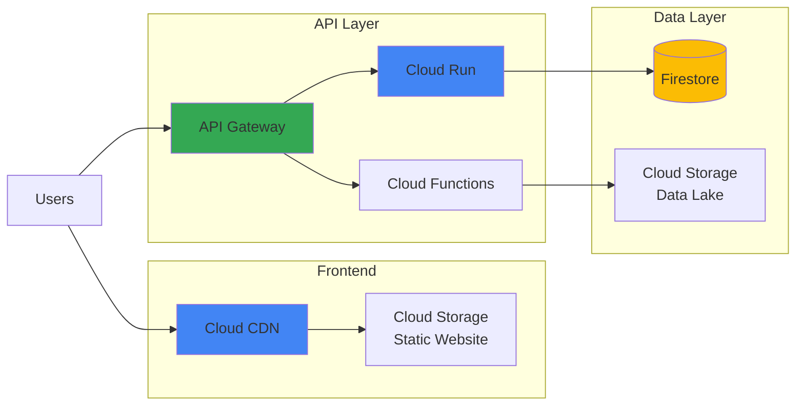
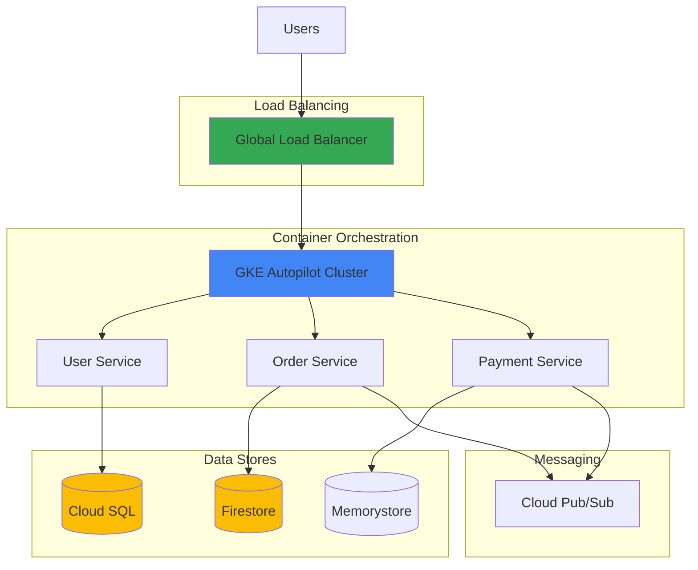
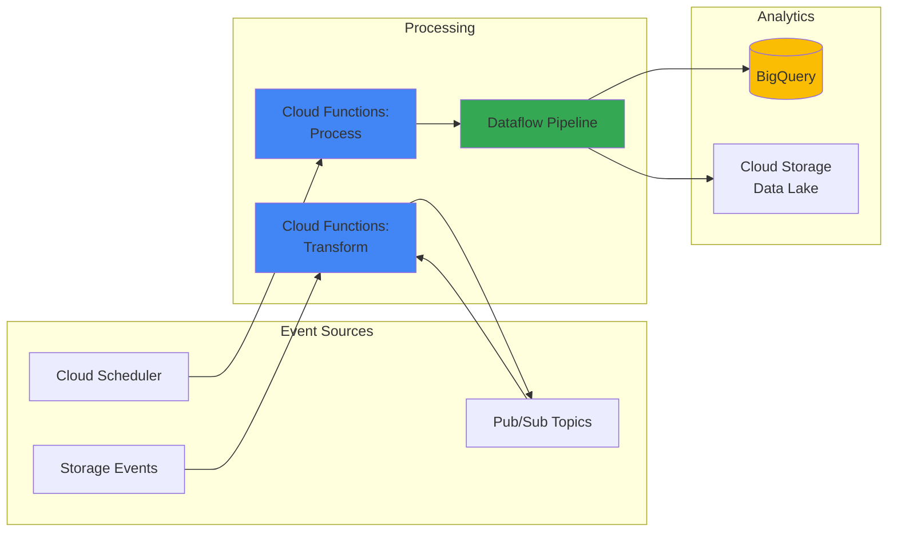
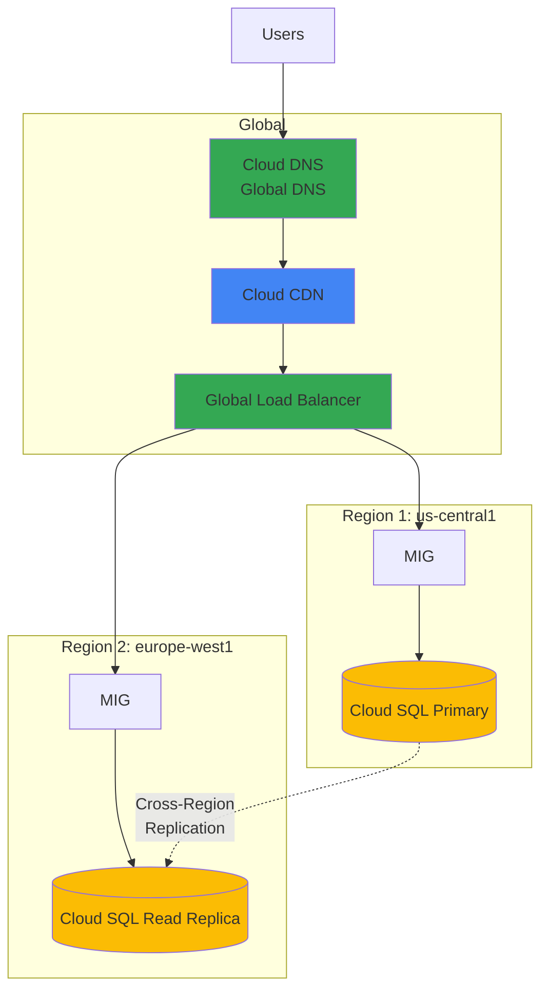

# GCP (Google Cloud Platform)

Best practices, architecture patterns, and essential services for building on Google Cloud Platform.

## Overview

Google Cloud Platform is a suite of cloud computing services that runs on the same infrastructure that Google uses internally for products like Google Search, Gmail, and YouTube.

## Best Practices

### Security

**1. Identity and Access Management**

- Use **Service Accounts** for applications, not user credentials
- Implement **Workload Identity** for GKE to avoid service account keys
- Follow **least privilege principle** with granular IAM roles
- Enable **Organization Policy Service** for centralized governance
- Use **Google Groups** for team-based access management
- Enable **Access Transparency** for audit visibility
- Implement **VPC Service Controls** to prevent data exfiltration

**2. Data Protection**

- Encrypt data **at rest** using:
  - Cloud Storage: Customer-managed encryption keys (CMEK)
  - Compute Engine: Encrypted persistent disks
  - Cloud SQL: Automatic encryption
- Encrypt data **in transit** using TLS/SSL
- Use **Cloud KMS** for encryption key management
- Enable **Cloud Storage versioning** for important data
- Implement **uniform bucket-level access** for Cloud Storage
- Use **Secret Manager** for managing credentials and API keys
- Enable **Cloud Data Loss Prevention (DLP)** for sensitive data discovery

**3. Network Security**

- Use **VPC firewall rules** for network-level security
- Implement **Cloud Armor** for DDoS protection and WAF
- Enable **VPC Flow Logs** for network traffic monitoring
- Use **Private Google Access** for private connectivity
- Implement **Cloud NAT** for secure outbound traffic
- Use **Shared VPC** for centralized network management
- Enable **Binary Authorization** for container image verification

**4. Monitoring and Compliance**

- Enable **Cloud Audit Logs** for all services
- Use **Security Command Center** for threat detection and compliance
- Implement **Cloud Monitoring** for real-time alerting
- Set up **Cloud Logging** sinks for long-term retention
- Use **Access Approval** for additional control over Google support access
- Regular security assessments using **Security Health Analytics**
- Conduct **vulnerability scanning** with Container Analysis

### Cost Optimization

**1. Compute Cost Optimization**

- Use **Committed Use Discounts** (CUD) for predictable workloads (up to 57% savings)
- Leverage **Sustained Use Discounts** (automatic savings for consistent usage)
- Use **Preemptible VMs** for fault-tolerant workloads (up to 80% savings)
- Implement **Spot VMs** for batch processing and fault-tolerant workloads
- Right-size instances using **Active Assist Recommender**
- Use **autoscaling** for Compute Engine and GKE
- Consider **E2 instances** for general-purpose workloads (better price-performance)

**2. Storage Cost Optimization**

- Implement **Cloud Storage lifecycle policies** for automatic tiering
- Use **Nearline/Coldline/Archive** storage classes for infrequent access
- Enable **Cloud Storage Object Lifecycle Management**
- Delete **orphaned persistent disks** and snapshots
- Use **Balanced or Standard persistent disks** instead of SSD when appropriate
- Compress data before storage
- Use **Regional storage** instead of multi-regional when possible

**3. Monitoring and Governance**

- Set up **Budget alerts** with Cloud Billing
- Use **Cloud Billing Reports** for cost analysis and forecasting
- Implement **labels and tags** for cost allocation tracking
- Enable **Cost Breakdown** by project, service, and SKU
- Use **Recommender** for cost optimization suggestions
- Review **Committed Use Discount** recommendations
- Delete unused **static IP addresses** and **load balancers**

**4. Data Transfer Optimization**

- Minimize cross-region data transfer costs
- Use **Cloud CDN** to reduce egress costs
- Implement **Private Google Access** to avoid egress charges
- Use **Transfer Appliance** for large data migrations
- Leverage **Cloud Interconnect** for hybrid cloud scenarios

### High Availability

**1. Multi-Regional Architecture**

- Deploy critical workloads across **multiple regions**
- Use **Cloud SQL with High Availability** (regional HA configuration)
- Configure **Memorystore for Redis** with HA
- Distribute **Cloud Load Balancing** across multiple regions
- Use **Managed Instance Groups** (MIGs) spanning multiple zones
- Implement **multi-region Cloud Storage** for critical data

**2. Fault Tolerance and Resilience**

- Implement **health checks** for instance groups and load balancers
- Use **Global Load Balancing** for automatic failover
- Configure **Cloud SQL automated backups** and point-in-time recovery
- Enable **Firestore export** for disaster recovery
- Implement **Cloud Storage dual-region** for data redundancy
- Use **Cloud DNS** with health checking and failover

**3. Disaster Recovery**

- Define **RTO** (Recovery Time Objective) and **RPO** (Recovery Point Objective)
- Implement appropriate DR strategy:
  - **Backup and Restore**: Lowest cost, slower recovery
  - **Warm Standby**: Reduced capacity in secondary region
  - **Hot Standby**: Full capacity in multiple regions
  - **Multi-Region Active-Active**: Highest availability, highest cost
- Regular **disaster recovery drills**
- Use **Cloud Storage Transfer Service** for cross-region replication
- Implement **snapshot scheduling** for persistent disks

**4. Monitoring and Alerting**

- Set up **Cloud Monitoring dashboards** for key metrics
- Configure **alerting policies** for critical thresholds
- Use **Cloud Trace** for distributed tracing
- Implement **uptime checks** for critical endpoints
- Monitor **Error Reporting** for application errors
- Use **Cloud Profiler** for performance optimization

## Architecture Patterns

### 1. Three-Tier Web Application

### 2. Serverless Application

### 3. Microservices on GKE

### 4. Event-Driven Architecture

### 5. Multi-Region Active-Active

## Top GCP Services

### Compute

| Service | Description | Use Case | Pricing Model |
|---------|-------------|----------|---------------|
| **Compute Engine** | Virtual machines | General-purpose computing, custom workloads | Per second billing |
| **Cloud Run** | Serverless containers | Containerized apps without infrastructure | Per request + CPU/memory |
| **Cloud Functions** | Serverless functions | Event-driven, microservices | Per invocation + compute time |
| **GKE** | Managed Kubernetes | Container orchestration | Cluster management + nodes |
| **GKE Autopilot** | Fully managed Kubernetes | Simplified K8s management | Per pod resources |
| **App Engine** | Platform as a Service | Web apps, mobile backends | Per instance hour |
| **Bare Metal** | Dedicated servers | High-performance, specialized workloads | Per server |

### Storage

| Service | Description | Use Case | Pricing Model |
|---------|-------------|----------|---------------|
| **Cloud Storage** | Object storage | Static assets, data lakes, backups | Per GB stored + operations |
| **Persistent Disk** | Block storage | VM storage, databases | Per GB provisioned |
| **Filestore** | Managed NFS | Shared file storage | Per GB provisioned |
| **Local SSD** | High-performance local storage | Low-latency workloads | Per GB per hour |
| **Cloud Storage for Firebase** | Mobile/web object storage | User-generated content | Per GB + operations |

### Database

| Service | Description | Use Case | Pricing Model |
|---------|-------------|----------|---------------|
| **Cloud SQL** | Managed relational DB | PostgreSQL, MySQL, SQL Server | vCPU hours + storage |
| **Cloud Spanner** | Globally distributed DB | Mission-critical, scalable apps | Node hours + storage |
| **Firestore** | NoSQL document database | Mobile, web, real-time apps | Per read/write/delete |
| **Bigtable** | Wide-column NoSQL | Time-series, IoT, analytics | Node hours + storage |
| **Memorystore** | In-memory data store | Redis/Memcached caching | Per GB per hour |
| **AlloyDB** | PostgreSQL-compatible DB | Enterprise PostgreSQL workloads | vCPU hours + storage |
| **BigQuery** | Serverless data warehouse | Analytics, BI, ML | Per TB scanned + storage |

### Networking & Content Delivery

| Service | Description | Use Case | Pricing Model |
|---------|-------------|----------|---------------|
| **VPC** | Virtual private cloud | Network isolation | No charge (resources charged) |
| **Cloud Load Balancing** | Global load distribution | Traffic distribution | Per rule + data processed |
| **Cloud CDN** | Content delivery network | Global content delivery | Per GB cache egress |
| **Cloud DNS** | Managed DNS service | Domain management | Per zone + queries |
| **Cloud NAT** | Network address translation | Outbound internet access | Per NAT gateway hour + data |
| **Cloud Interconnect** | Dedicated connectivity | Hybrid cloud, high throughput | Per connection + data |
| **Cloud VPN** | Encrypted VPN tunnels | Secure hybrid connectivity | Per tunnel hour + data |

### Security & Identity

| Service | Description | Use Case | Pricing Model |
|---------|-------------|----------|---------------|
| **IAM** | Identity and access | User/service account management | Free |
| **Cloud KMS** | Key management | Encryption key management | Per key version + operations |
| **Secret Manager** | Secrets storage | API keys, passwords, certificates | Per secret + operations |
| **Cloud Armor** | DDoS and WAF protection | Application security | Per policy + requests |
| **Security Command Center** | Security posture management | Threat detection, compliance | Per asset |
| **VPC Service Controls** | Data exfiltration protection | Perimeter security | No additional charge |
| **Binary Authorization** | Container image verification | Secure deployments | Free |

### Monitoring & Management

| Service | Description | Use Case | Pricing Model |
|---------|-------------|----------|---------------|
| **Cloud Monitoring** | Infrastructure monitoring | Metrics, dashboards, alerts | Per GB ingested |
| **Cloud Logging** | Log management | Centralized logging | Per GB ingested |
| **Cloud Trace** | Distributed tracing | Performance analysis | Per span ingested |
| **Cloud Profiler** | Continuous profiling | Performance optimization | Free |
| **Error Reporting** | Error tracking | Application error monitoring | Free |
| **Cloud Debugger** | Live debugging | Production debugging | Free |

### Analytics & Big Data

| Service | Description | Use Case | Pricing Model |
|---------|-------------|----------|---------------|
| **BigQuery** | Serverless data warehouse | SQL analytics, BI | Per TB scanned + storage |
| **Dataflow** | Stream/batch processing | ETL, data pipelines | Per vCPU hour |
| **Dataproc** | Managed Hadoop/Spark | Big data processing | Per cluster hour |
| **Pub/Sub** | Messaging service | Event ingestion, streaming | Per GB delivered |
| **Data Fusion** | Visual ETL | Code-free data integration | Per instance hour |
| **Looker** | Business intelligence | Data visualization, BI | Per user per month |
| **Datastream** | Change data capture | Real-time replication | Per GB processed |

### Developer Tools

| Service | Description | Use Case | Pricing Model |
|---------|-------------|----------|---------------|
| **Cloud Source Repositories** | Git repositories | Source control | Per GB stored + GB egress |
| **Cloud Build** | CI/CD platform | Build, test, deploy | Per build minute |
| **Artifact Registry** | Container/package registry | Store build artifacts | Per GB stored |
| **Cloud Deploy** | Continuous delivery | Deploy to GKE | No additional charge |
| **Cloud Workstations** | Cloud-based development | Remote development | Per workstation hour |
| **Cloud Code** | IDE extensions | Develop cloud apps | Free |

### Machine Learning & AI

| Service | Description | Use Case | Pricing Model |
|---------|-------------|----------|---------------|
| **Vertex AI** | Unified ML platform | Train and deploy models | Per training/prediction hour |
| **AutoML** | Custom ML models | No-code ML | Per training hour |
| **Vision AI** | Image analysis | Image recognition, OCR | Per image |
| **Natural Language AI** | Text analysis | Sentiment, entity extraction | Per unit |
| **Translation AI** | Text translation | Multi-language translation | Per character |
| **Speech-to-Text** | Audio transcription | Voice recognition | Per 15 seconds |
| **Text-to-Speech** | Voice synthesis | Voice generation | Per character |

### Hybrid & Multi-Cloud

| Service | Description | Use Case | Pricing Model |
|---------|-------------|----------|---------------|
| **Anthos** | Hybrid/multi-cloud platform | Unified Kubernetes management | Per vCPU hour |
| **Google Distributed Cloud** | Edge and data center solutions | On-premises GCP services | Per deployment |
| **Cloud Run for Anthos** | Serverless on GKE/Anthos | Portable serverless | GKE pricing |
| **Traffic Director** | Service mesh traffic management | Microservices traffic control | No additional charge |

## Tags

`gcp`, `cloud`, `devops`, `infrastructure`, `google-cloud`, `architecture`, `best-practices`

---

*Last updated: 2025-10-31*
