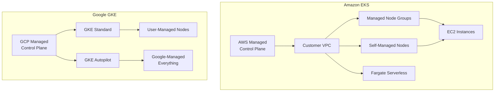
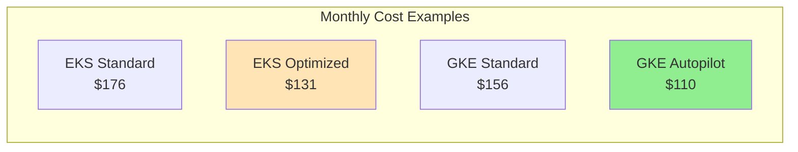
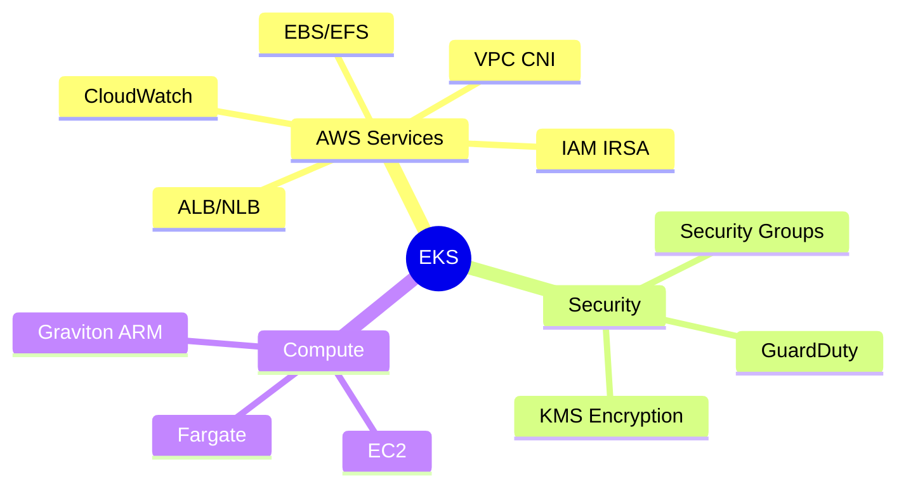
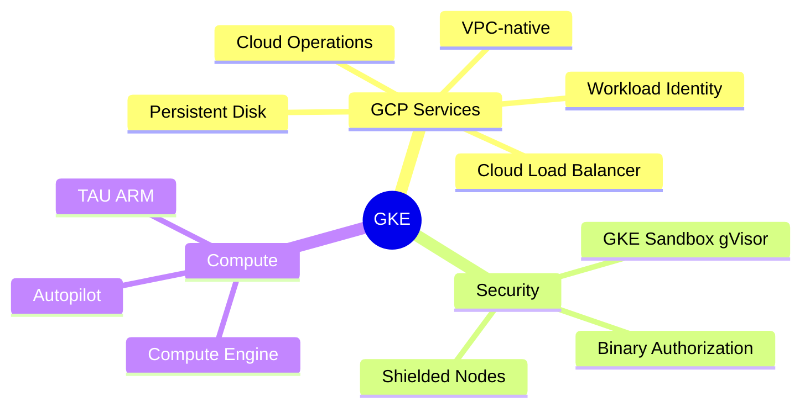
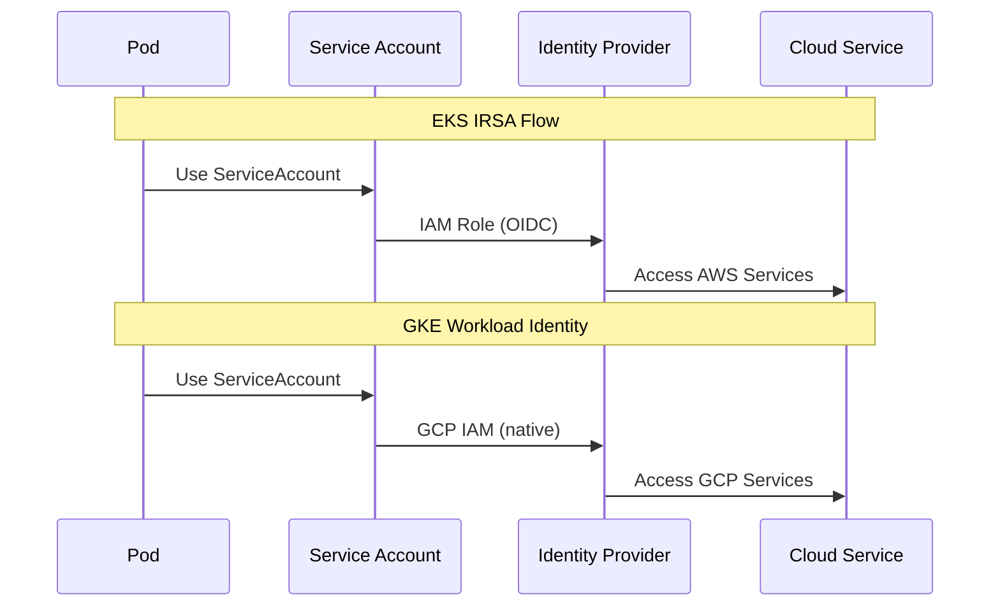
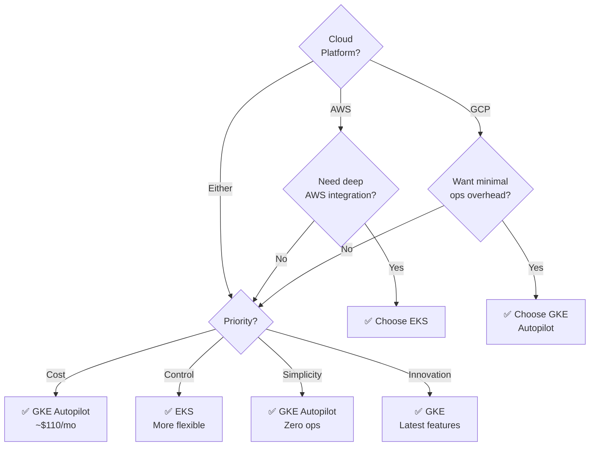

# EKS vs GKE Comparison

Quick visual comparison of Amazon EKS and Google GKE.

## Architecture Comparison

## Quick Comparison

| Feature | EKS | GKE |
|---------|-----|-----|
| **Provider** | AWS | Google Cloud |
| **Control Plane Cost** | $73/month | $73/month (Standard) Free (Autopilot) |
| **Setup Complexity** | ⭐⭐⭐ | ⭐⭐ (Standard) ⭐ (Autopilot) |
| **Operational Overhead** | Medium | Low (Standard) Minimal (Autopilot) |
| **Best For** | AWS ecosystem | GCP ecosystem, Easy ops |
| **SLA** | 99.95% | 99.95%-99.99% |
| **Max Nodes** | 5,000 | 15,000 |
| **Upgrades** | Manual | Automatic |

## Cost Comparison

| Configuration | EKS | GKE |
|--------------|-----|-----|
| **Control Plane** | $73/month | $73 (Standard) $0 (Autopilot) |
| **3 Medium Nodes** | ~$93 | ~$73 |
| **Storage** | ~$10 | ~$10 |
| **Total (Standard)** | ~$176 | ~$156 |
| **Optimized** | ~$131 (Spot+Graviton) | ~$110 (Autopilot) |
| **Savings** | 25% | 30% |

## Node Options

| Feature | EKS | GKE |
|---------|-----|-----|
| **Managed Nodes** | ✅ Managed Node Groups | ✅ Standard Clusters |
| **Serverless** | ✅ Fargate | ✅ Autopilot |
| **Custom Control** | ✅ Self-managed | ⚠️ Limited in Autopilot |
| **Spot/Preemptible** | ✅ 70-90% savings | ✅ 60-91% savings |
| **ARM Support** | ✅ Graviton (20% better) | ✅ TAU VMs |

## Integration & Features

## Networking

| Feature | EKS | GKE |
|---------|-----|-----|
| **CNI** | VPC CNI (AWS IPs) | VPC-native or Kubenet |
| **Max Pods/Node** | ~750 | ~110 (configurable) |
| **Network Policies** | Calico/Cilium | ✅ Native |
| **Service Mesh** | App Mesh, Istio | Anthos Service Mesh |
| **Ingress** | ALB Controller | Native GKE Ingress |

## Storage

| Type | EKS | GKE |
|------|-----|-----|
| **Block** | EBS (gp3, io1, io2) | Persistent Disk (SSD, Balanced) |
| **File** | EFS, FSx | Filestore |
| **Object** | S3 via CSI | Cloud Storage via CSI |
| **Snapshots** | ✅ | ✅ |

## Security & Identity

| Security Feature | EKS | GKE |
|-----------------|-----|-----|
| **Pod-level IAM** | IRSA | Workload Identity |
| **Network Security** | Security Groups for Pods | Native Network Policies |
| **Image Scanning** | ECR Scanning | Artifact Registry Scanning |
| **Advanced** | GuardDuty | Binary Authorization, gVisor |
| **Encryption** | KMS | Customer-managed keys |

## Monitoring & Operations

| Feature | EKS | GKE |
|---------|-----|-----|
| **Metrics** | CloudWatch | Cloud Monitoring |
| **Logs** | CloudWatch Logs | Cloud Logging |
| **Tracing** | X-Ray | Cloud Trace |
| **Setup** | Manual | Auto (Autopilot) |
| **Cost** | Pay per GB | 50GB free, then pay |

## Scaling & Availability

| Feature | EKS | GKE | Winner |
|---------|-----|-----|--------|
| **SLA** | 99.95% | 99.95-99.99% | 🏆 GKE |
| **Auto-repair** | Managed nodes | Native + Auto | 🏆 GKE |
| **Auto-upgrade** | Manual trigger | ✅ Automatic | 🏆 GKE |
| **Autoscaling** | Cluster AS, Karpenter | Native, Autopilot | 🏆 GKE |
| **VPA** | ✅ Manual install | ✅ Built-in | 🏆 GKE |
| **Max Nodes** | 5,000 | 15,000 | 🏆 GKE |

## Decision Matrix

## Choose EKS If

| Reason | Details |
|--------|---------|
| ✅ **AWS Ecosystem** | Already using RDS, DynamoDB, S3, etc. |
| ✅ **AWS Compliance** | Need AWS certifications |
| ✅ **More Control** | Want custom AMIs, specific configs |
| ✅ **Fargate** | Need serverless pods |
| ✅ **AWS Expertise** | Team knows AWS well |

## Choose GKE If

| Reason | Details |
|--------|---------|
| ✅ **GCP Ecosystem** | Using BigQuery, Cloud Storage, Pub/Sub |
| ✅ **Minimal Ops** | Want Autopilot (zero management) |
| ✅ **Lower Cost** | Autopilot ~30% cheaper |
| ✅ **Innovation** | Want latest K8s features first |
| ✅ **Faster Setup** | Simpler configuration |

## Summary

| Aspect | Winner | Reason |
|--------|--------|--------|
| **Ease of Use** | 🏆 GKE | Autopilot is simplest |
| **Cost (Optimized)** | 🏆 GKE | $110 vs $131/month |
| **Operational Overhead** | 🏆 GKE | Autopilot = zero ops |
| **AWS Integration** | 🏆 EKS | Native AWS services |
| **GCP Integration** | 🏆 GKE | Native GCP services |
| **Control & Flexibility** | 🏆 EKS | More node options |
| **Innovation** | 🏆 GKE | Gets features first |
| **Enterprise Adoption** | 🏆 EKS | Larger user base |

## Migration Tools

Both platforms support:
- **Velero** - Backup/restore
- **Helm** - Application portability
- **Terraform** - Infrastructure as Code
- **kubectl** - Standard Kubernetes CLI

---

**💡 Quick Recommendation:**
- **New to K8s?** → GKE Autopilot
- **Already on AWS?** → EKS
- **Already on GCP?** → GKE Autopilot
- **Want control?** → EKS
- **Want simplicity?** → GKE Autopilot

## Tags

`kubernetes`, `k8s`, `eks`, `gke`, `comparison`, `cloud`

---

*Last updated: 2025-10-30*
