# EKS vs GKE Comparison

Quick comparison of Amazon EKS and Google GKE for DevOps teams.

## Key Differences at a Glance

| Category | Amazon EKS | Google GKE | Winner |
|----------|-----------|-----------|--------|
| **Control Plane Cost** | $73/month | $73/month (Standard) Free (Autopilot) | 🆠GKE Autopilot |
| **Node Pricing (3 medium)** | ~$93/month | ~$73/month | 🏆 GKE |
| **Total Monthly Cost** | ~$176 (Standard) ~$131 (Spot optimized) | ~$156 (Standard) ~$110 (Autopilot) | 🆠GKE Autopilot |
| **Setup Complexity** | Medium-High | Low (Standard) Very Low (Autopilot) | 🆠GKE |
| **Operational Overhead** | Medium | Low (Standard) Minimal (Autopilot) | 🆠GKE |
| **Upgrades** | Manual | Automatic | 🏆 GKE |
| **SLA** | 99.95% | 99.95%-99.99% | 🏆 GKE |
| **Max Nodes** | 5,000 | 15,000 | 🏆 GKE |
| **Pod IAM** | IRSA | Workload Identity | Tie |
| **Network Policies** | Via add-ons (Calico/Cilium) | Native | 🏆 GKE |
| **Best For** | Deep AWS integration | Simplified operations, cost | - |

## Architecture Options

### EKS Node Types

- **Managed Node Groups** - AWS-managed EC2 instances
- **Self-Managed Nodes** - Full control over nodes
- **Fargate** - Serverless containers (pay per pod)
- **Spot Instances** - 70-90% cost savings

### GKE Node Types

- **Standard** - User-managed nodes with control
- **Autopilot** - Fully managed (Google handles everything)
- **Preemptible VMs** - 60-91% cost savings
- **ARM Support** - TAU VMs for cost efficiency

## Decision Flowchart

```mermaid
flowchart TD
    Start{Already using<br/>AWS or GCP?}
    Start -->|AWS| AWS{Need deep AWS<br/>service integration?}
    Start -->|GCP| GKE1[✅ Choose GKE Autopilot]
    Start -->|Either/New| Priority{What's most important?}

    AWS -->|Yes| EKS1[✅ Choose EKS]
    AWS -->|No| Priority

    Priority -->|Lowest cost| GKE2[✅ GKE Autopilot<br/>$110/month]
    Priority -->|Simplicity| GKE3[✅ GKE Autopilot<br/>Zero ops overhead]
    Priority -->|Max control| EKS2[✅ EKS<br/>More flexibility]
```

## Quick Facts

### Storage Options

- **EKS**: EBS (block), EFS (file), S3 (object)
- **GKE**: Persistent Disk (block), Filestore (file), Cloud Storage (object)

### Monitoring

- **EKS**: CloudWatch (manual setup, pay per GB)
- **GKE**: Cloud Monitoring/Logging (automatic in Autopilot, 50GB free)

### Security

- **EKS**: KMS encryption, ECR scanning, GuardDuty
- **GKE**: Customer-managed keys, Artifact Registry scanning, Binary Authorization, gVisor sandboxing

## Tags

`kubernetes`, `k8s`, `eks`, `gke`, `aws`, `gcp`, `comparison`, `cloud`

---

*Last updated: 2025-10-31*
