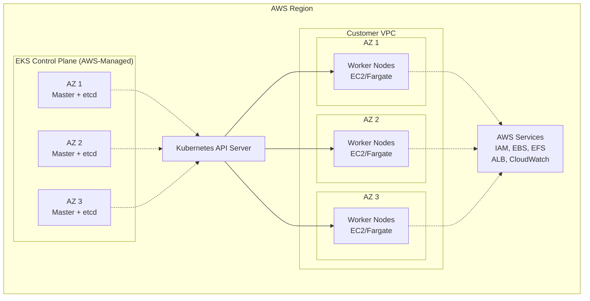
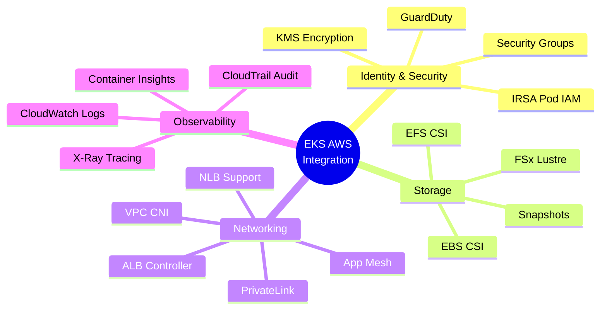
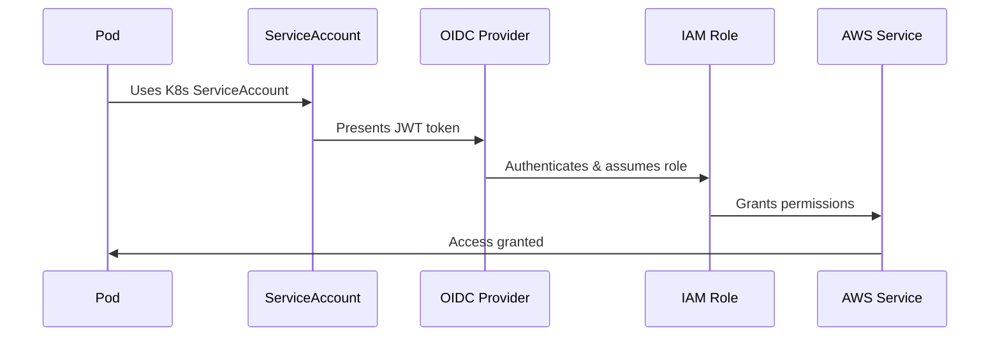
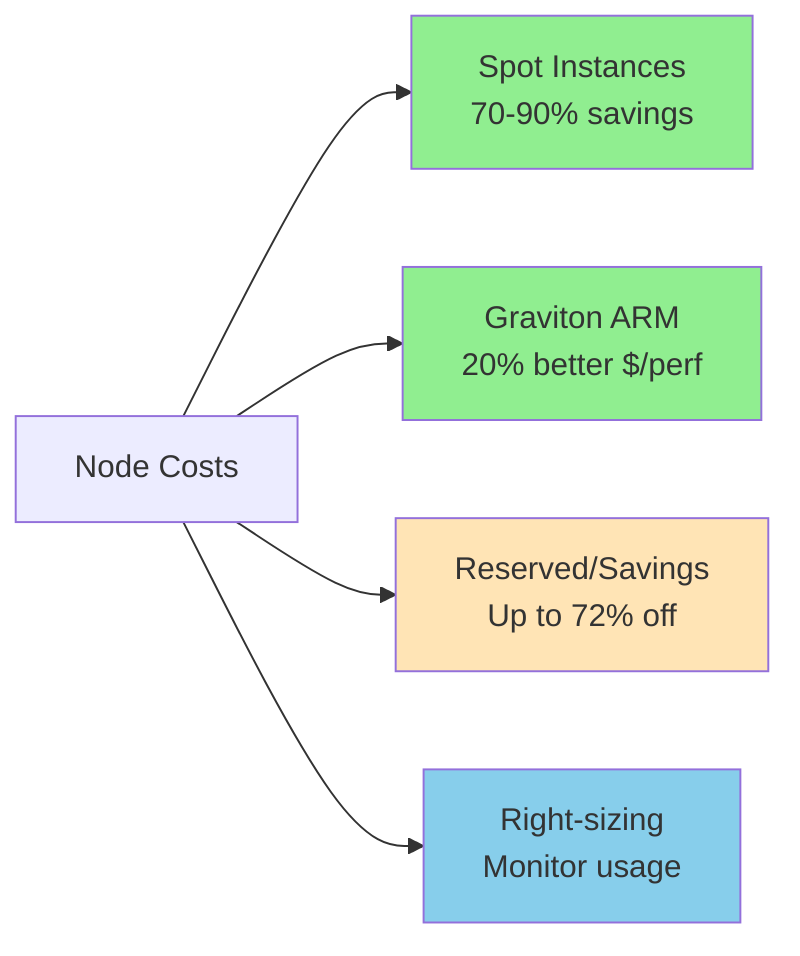
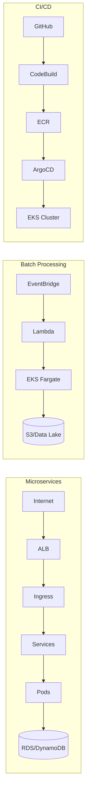
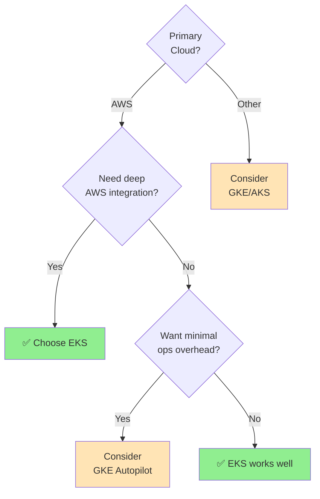

# Amazon EKS

Best practices and patterns for running Kubernetes on AWS with EKS.

## Overview

Amazon EKS is a managed Kubernetes service that runs the control plane across multiple AWS Availability Zones, automatically handles node health, and provides on-demand upgrades.

## Architecture

### Key Components

| Layer | Components | Management | Details |
|-------|-----------|------------|---------|
| **Control Plane** | API Server, etcd, Scheduler, Controller Manager | AWS-Managed | HA across 3 AZs, Auto-scaling, Auto-updates |
| **Data Plane** | Worker Nodes (EC2), Fargate Pods | Customer-Managed | Runs in customer VPC, Connects via API |
| **Networking** | VPC CNI, Security Groups, Load Balancers | Shared | VPC IPs for pods, Pod/node security, ALB/NLB |

## Node Options

| Type | Management | Updates | Best For | Cost Model |
|------|-----------|---------|----------|-----------|
| **Managed Node Groups** | AWS-managed | Automatic | Most use cases | EC2 pricing |
| **Self-Managed Nodes** | Customer-managed | Manual | Custom configs, AMIs | EC2 pricing |
| **Fargate** | AWS-managed | Automatic | Batch jobs, sporadic workloads | Per pod/vCPU/memory |

## AWS Integration

### IRSA (IAM Roles for Service Accounts)

| Feature | IRSA | Node IAM Role |
|---------|------|---------------|
| **Scope** | Per-pod | All pods on node |
| **Security** | ✅ Fine-grained | ⚠️ Over-privileged |
| **Audit** | ✅ Per-pod CloudTrail | ⚠️ Node-level only |
| **Best Practice** | ✅ Recommended | ❌ Avoid for pods |

## Best Practices

### Security

| Category | Practice | Implementation |
|----------|----------|----------------|
| **Identity** | Use IRSA | One IAM role per ServiceAccount, least privilege |
| **Encryption** | Enable KMS | Secrets encryption, envelope encryption for etcd |
| **Network** | Private endpoints | Private API, Security Groups for pods, Network Policies |
| **Images** | ECR scanning | Private repos, admission controllers, image signing |
| **Audit** | Control plane logs | Enable all log types → CloudWatch Logs |

### High Availability

| Component | Strategy | Details |
|-----------|----------|---------|
| **Nodes** | Multi-AZ | 3+ AZs, multiple node groups, pod anti-affinity |
| **Workloads** | PodDisruptionBudgets | Define min available replicas |
| **Scaling** | HPA + Cluster Autoscaler | Or use Karpenter for advanced needs |
| **Health** | Probes | Liveness, readiness, startup probes |

### Performance

| Area | Optimization | Options |
|------|-------------|---------|
| **Instances** | Right-size | Compute-optimized (CPU), memory-optimized, Graviton (ARM) |
| **Placement** | Pod scheduling | Node selectors, taints/tolerations, topology spread |
| **Resources** | Limits & quotas | Requests/limits, LimitRanges, ResourceQuotas |
| **Networking** | VPC CNI optimization | Latest version, prefix delegation, ENI trunking, Nitro instances |

## Cost Optimization

### Pricing Overview

| Component | Cost | Strategy |
|-----------|------|----------|
| **Control Plane** | ~$73/month | Share clusters across teams |
| **Nodes** | EC2 pricing | Spot, Graviton, right-sizing |
| **Storage** | EBS/EFS pricing | Use gp3, lifecycle policies |
| **Data Transfer** | Standard AWS rates | Same-AZ communication |

### Node Cost Strategies

| Strategy | Savings | Best For | Trade-off |
|----------|---------|----------|-----------|
| **Spot Instances** | 70-90% | Fault-tolerant workloads | Can be interrupted |
| **Graviton (ARM)** | 20% | Most workloads | Limited legacy app support |
| **Reserved Instances** | Up to 72% | Predictable workloads | 1-3 year commitment |
| **Savings Plans** | Up to 72% | Flexible workloads | Commitment, can change types |
| **Right-sizing** | 20-40% | All workloads | Requires monitoring |

### Auto-Scaling Tools

| Tool | Purpose | When to Use |
|------|---------|-------------|
| **Cluster Autoscaler** | Adjust node count | Standard use cases |
| **Karpenter** | Advanced provisioning | Complex requirements, better consolidation |
| **HPA** | Scale pods | Application-level scaling |
| **VPA** | Right-size pods | Optimize resource requests |

### Quick Wins

| Action | Impact | Effort |
|--------|--------|--------|
| Switch gp2 → gp3 | 20% storage savings | ⭐ Low |
| Enable Cluster Autoscaler | 20-40% node savings | ⭐⭐ Medium |
| Use Spot for dev/test | 70-90% savings | ⭐⭐ Medium |
| Add Graviton nodes | 20% compute savings | ⭐⭐⭐ High |
| Implement Kubecost | Visibility + 15-30% | ⭐⭐ Medium |

## Upgrade Strategy

| Phase | Steps | Downtime | Automation |
|-------|-------|----------|------------|
| **Control Plane** | Review changelog → Test → Upgrade (1 version at a time) | None | AWS-managed |
| **Nodes** | Update AMI → Launch new → Drain old → Delete old | Rolling | Managed node groups |
| **Frequency** | Every ~3 months | Plan quarterly | Stay within N-2 versions |
| **Support** | 14 months per version | Regular updates critical | Use maintenance windows |

## Operations

### Observability Stack

| Component | Tool | Purpose |
|-----------|------|---------|
| **Metrics** | Container Insights, Prometheus | Resource usage, performance |
| **Logs** | CloudWatch Logs, FluentBit | Debugging, audit trail |
| **Tracing** | X-Ray | Distributed request tracing |
| **Alerts** | CloudWatch Alarms | Proactive issue detection |

### Disaster Recovery

| Strategy | Tool/Method | Frequency |
|----------|-------------|-----------|
| **Backup** | Velero | Daily/weekly |
| **Multi-region** | Terraform, GitOps | Continuous |
| **Runbooks** | Documentation | As needed |
| **Testing** | DR drills | Quarterly |

## Common Patterns

## Quick Wins vs Common Pitfalls

| ✅ Do This | ❌ Avoid This |
|-----------|--------------|
| Enable IRSA immediately | Using node IAM roles for pods |
| Use gp3 volumes | Over-provisioning nodes |
| Enable Container Insights | Running nodes in public subnets |
| Implement autoscaling | Ignoring IP address planning |
| Set resource limits | Skipping regular upgrades |
| Enable control plane logs | Not implementing PodDisruptionBudgets |

## Decision Guide

### Choose EKS If

| Reason | Details |
|--------|---------|
| ✅ **AWS Ecosystem** | Using RDS, DynamoDB, S3, Lambda, etc. |
| ✅ **AWS Compliance** | Need AWS certifications (HIPAA, PCI-DSS, etc.) |
| ✅ **Enterprise Support** | Want AWS support for entire stack |
| ✅ **Multi-region AWS** | Planning global AWS deployment |
| ✅ **ECS Migration** | Moving from ECS or using both |

## Resources

- [EKS Best Practices Guide](https://aws.github.io/aws-eks-best-practices/)
- [EKS Workshop](https://eksworkshop.com/)
- [AWS Documentation](https://docs.aws.amazon.com/eks/)

## Tags

`eks`, `kubernetes`, `aws`, `k8s`, `cloud`, `managed-kubernetes`

---

*Last updated: 2025-10-30*
