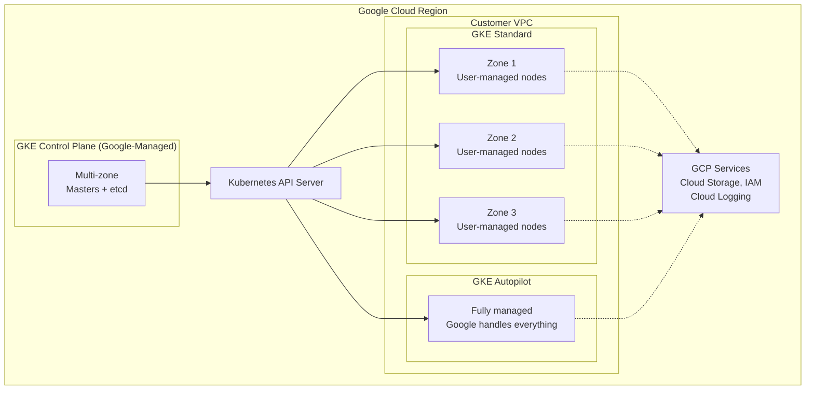
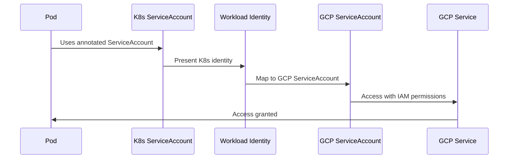
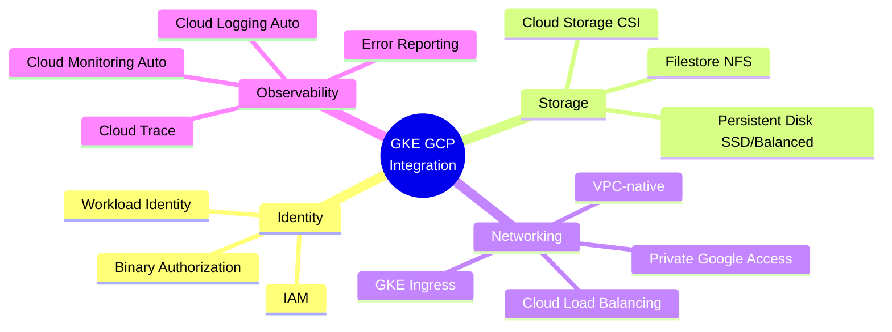
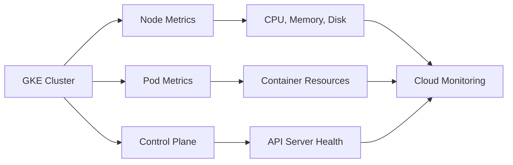
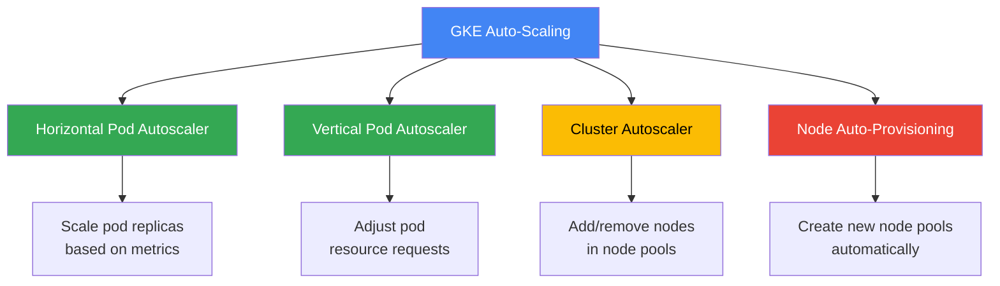
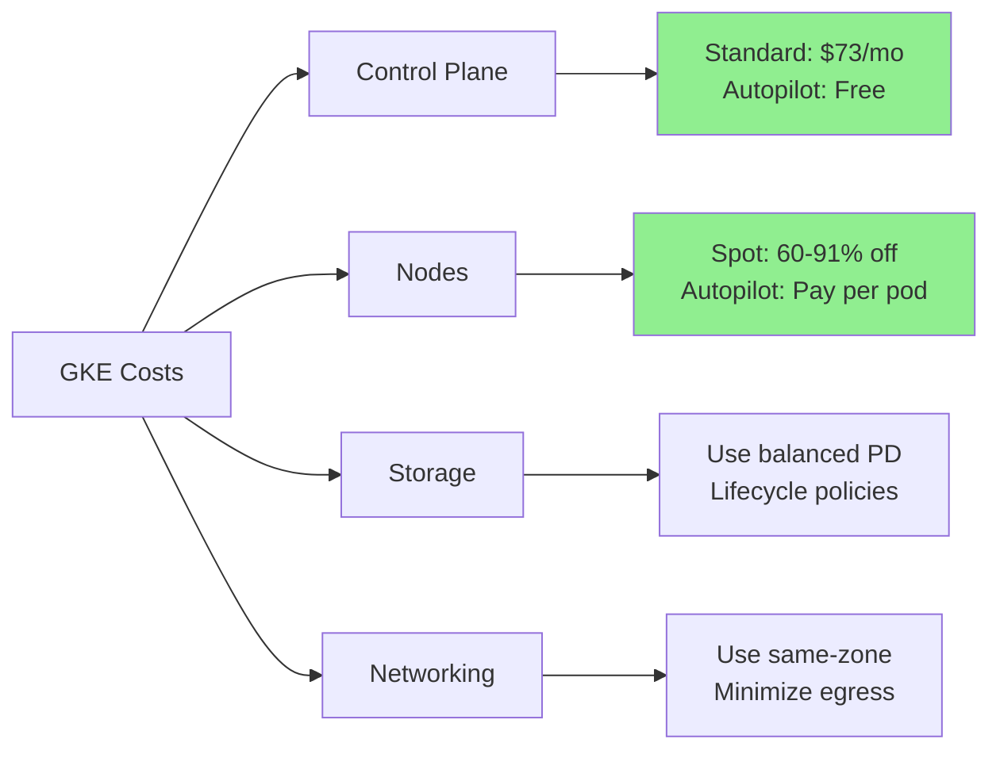
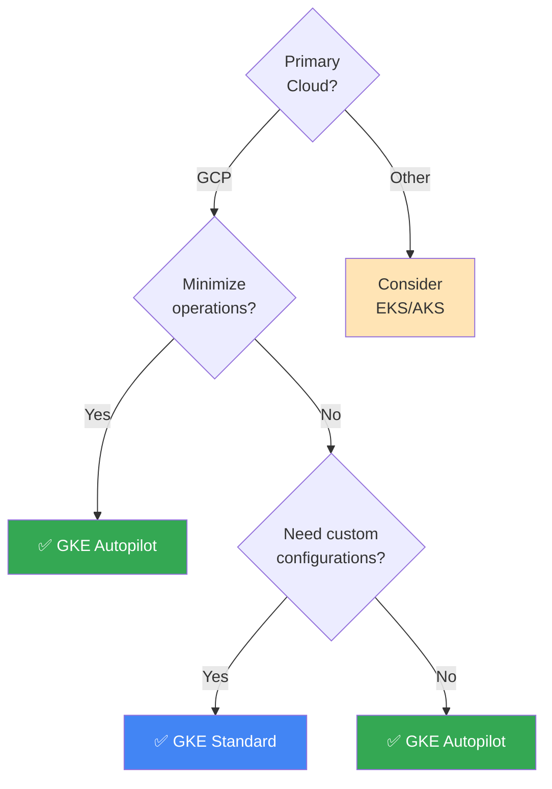

# Google GKE

Best practices and patterns for running Kubernetes on Google Cloud with GKE.

## Overview

Google Kubernetes Engine (GKE) is a managed Kubernetes service with automated cluster management, scaling, and upgrades. Offers both Standard and Autopilot modes.

## Architecture

## Cluster Modes

| Feature | Standard | Autopilot |
|---------|----------|-----------|
| **Node Management** | User-managed | Google-managed |
| **Scaling** | Manual/CA | Automatic |
| **Pricing** | Per node | Per pod resources |
| **Control** | Full | Limited |
| **Best For** | Custom configs | Minimal ops overhead |
| **Control Plane Cost** | $73/month | Free |

### Quick Start

| Mode | Command | Use Case |
|------|---------|----------|
| **Standard** | `gcloud container clusters create my-cluster --region us-central1 --num-nodes 3` | Need custom configuration |
| **Autopilot** | `gcloud container clusters create-auto my-cluster --region us-central1` | Want zero node management |

## Node Pools (Standard Mode)

| Type | Cost | Use Case | Configuration |
|------|------|----------|---------------|
| **Regular** | Standard pricing | Production workloads | Auto-repair, auto-upgrade |
| **Spot VMs** | 60-91% savings | Fault-tolerant jobs | Can be preempted |
| **TAU VMs** | Better price/perf | ARM-compatible workloads | T2A machine types |

## Workload Identity

Pod-level IAM permissions for secure GCP service access.

| Step | Action | Command/Config |
|------|--------|----------------|
| 1. Enable | Enable Workload Identity | `--workload-pool=PROJECT_ID.svc.id.goog` |
| 2. Create K8s SA | Create ServiceAccount | `kubectl create serviceaccount my-ksa` |
| 3. Create GCP SA | Create GCP SA | `gcloud iam service-accounts create my-gsa` |
| 4. Grant Permissions | Assign IAM roles | `gcloud projects add-iam-policy-binding` |
| 5. Bind | Link accounts | Annotation: `iam.gke.io/gcp-service-account` |

## GCP Integration

## Storage Options

| Type | Provisioner | Use Case | Features |
|------|------------|----------|----------|
| **Persistent Disk (SSD)** | `pd.csi.storage.gke.io` | High-performance databases | Regional, expandable |
| **Persistent Disk (Balanced)** | `pd.csi.storage.gke.io` | General purpose | Cost-effective |
| **Filestore** | `filestore.csi.storage.gke.io` | Shared file storage (NFS) | Multi-pod read/write |
| **Cloud Storage** | `gcsfuse.csi.storage.gke.io` | Object storage | Massive scale |

## Load Balancing

| Type | Use Case | Annotation | Scope |
|------|----------|------------|-------|
| **GCE Ingress** | HTTP(S) traffic | `kubernetes.io/ingress.class: "gce"` | Global |
| **Internal LB** | Private services | `networking.gke.io/load-balancer-type: "Internal"` | Regional |
| **External LB** | Public services | Default Service type: LoadBalancer | Regional |
| **NEG** | Advanced routing | `cloud.google.com/neg: '{"ingress": true}'` | Global |

## Observability

### Cloud Operations (Built-in)

| Component | What It Does | Cost |
|-----------|-------------|------|
| **Cloud Logging** | Automatic pod/system logs | 50GB free/month |
| **Cloud Monitoring** | Metrics, dashboards, alerts | Free tier available |
| **Cloud Trace** | Distributed tracing | Pay per span |
| **Error Reporting** | Application error tracking | Free |

### Key Metrics

## Security

| Feature | Purpose | Benefit | Availability |
|---------|---------|---------|--------------|
| **Binary Authorization** | Only signed images run | Prevent untrusted code | Enable on cluster |
| **GKE Sandbox (gVisor)** | Isolated container runtime | Extra security layer | Use RuntimeClass |
| **Workload Identity** | Pod-level IAM | No node credentials | Recommended |
| **Network Policies** | Pod traffic control | Micro-segmentation | Native support |
| **Shielded GKE Nodes** | Secure boot, integrity | Rootkit protection | Enable on node pool |
| **Private Clusters** | No public IPs | Reduced attack surface | Create with --enable-private-nodes |

## Auto-Scaling

| Scaler | What It Scales | Trigger | Autopilot |
|--------|---------------|---------|-----------|
| **HPA** | Pod replicas | CPU/memory/custom metrics | ✅ Built-in |
| **VPA** | Pod resource requests | Historical usage | ✅ Built-in |
| **Cluster Autoscaler** | Node count in pool | Pending pods | ✅ Automatic |
| **Node Auto-Provisioning** | New node pool creation | Workload requirements | Standard only |

## Best Practices

| Category | Practice | Why |
|----------|----------|-----|
| **Cluster Type** | Use Autopilot | Zero node management, automatic scaling |
| **Identity** | Enable Workload Identity | Secure, pod-level GCP permissions |
| **Availability** | Regional clusters | HA across multiple zones |
| **Security** | Binary Authorization | Only trusted images |
| **Cost** | Spot VMs for batch | 60-91% savings |
| **Resources** | Set requests/limits | Better scheduling, cost allocation |
| **Network** | Enable Network Policies | Secure pod communication |
| **Updates** | Use release channels | Automatic K8s version management |

## Maintenance & Upgrades

| Aspect | Autopilot | Standard | Details |
|--------|-----------|----------|---------|
| **Control Plane** | Automatic | Automatic | No downtime |
| **Nodes** | Automatic | Configurable | Rolling updates |
| **Frequency** | Google-managed | Release channel | Rapid/Regular/Stable |
| **Maintenance Window** | Not needed | Optional | Configure off-peak hours |
| **Downtime** | None | None (rolling) | PodDisruptionBudgets respected |

## Cost Optimization

| Strategy | Savings | Implementation | Trade-off |
|----------|---------|----------------|-----------|
| **Use Autopilot** | 30%+ | Create with `create-auto` | Less control |
| **Spot VMs** | 60-91% | Add spot node pool | Preemptible |
| **Cluster Autoscaler** | 20-40% | Enable on node pool | None |
| **VPA** | 10-25% | Enable VPA | Requires monitoring period |
| **Committed Use** | Up to 57% | 1 or 3-year commitment | Long-term commitment |
| **Balanced PD** | 20% vs SSD | Use balanced disk type | Lower IOPS than SSD |

## Decision Guide

### Choose GKE If

| Reason | Details |
|--------|---------|
| ✅ **GCP Ecosystem** | Using BigQuery, Cloud Storage, Pub/Sub, etc. |
| ✅ **Minimal Operations** | Want Autopilot (zero node management) |
| ✅ **Cost Efficiency** | Autopilot ~30% cheaper than standard |
| ✅ **Latest Features** | GKE gets new K8s features first |
| ✅ **Auto-Everything** | Auto-scaling, auto-repair, auto-upgrade |
| ✅ **Built-in Observability** | Cloud Operations automatically configured |

### Autopilot vs Standard

| Use Autopilot If | Use Standard If |
|------------------|-----------------|
| Want zero node management | Need custom node configurations |
| Prefer pay-per-pod pricing | Want full control over instances |
| Don't need privileged pods | Need Windows containers |
| Standard workloads | Need specific kernel modules |
| Cost optimization priority | Need GPUs with custom setup |

## Quick Reference

| Task | Autopilot | Standard |
|------|-----------|----------|
| **Create cluster** | `gcloud container clusters create-auto` | `gcloud container clusters create` |
| **Node management** | None | Configure node pools |
| **Scaling** | Automatic | Enable autoscaler |
| **Security** | Built-in best practices | Manual configuration |
| **Cost** | Per-pod + free control plane | Per-node + $73/mo control plane |

## Resources

- [GKE Documentation](https://cloud.google.com/kubernetes-engine/docs)
- [GKE Best Practices](https://cloud.google.com/kubernetes-engine/docs/best-practices)
- [Autopilot Overview](https://cloud.google.com/kubernetes-engine/docs/concepts/autopilot-overview)

## Tags

`gke`, `kubernetes`, `gcp`, `k8s`, `devops`, `cloud`, `google-cloud`

---

*Last updated: 2025-10-30*
