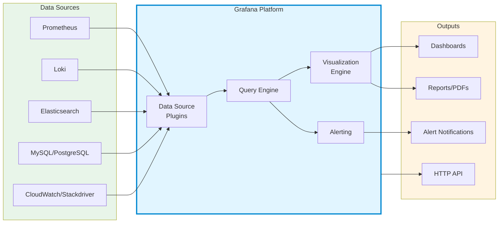

# Grafana

Overview of Grafana features, visualization types, and popular dashboards.

## What is Grafana?

Grafana is an open-source analytics and interactive visualization platform that connects to various data sources and displays metrics in customizable dashboards.



---

## Core Features

### 1. Data Sources

**Supported sources (100+):**

| Category | Data Sources |
|----------|-------------|
| **Metrics** | Prometheus, Graphite, InfluxDB, OpenTSDB |
| **Logs** | Loki, Elasticsearch, CloudWatch Logs |
| **Tracing** | Jaeger, Tempo, Zipkin, X-Ray |
| **Databases** | MySQL, PostgreSQL, MSSQL, MongoDB |
| **Cloud** | CloudWatch, Azure Monitor, Google Cloud Monitoring |
| **APM** | Datadog, New Relic, AppDynamics |

---

### 2. Visualization Types

**Built-in panel types:**

| Visualization | Best For | Example Use Case |
|--------------|----------|------------------|
| **Time Series** | Trends over time | CPU usage, request rates |
| **Gauge** | Current values with thresholds | Disk usage %, memory % |
| **Stat** | Single big number | Total requests, active users |
| **Bar Chart** | Compare categories | Requests by endpoint |
| **Pie Chart** | Proportions | Traffic by region |
| **Table** | Detailed data listing | Pod status, error logs |
| **Heatmap** | Density/distribution | Latency distribution |
| **Logs** | Log entries | Application logs |
| **Node Graph** | Relationships/topology | Service dependencies |
| **Geomap** | Geographic data | User locations |

---

### 3. Alerting

**Alert capabilities:**

- **Multi-dimensional alerting** - Alert on any query result
- **Alert routing** - Send to different channels
- **Notification channels** - Slack, PagerDuty, Email, Webhook, etc.
- **Alert rules** - Conditions with evaluation intervals
- **Silences & mute timings** - Suppress alerts temporarily

**Example alert:**
```yaml
# CPU usage alert
IF avg(cpu_usage_percent) > 80
FOR 5 minutes
SEND TO: #ops-alerts (Slack)
```

---

### 4. Dashboard Features

| Feature | Description |
|---------|-------------|
| **Variables** | Dynamic filters (namespace, pod, region) |
| **Templating** | Reusable dashboards across environments |
| **Annotations** | Mark events on graphs (deployments, incidents) |
| **Playlists** | Rotate through dashboards automatically |
| **Snapshots** | Share dashboard state at specific time |
| **Export/Import** | JSON-based dashboard sharing |
| **Folders** | Organize dashboards by team/project |
| **Permissions** | Role-based access control |

---

## Popular Public Dashboards

### Grafana Dashboard Library

**Official marketplace:** [grafana.com/grafana/dashboards](https://grafana.com/grafana/dashboards)

### Most Used Dashboards

| Dashboard ID | Name | Purpose | Data Source |
|--------------|------|---------|-------------|
| **1860** | Node Exporter Full | Complete server metrics | Prometheus |
| **315** | Kubernetes Cluster Monitoring | K8s cluster overview | Prometheus |
| **6417** | Kubernetes Deployment | Deployment/StatefulSet metrics | Prometheus |
| **13332** | Kube State Metrics | K8s object state | Prometheus |
| **7249** | Kubernetes Cluster (Prometheus) | Comprehensive K8s monitoring | Prometheus |
| **12740** | Kubernetes Monitoring | Namespaces and pods | Prometheus |
| **10566** | GitLab Omnibus | GitLab metrics | Prometheus |
| **11074** | Node Exporter for Prometheus | Hardware and OS metrics | Prometheus |
| **3662** | Prometheus 2.0 Overview | Prometheus server stats | Prometheus |
| **9628** | PostgreSQL Database | PostgreSQL monitoring | Prometheus |
| **7362** | MySQL Overview | MySQL metrics | Prometheus |
| **763** | Redis Dashboard | Redis monitoring | Prometheus |

**Benefits:**
- Single dashboard for all environments
- Cascade variables (environment → namespace → pod)
- Easy switching between contexts

---

## Grafana Plugins

**Popular plugins:**

| Plugin | Type | Purpose |
|--------|------|---------|
| **Pie Chart** | Visualization | Enhanced pie/donut charts |
| **Worldmap Panel** | Visualization | Geographic visualization |
| **Boom Table** | Visualization | Advanced tables with sparklines |
| **Diagram** | Visualization | Network/flow diagrams |
| **Clock** | Visualization | Display time |
| **Google Sheets** | Data Source | Query Google Sheets |
| **JSON API** | Data Source | Query JSON APIs |
| **GitHub** | Data Source | GitHub metrics |

**Install plugin:**
```bash
# CLI
grafana-cli plugins install grafana-piechart-panel

# Docker
docker run -e "GF_INSTALL_PLUGINS=grafana-piechart-panel" grafana/grafana

# Kubernetes (Helm)
grafana:
  plugins:
    - grafana-piechart-panel
```

---

## Tags

`grafana`, `dashboards`, `visualization`, `monitoring`, `alerting`, `charts`

---

*Last updated: 2025-11-02*
