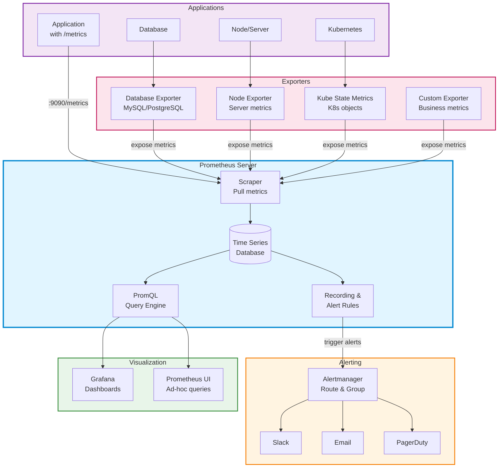
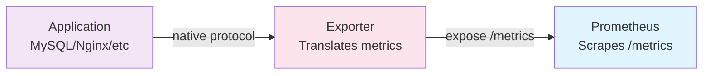
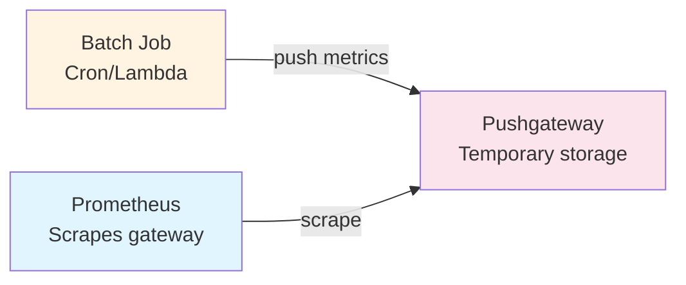

# Prometheus

High-level architecture and concepts for monitoring with Prometheus.

## Architecture



## Core Components

### 1. Prometheus Server

**Purpose:** Central monitoring server that collects and stores metrics

**Sub-components:**
- **Scraper** - Pulls metrics from targets via HTTP
- **TSDB** - Time-series database for efficient storage
- **Rules Engine** - Evaluates recording and alerting rules
- **PromQL Engine** - Query language processor
- **Web UI** - Built-in expression browser

---

### 2. Exporters

**Purpose:** Expose metrics from third-party systems in Prometheus format

**Common Exporters:**

| Exporter | Purpose |
|----------|---------|
| **Node Exporter** | Hardware & OS metrics (CPU, memory, disk) |
| **Blackbox Exporter** | Probing endpoints (HTTP, TCP, ICMP) |
| **MySQL Exporter** | MySQL database metrics |
| **PostgreSQL Exporter** | PostgreSQL database metrics |
| **Redis Exporter** | Redis metrics |
| **Nginx Exporter** | Nginx web server metrics |
| **Kube State Metrics** | Kubernetes object state |

---

### 3. Alertmanager

**Purpose:** Handle alerts sent by Prometheus server

**Features:**
- **Grouping** - Combine similar alerts
- **Inhibition** - Suppress alerts when others fire
- **Silencing** - Temporarily mute alerts
- **Routing** - Send to different receivers (Slack, Email, PagerDuty)

---

### 4. Client Libraries

**Purpose:** Instrument application code to expose custom metrics

**Official Libraries:**

| Language | Library |
|----------|---------|
| Go | `github.com/prometheus/client_golang` |
| Java | `io.prometheus:simpleclient` |
| Python | `prometheus_client` |
| Ruby | `prometheus-client` |
| Node.js | `prom-client` |
| .NET | `prometheus-net` |

---

## Metric Types

| Type | Behavior | Common Use Cases | Example Query |
|------|----------|------------------|---------------|
| **Counter** | Only increases (resets on restart) | Request counts, errors, completed tasks | `rate(http_requests_total[5m])` |
| **Gauge** | Can increase or decrease | Memory usage, temperature, active connections | `memory_usage_bytes` |
| **Histogram** | Samples observations in buckets | Request duration, response sizes | `histogram_quantile(0.95, rate(http_request_duration_seconds_bucket[5m]))` |
| **Summary** | Pre-calculated quantiles (client-side) | Request latencies with percentiles | `http_request_duration_seconds{quantile="0.95"}` |

### Metric Type Details

**Counter Example:**
```promql
http_requests_total{method="GET", status="200"} 1234
```

**Gauge Example:**
```promql
memory_usage_bytes{instance="server1"} 4294967296
```

**Histogram** automatically creates:
- `_bucket{le="..."}` - Cumulative counters
- `_sum` - Total sum
- `_count` - Total observations

**Summary** automatically creates:
- `{quantile="..."}` - Pre-calculated percentiles
- `_sum` - Total sum
- `_count` - Total observations

---

## Data Model

### Labels & Time Series

```promql
# Format: metric_name{label1="value1", label2="value2"} value

# Example
http_requests_total{method="GET", endpoint="/api", status="200"} 1523
```

**Each unique combination of labels creates a new time series:**
```promql
http_requests_total{method="GET", endpoint="/api", status="200"}
http_requests_total{method="POST", endpoint="/api", status="201"}
http_requests_total{method="GET", endpoint="/health", status="200"}
```

### Sample Data Structure

| Timestamp | Metric Name | Labels | Value |
|-----------|-------------|--------|-------|
| 1699000000 | `http_requests_total` | `{method="GET", status="200"}` | 1234 |
| 1699000015 | `http_requests_total` | `{method="GET", status="200"}` | 1256 |
| 1699000030 | `http_requests_total` | `{method="GET", status="200"}` | 1289 |

---

## How Services Expose Metrics

### 1. Direct Instrumentation

Application exposes `/metrics` endpoint:

```plaintext
# Application with built-in metrics
http://localhost:8080/metrics
```

**Example Output:**
```plaintext
# HELP http_requests_total Total HTTP requests
# TYPE http_requests_total counter
http_requests_total{method="GET",status="200"} 1523
http_requests_total{method="POST",status="201"} 421

# HELP http_request_duration_seconds HTTP request latency
# TYPE http_request_duration_seconds histogram
http_request_duration_seconds_bucket{le="0.1"} 100
http_request_duration_seconds_bucket{le="0.5"} 250
http_request_duration_seconds_sum 245.3
http_request_duration_seconds_count 300
```

---

### 2. Exporter Pattern

Use exporter when application doesn't have native Prometheus support:



---

### 3. Pushgateway Pattern

For short-lived jobs that can't be scraped:



**Example:**
```bash
# Push metric to Pushgateway
echo "backup_duration_seconds 145.3" | curl --data-binary @- \
  http://pushgateway:9091/metrics/job/backup/instance/db1
```

---

## Common PromQL Functions

### Aggregation

| Function | Purpose | Example |
|----------|---------|---------|
| `sum()` | Sum values | `sum(http_requests_total)` |
| `avg()` | Average values | `avg(cpu_usage_percent)` |
| `max()` | Maximum value | `max(memory_usage_bytes)` |
| `min()` | Minimum value | `min(disk_free_bytes)` |
| `count()` | Count time series | `count(up == 1)` |

---

### Rate & Increase

| Function | Purpose | When to Use |
|----------|---------|-------------|
| `rate()` | Per-second rate | Counters - smooth graphs |
| `irate()` | Instant rate | Counters - spiky/volatile metrics |
| `increase()` | Total increase | Counters - total growth over time |

**Example:**
```promql
# Requests per second (averaged over 5m)
rate(http_requests_total[5m])

# Total new requests in last hour
increase(http_requests_total[1h])
```

---

### Aggregation Over Time

| Function | Purpose |
|----------|---------|
| `avg_over_time()` | Average over time range |
| `max_over_time()` | Maximum over time range |
| `min_over_time()` | Minimum over time range |
| `sum_over_time()` | Sum over time range |

**Example:**
```promql
# Average CPU over last hour
avg_over_time(cpu_usage_percent[1h])
```

---

### Prediction & Trending

| Function | Purpose |
|----------|---------|
| `predict_linear()` | Linear prediction |
| `deriv()` | Derivative (rate of change) |
| `delta()` | Difference in range |

**Example:**
```promql
# Predict disk usage in 4 hours
predict_linear(disk_usage_bytes[1h], 4*3600)
```

---

## Prometheus Configuration

### Basic prometheus.yml

```yaml
global:
  scrape_interval: 15s      # Scrape every 15 seconds
  evaluation_interval: 15s   # Evaluate rules every 15 seconds

# Scrape targets
scrape_configs:
  # Prometheus itself
  - job_name: 'prometheus'
    static_configs:
      - targets: ['localhost:9090']

  # Application
  - job_name: 'app'
    static_configs:
      - targets: ['app:8080']
        labels:
          env: 'production'

  # Node Exporter
  - job_name: 'node'
    static_configs:
      - targets: ['node-exporter:9100']

  # Kubernetes Service Discovery
  - job_name: 'kubernetes-pods'
    kubernetes_sd_configs:
      - role: pod
```

---

## Recording & Alerting Rules

### Recording Rules

Pre-compute frequently used queries:

```yaml
groups:
  - name: example
    interval: 30s
    rules:
      # Pre-compute request rate
      - record: job:http_requests:rate5m
        expr: sum(rate(http_requests_total[5m])) by (job)
```

---

### Alerting Rules

Define alert conditions:

```yaml
groups:
  - name: alerts
    rules:
      # High error rate
      - alert: HighErrorRate
        expr: rate(http_requests_total{status=~"5.."}[5m]) > 0.05
        for: 5m
        labels:
          severity: critical
        annotations:
          summary: "High error rate detected"
          description: "Error rate is {{ $value }} req/s"
```

---

## Quick Links

- 📊 [PromQL Cheat Sheet](./promql-cheatsheet.md) - Queries for Grafana dashboards
- 🚀 [Prometheus + Grafana on GKE](./prometheus-grafana-gke.md) - Production setup guide

## Tags

`prometheus`, `monitoring`, `observability`, `metrics`, `architecture`, `overview`

---

*Last updated: 2025-11-02*
