# PromQL

Most common PromQL queries for Grafana dashboard visualizations.

## Choose Chart Type

```mermaid
flowchart TB
    Start([What do you want to display?])

    Start --> Trends[📈 Trends over time<br/>Rates • Resource usage]
    Start --> Current[🎯 Current values<br/>Thresholds • Percentage]
    Start --> Single[📊 Single aggregated value<br/>Totals • Counts • Averages]
    Start --> Compare[📋 Compare multiple items<br/>Lists • Rankings]
    Start --> Distribution[🔥 Latency distribution<br/>Percentiles • Histograms]

    Trends --> Graph[Time Series Graph]
    Current --> Gauge[Gauge]
    Single --> Stat[Stat Panel]
    Compare --> Table[Table]
    Distribution --> Heatmap[Heatmap]

    Graph --> GraphQ[Use: rate, irate<br/>avg_over_time]
    Gauge --> GaugeQ[Use: current value<br/>percentage calculations]
    Stat --> StatQ[Use: sum, avg, count<br/>increase]
    Table --> TableQ[Use: topk, bottomk<br/>group by labels]
    Heatmap --> HeatmapQ[Use: histogram_quantile<br/>bucket aggregations]

    style Start fill:#e3f2fd,stroke:#1976d2,stroke-width:3px
    style Trends fill:#e8f5e9
    style Current fill:#fff4e1
    style Single fill:#fce4ec
    style Compare fill:#e1f5ff
    style Distribution fill:#f3e5f5
    style Graph fill:#e8f5e9,stroke:#388e3c,stroke-width:2px
    style Gauge fill:#fff4e1,stroke:#f57c00,stroke-width:2px
    style Stat fill:#fce4ec,stroke:#c2185b,stroke-width:2px
    style Table fill:#e1f5ff,stroke:#0288d1,stroke-width:2px
    style Heatmap fill:#f3e5f5,stroke:#7b1fa2,stroke-width:2px
```



---

## Time Series Graph

### CPU Usage Over Time

```promql
# CPU usage percentage per pod
100 - (avg by (pod) (rate(container_cpu_usage_seconds_total[5m])) * 100)

# CPU usage by namespace
sum(rate(container_cpu_usage_seconds_total[5m])) by (namespace) * 100

# Node CPU usage
100 - (avg by (instance) (rate(node_cpu_seconds_total{mode="idle"}[5m])) * 100)
```

### Memory Usage Over Time

```promql
# Memory usage per pod (MB)
sum(container_memory_working_set_bytes) by (pod) / 1024 / 1024

# Memory usage by namespace (GB)
sum(container_memory_working_set_bytes) by (namespace) / 1024 / 1024 / 1024

# Memory usage percentage
(container_memory_working_set_bytes / container_spec_memory_limit_bytes) * 100
```

### Request Rate (HTTP/API)

```promql
# Requests per second
rate(http_requests_total[5m])

# Requests per second by endpoint
sum(rate(http_requests_total[5m])) by (endpoint)

# Requests per minute
rate(http_requests_total[5m]) * 60
```

### Error Rate

```promql
# Error rate percentage
(sum(rate(http_requests_total{status=~"5.."}[5m])) / sum(rate(http_requests_total[5m]))) * 100

# Errors per second
rate(http_requests_total{status=~"5.."}[5m])

# Error ratio (0-1)
sum(rate(http_requests_total{status=~"5.."}[5m])) / sum(rate(http_requests_total[5m]))
```

### Network Traffic

```promql
# Network receive rate (MB/s)
rate(container_network_receive_bytes_total[5m]) / 1024 / 1024

# Network transmit rate (MB/s)
rate(container_network_transmit_bytes_total[5m]) / 1024 / 1024

# Total network I/O
(rate(container_network_receive_bytes_total[5m]) + rate(container_network_transmit_bytes_total[5m])) / 1024 / 1024
```

---

## Gauge

### Current CPU Percentage

```promql
# Current CPU usage
100 - (avg(rate(node_cpu_seconds_total{mode="idle"}[1m])) * 100)

# Pod CPU percentage
sum(rate(container_cpu_usage_seconds_total{pod="my-pod"}[1m])) * 100
```

### Current Memory Percentage

```promql
# Memory utilization
(1 - (node_memory_MemAvailable_bytes / node_memory_MemTotal_bytes)) * 100

# Container memory percentage
(container_memory_working_set_bytes{pod="my-pod"} / container_spec_memory_limit_bytes{pod="my-pod"}) * 100
```

### Disk Usage

```promql
# Disk usage percentage
(1 - (node_filesystem_avail_bytes / node_filesystem_size_bytes)) * 100

# Available disk space (GB)
node_filesystem_avail_bytes / 1024 / 1024 / 1024
```

### Pod Count

```promql
# Running pods
count(kube_pod_status_phase{phase="Running"})

# Pods by namespace
count(kube_pod_info) by (namespace)
```

---

## Stat Panel

### Total Requests (Last Hour)

```promql
increase(http_requests_total[1h])
```

### Average Response Time

```promql
# Average latency (seconds)
avg(http_request_duration_seconds)

# Average over time
avg_over_time(http_request_duration_seconds[5m])
```

### Active Connections

```promql
# Current connections
sum(node_netstat_Tcp_CurrEstab)

# Active sessions
sum(application_active_sessions)
```

### Success Rate (Last 5 minutes)

```promql
(sum(rate(http_requests_total{status=~"2.."}[5m])) / sum(rate(http_requests_total[5m]))) * 100
```

### Pod Restart Count

```promql
# Total restarts
sum(kube_pod_container_status_restarts_total)

# Restarts in last hour
sum(increase(kube_pod_container_status_restarts_total[1h]))
```

---

## Table

### Top CPU Consumers

```promql
# Top 10 pods by CPU
topk(10, sum(rate(container_cpu_usage_seconds_total[5m])) by (pod, namespace))
```

### Top Memory Consumers

```promql
# Top 10 pods by memory
topk(10, sum(container_memory_working_set_bytes) by (pod, namespace) / 1024 / 1024)
```

### Pod Status by Namespace

```promql
# Pods grouped by status
sum(kube_pod_status_phase) by (namespace, phase)
```

### Node Resources

```promql
# CPU capacity by node
sum(kube_node_status_capacity{resource="cpu"}) by (node)

# Memory capacity by node
sum(kube_node_status_capacity{resource="memory"}) by (node) / 1024 / 1024 / 1024
```

### Service Endpoints

```promql
# Endpoint count per service
count(up) by (job, instance)

# Up/down status
up{job=~".*"}
```

---

## Heatmap

### Request Duration Distribution

```promql
# P50, P95, P99 latencies as heatmap
sum(rate(http_request_duration_seconds_bucket[5m])) by (le)
```

### Response Time Percentiles

```promql
# 95th percentile
histogram_quantile(0.95, sum(rate(http_request_duration_seconds_bucket[5m])) by (le))

# Multiple percentiles for heatmap
histogram_quantile(0.50, sum(rate(http_request_duration_seconds_bucket[5m])) by (le))
histogram_quantile(0.95, sum(rate(http_request_duration_seconds_bucket[5m])) by (le))
histogram_quantile(0.99, sum(rate(http_request_duration_seconds_bucket[5m])) by (le))
```

---

## Quick Reference: Query Patterns

| What to Display | Query Pattern | Chart Type |
|----------------|---------------|------------|
| Current value | `metric_name` | Gauge, Stat |
| Rate per second | `rate(counter[5m])` | Graph |
| Total in period | `increase(counter[1h])` | Stat |
| Percentage | `(part / total) * 100` | Gauge, Graph |
| Top N items | `topk(N, metric)` | Table |
| Average over time | `avg_over_time(metric[1h])` | Graph, Stat |
| Percentile (P95) | `histogram_quantile(0.95, ...)` | Graph, Heatmap |
| Count items | `count(metric)` | Stat |

---

## Tags

`promql`, `grafana`, `queries`, `dashboard`, `metrics`, `visualization`, `cheatsheet`

---

*Last updated: 2025-11-02*
